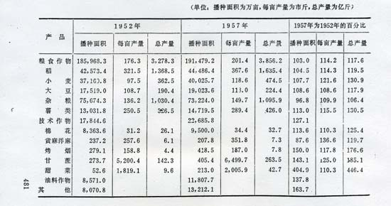
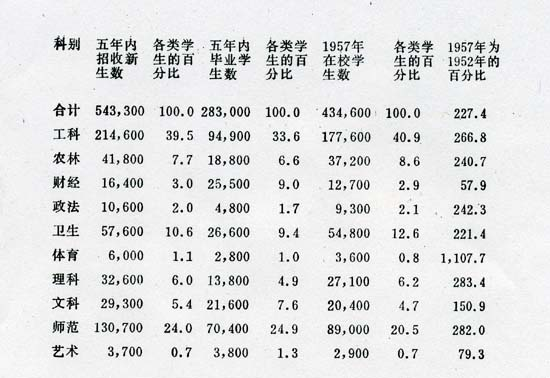
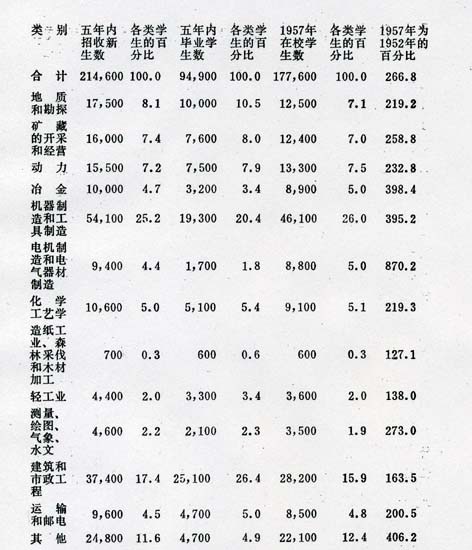
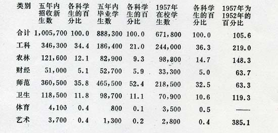

**中华人民共和国发展国民经济的第一个五年计划[^1]（一九五三—一九五七）**

> （一九五五年七月三十日第一届全国人民代表大会第二次会议通过）

目录

- 绪　言
- 第一章  第一个五年计划的任务
- 第二章  第一个五年计划的投资分配和生产指标
- 第三章  工　业
- 第四章  农　业
- 第五章  运输和邮电
- 第六章  商　业
- 第七章  提高劳动生产率和降低
- 第八章  培养建设干部，加强科学研究工作
- 第九章  提高人民的物质生活和文化生活的水平
- 第十章  地方计划问题
- 第十一章  厉行节约，反对浪费

## 绪　言

中华人民共和国于一九五三年开始伟大的发展国民经济的第一个五年计划。

以工人阶级为领导的中华人民共和国的成立和经济命脉归国家掌握，就使得我们有可能根据建设社会主义的目标，来有计划地发展和改造国民经济，以便逐步地把我国由落后的农业国变成先进的社会主义的工业国。

依靠工人阶级和广大人民群众在劳动战线上的高度的积极性和创造性，依靠全国人民在改革土地制度、抗美援朝、镇压反革命、进行“三反”“五反”等各个战线上的胜利，依靠中国共产党和中央人民政府在共同纲领的基础上所实行的正确的经济政策的领导，同时还由于伟大的苏联和各人民民主国家的支援，我国在一九五二年底结束了国民经济的恢复阶段，工业和农业的主要产品的产量，除个别的以外，都超过了解放前的最高水平；运输和邮电有了相应的恢复和发展。国家在平衡财政收支和稳定物价这些方面所取得的重大成就，对于国民经济的迅速恢复和人民生活的改善，起了显著的作用。

在一九五二年，我国工业农业的总产值（按一九五二年不变价格计算，下同）比一九四九年增长了百分之七七·五，其中现代工业增长了百分之一七八·六，农业（包括农村副业）增长了百分之四八·五。作为国家经济发展水平主要标志的现代工业，在工业农业总产值中所占的比重，由一九四九年的百分之一七上升到一九五二年的百分之二六·七。工业总产值（包括现代工业和工场手工业的产值，不包括合作化手工业、个体手工业和农村副业的手工业的产值）中生产资料和消费资料的生产所占的比重，由一九四九年的二九比七一变为一九五二年的三九·七比六〇·三。在工业总产值中，国营、合作社营[^2]和公私合营的工业所占的比重，已由一九四九年的百分之三六·七上升到一九五二年的百分之六一；私人资本主义工业的总产值虽有增加，但所占比重则由一九四九年的百分之六三·三下降到一九五二年的百分之三九。在农业中，一九五二年参加互助组的农户已发展到占农户总数的百分之四〇，并组织了三、六四四个农业生产合作社。国营商业和合作社营商业在国内商业批发中的比重达到百分之六三·二，在社会零售中的比重达到百分之三四；对外贸易已由国家管制。总的说来，社会主义经济在国民经济中的领导作用和领导地位，随着我国人民民主专政的日益巩固，已经在恢复时期大大地加强起来，因而也就为我国实行计划经济开辟了道路，并需要我们着手制定发展国民经济的长期计划。

我国曾经是一个在帝国主义统治下的殖民地、半殖民地和半封建的国家，经济是很落后的。在解放前，我国生铁在历史上的最高年产量不过一八〇多万吨，钢不过九〇多万吨，[^3]并且没有制造主要生产工具的机器制造工业。一九五二年恢复阶段终结的时候，虽然生铁和钢的产量都超过了解放前的数字，但生铁也还只有一九〇万吨，钢只有一三五万吨。鉴于我国经济这种极端落后的情况，我们必须实行积极的社会主义工业化的政策，来提高我国生产力的水平。毛泽东同志说过：“没有工业，便没有巩固的国防，便没有人民的福利，便没有国家的富强。”采取积极的工业化的政策，即优先发展重工业的政策，其目的就是在于求得建立巩固的国防、满足人民需要和对国民经济实现社会主义改造的物质基础。因此，我们把重工业的基本建设作为制定发展国民经济第一个五年计划的重点，并首先集中力量进行苏联帮助我国设计的一五六个工业单位的建设[^4]，而在这个主要基础上来继续利用、限制和改造国民经济中的资本主义成分，保证不断地巩固和扩大国民经济中的社会主义成分。

我国现在还存在着下列的事实：第一，小农经济在农业经济中还占有绝对的优势。这种小农经济限制着农业生产力的发展，它是同社会主义的工业化相矛盾的，必须逐步地以合作化的农业代替分散的个体的小农业。同时，个体手工业在城市和乡村中都有很大的数量，必须逐步地把它引向合作化的道路。第二，资本主义经济在国民经济中还占有相当大的比重。这种资本主义的生产关系日益暴露出它同生产力的增长相矛盾，资本主义经济的无政府状态同社会主义经济的有计划发展是相对立的，必须迅步地以全民所有制代替资本家的所有制。因此，我国发展国民经济的第一个五年计划必须包括对农业、手工业和资本主义工商业逐步实行社会主义改造的计划，在优先发展社会主义经济的原则下，对各种经济成分的安排采取统筹兼顾的政策。

为着把计划放在可靠的基础上，在编制第一个五年计划的过程中，根据我国的具体情况并参照苏联和各人民民主国家的经验，曾经着重地注意以下一些问题。第一，在优先发展重工业的条件下，力求使各个经济部门--特别是工业和农业、重工业和轻工业--之间的发展保持适当的比例，避免彼此脱节。第二，力求使建设计划同资金积累的程度（即投资力量）相适应，并适当地估计到技术力量。第三，使地方的计划同中央各部的计划结合起来，在中央统一领导下，首先保证重点工程的建设，同时充分地发挥地方的积极性和创造性。第四，在建设中采取合理地利用原有的工业基地和积极地着手创设新的工业基地--这两个方面互相结合的步骤，逐步地改变过去的经济发展不平衡的状态，并使经济建设的布局适应于国防安全的条件。第五，照顾到积累资金和改善人民生活两个方面，既要注意扩大资金积累，保证国家建设，为不断地提高人民的生活水平建立物质基础；同时在发展生产和提高劳动生产率的基础上逐步地提高人民的物质生活和文化生活的水平，减少失业现象。

第一个五年计划期间，我国在原来生产力薄弱的基础上进行大规模的建设工作，是不能够不遇到困难的。我们的工作将是十分紧张的。因为我国原来的技术落后，这就必须充分地估计到技术人材、设备供应同建设需要的矛盾而发生的困难。因为农业的社会主义改造的复杂任务需要长时间才能够解决，这就必须充分地估计到农业的发展落后于工业的迅速发展而发生的困难。面对着这些困难，我们必须最合理地和最有效地利用人力、物力和财力，找寻适当的办法，而加以克服。同时，由于我们的计划工作经验缺乏和统计资料不全，这就不能不影响到计划的准确性。因此，在执行计划的过程中，我们必须随时地注意计划工作同实际的发展情况相结合，从而根据实际的经验，根据广大群众的创造性的经验，来不断地使计划能够比较准确和比较完善。认真地学习苏联建设社会主义的先进经验，将使我们少犯一些错误。苏联和各人民民主国家的支援，是我国进行有计划的经济建设的重要的有利条件。

实现五年计划，是在现在环境下的一种特殊形式的阶级斗争。人民的敌人将采取各种方法来破坏五年计划。全国人民必须时时刻刻地提高政治的警惕性，肃清一切暗藏的反革命分子，击破国内国外敌人对于五年计划任何形式的破坏活动。

在工人阶级及其政党――中国共产党领导下的工农联盟是我国获得伟大人民革命胜利、建立人民民主专政的基础，是我国继续取得社会主义胜利的基础。为着运用和加强人民民主专政的国家权力来有计划地发展和改造国民经济，建设社会主义社会，就必须不断地巩固工农联盟，巩固以工农联盟为基础的全国各民族、各民主阶级、各民主党派、各人民团体的人民民主统一战线。

## 第一章  第一个五年计划的任务

中华人民共和国宪法规定：“从中华人民共和国成立到社会主义社会建成，这是一个过渡时期。国家在过渡时期的总任务是逐步实现国家的社会主义工业化，逐步完成对农业、手工业和资本主义工商业的社会主义改造。”完成这个过渡时期的总任务，需要经过一个相当长的时间，除了恢复时期的三年以外，大概还需要十五年左右的时间，即大概需要三个五年计划。

第一个五年计划的基本任务是根据这个过渡时期的总任务提出的。第一个五年计划的基本任务，概括地说来就是：集中主要力量进行以苏联帮助我国设计的一五六个建设单位为中心的、由限额以上的六九四个建设单位组成的工业建设，建立我国的社会主义工业化的初步基础；发展部分集体所有制的农业生产合作社，并发展手工业生产合作社，建立对于农业和手工业的社会主义改造的初步基础；基本上把资本主义工商业分别地纳入各种形式的国家资本主义的轨道，建立对于私营工商业的社会主义改造的基础。这是中国共产党和中华人民共和国国家机关领导全国人民为实现过渡时期总任务而奋斗的带有决定意义的纲领。

围绕着这些基本任务，第一个五年计划有以下各项具体任务：

一、建立和扩建电力工业、煤矿工业和石油工业；建立和扩建现代化的钢铁工业、有色金属工业和基本化学工业；建立制造大型金属切削机床，发电设备、冶金设备、采矿设备和汽车、拖拉机、飞机的机器制造工业。这些都是我国重工业的新建设。这些新建设的逐步完成，将使我国能够在社会主义大工业的物质基础上改造我国国民经济的原来面貌。

二、随着重工业的建设，相应地建设纺织工业和其他轻工业，建设为农业服务的新的中小型的工业企业，以便适应城乡人民对日用品和农业生产资料的日益增长的需要。

三、在建设新工业的同时，必须充分地和合理地利用原有的工业企业，发挥它们的潜在的生产力量。在第一个五年计划期间，重工业和轻工业的生产任务的完成，主要地还是依靠原有的企业。

四、依靠贫农（包括全部原来是贫农的新中农），巩固地联合中农，采用说服、示范和国家援助的方法，推动农业生产的合作运动，以部分集体所有制的农业生产合作社为主要形式来初步地改造小农经济，在这个基础上对农业进行初步的技术改良，提高单位面积的产量，同时也发挥单干农民潜在的生产力量，并利用一切可能的条件努力开垦荒地，加强国营农场的示范作用，以保证农业生产--特别是粮食生产和棉花生产的进一步发展，逐步地克服农业落后于工业的矛盾。

注意兴修水利，植树造林，广泛地开展关于保持水土的工作。

促进畜牧业和水产业的发展，增加农业特产品的生产。

五、随着国民经济的高涨，相应地发展运输业和邮电业，主要是铁路的建设，同时发展内河和海上的运输，扩大公路、民用航空和邮电事业的建设。

六、在国家的统筹安排的方针下，按照个体手工业、个体运输业和独立小商业等不同行业的情况，分别地用不同的合作形式把它们逐步地组织起来，使它们能够有效地为国家和社会的需要服务。

七、继续巩固和扩大社会主义经济对于资本主义经济的领导，正确地利用资本主义经济的有利于国计民生的积极作用，限制它们的不利于国计民生的消极作用，对它们逐步地实行社会主义的改造。根据需要和可能，逐步地扩展公私合营的企业，加强对私营工业产品的加工、定货和收购的工作，并稳步地和分别地使私营商业为国营商业和合作社营商业执行代销、经销等业务。

八、保证市场的稳定。继续保持财政收支的平衡，增加财政和物资的后备力量；随着工业农业的生产的发展，相应地发展城乡和内外的物资交流，扩大商品流通，对生产增长赶不上需要增长的某些主要的工业农业产品，在努力增产的基础上逐步地实施计划收购和计划供应的政策。

九、发一文化教育和科学研究事业，提高科学技术水平，积极地培养为国家建设特别是工业建设所必需的人材。

十、厉行节约，反对浪费，扩大资金积累，保证国家建设。

十一、在发展生产和提高劳动生产率的基础上，逐步地改善劳动人民的物质生活和文化生活。

十二、继续加强国内各民族之间的经济和文化的互助和合作，促进各少数民族的经济事业和文化事业的发展。

在第一个五年计划期间，胜利地完成由上述任务所规定的各种指标，不仅将使我国的国民经济有巨大的发展，现代工业在工业农业总产值中所占的比重有显著的增长，而且将变更各种社会经济成分之间的关系，即社会主义经济成分在国民经济中会有很大的增长，而其他经济成分则相应地缩小其原来在国民经济中所占的比重。工人阶级领导下的人民政权和工农联盟将因社会主义经济力量的增长而更加巩固起来。

## 第二章  第一个五年计划的投资分配和生产指标

根据上述任务，第一个五年计划关于基本建设投资的分配，关于生产、运输和商品流通的基本指标，作如下的规定。

### 第一节  基本建设投资的分配

为着保证第一个五年计划的实现，五年内国家对于经济事业和文化教育事业的支出总数为七六六·四亿元（其中国家财政拨款为七四一，三亿元，由中央各经济部门和各省市动员的内部资金为二五·一亿元），其分配和百分比如下：

工业部门为三一三·二亿元，占百分之四〇·九；

农业、水利和林业部门为六一亿元，占百分之八；

运输和邮电部门为八九·九亿元，占，百分之一一·七；

贸易、银行和物资储备部门为二一·六亿元，占百分之二·八；

文化、教育和卫生部门为一四二·七亿元，占百分之一八·六；

城市公用事业为二一·二亿元，占百分之二·八；

各经济部门的流动资金为六九亿元，占百分之九；

各经济部门的大修理费用为三六亿元，占百分之四·七；

其他经济支出为一一·八亿元，占百分之一·五。

在以上的经济事业和文化教育事业的支出总数中，各部门的基本建设投资为四二七·四亿元，占支出总数的百分之五五·八。此外，还有地质勘探费一六·四亿元，勘察设计费七亿元，为一九五八年和以后年度建设所需的器材储备费一一·二亿元，各经济部门的准备金一五·四亿元，军垦费三亿元，合计为五三亿元；这些费用，在逐年编制年度计划的时候，都将按照各部门的建设工程项目，用于基本建设方面，将这些费用和各部门的基本建设投资四二七·四亿元加在一起，则国家五年内用于基本建设方面的总投资[^5]，即占经济事业和文化教育事业支出总数的百分之六二·七。支出总数的其他百分之三七·三，除作为各经济部门的流动资金和大修理费用外，将分别地用作新种类产品试制费、技术组织措施费、零星固定资产购置费、中等专业学校经费、专业干部训练费、经济部门和文化教育部门的事业费以及城市公用事业的维护费

各部门的基本建设投资四二七·四亿元，其分配和百分比如下：

工业部门为二四八，五亿元，占百分之五八·二；

农业、水利和林业部门为三二·六亿元，占百分之七·六；

运输和邮电部门为八二·一亿元，占百分之一九·二；

贸易、银行和物资储备部门为一二·八亿元，占百分之三；

文化、教育和卫生部门为三〇·八亿元，占百分之七·二；

城市公用事业建设为一六亿元，占百分之三·七；

其他为四·六亿元，占百分之一·一。

从上列的经济事业、文化教育事业支出总数和基本建设投资的分配比例，很明显地可以看出，分配的重点都是工业，特别是在基本建设投资中，工业占有最重要的地位。上列工业部门基本建设的投资，再加上中央各工业部以外的其他各部的有关工业基本建设的投资一七·七亿元，那末，五年内工业基本建设投资就将共有二六六·亿元。除此以外，公私合营工业的公积金中，将有一部分投入工业基本建设，私营企业也将有一些资金投入工业基本建设。

上列工业基本建设投资二六六·二亿元，按管理部门划分，其分配情况如下列：

重工业部为六四·九亿元，占百分之二四·四；

燃料工业各部为六七·九亿元，占百分之二五·五；

机械工业各部为六九·三亿元，占百分之二六；

纺织工业部为一一·六亿元，占百分之四·四；

轻工业部为六·九亿元，占百分之二·六；

地质部为二亿元，占百分之〇·八；

建筑工程部（包括地方建筑企业）为六·九亿元，占百分之二·六，

地方工业为一九亿元，占百分之七，一；

中央各工业部以外的其他各部的工业（包括林业部的木材工业，商业部、粮食部的加工工业，铁道部和交通部的机车、车辆、船舶的修配工业和建筑业，文化部的电影工业，等等）为一七·七亿元，占百分之六·六。

在工业基本建设投资中，制造生产资料工业的投资占百分之八八·八；制造消费资料工业的投资占百分之一一·二[^6]。投资的比例关系必须根据生产资料优先增长的原理来决定，而在每个发展时期中，这种比例关系的具体规定，又应该照顾到当时的具体条件。我国第一个五年计划规定重工业投资的比重特别大，这是因为我国需要积极地扩大重工业的基础以促进国民经济的全面发展，同时，我国国营和私营的轻工业，在现在又还有相当大的潜在力量，并且还有广大的手工业可以作重要的补充。因此，我国第一个五年计划关于轻重工业的投资比例的规定是合适的。

在第一个五年计划期间，农业生产还不可能广泛地实现机械化，更大规模的水利建设和林业建设也还不能全面展开，所以五年内国家对农业、水利、林业方面的投资还只有二六·八亿元[^7]。但是加上国家对农业、水利、林业各部门的其他支出二八·四亿元[^8]，国家拨出的军垦费三亿元，农村救灾费一〇·六亿元，以及五年内国家增加的农业贷款一五·二亿元（随着农业生产合作社的发展，国家还准备适当地增加农业的贷款），则国家在五年内直接和间接用于发展农业生产的支出将共达八四亿元。同时，据初步估算，五年内农民自己用于扩大再生产的投资总额约为一〇〇亿元[^9]。这样，五年内用于发展农放的全部资金就将有一八四亿元左右。除此以外，由于农村信用合作社的发展，也还可以吸收大量游资投入农业生产。

五年内，全国经济各部门和文化教育各部门限额以上的建设单位共有一、六〇〇个，限额以下的建设单位在六、〇〇〇个以上。

五年内，中央三一个部（包括经济各部和文化教育各部），由于投资而开始利用的新增固定资产，共为二九八·〇八亿元，新增固定资产占该二一个部五年投资总额的百分之八四·五。在新增的固定资产中，生产性的固定资产占百分之五六·四，流通性的固定资产占百分之二五，八，消费性的固定资产占百分之一七·八[^10]。

### 第二节  生产、运输，商品流通的基本指标

各经济部门的增产比率是不一致的，把一九五七年同一九五二年比较，情形将如下列：

工业总产值（包括现代工业和工场手工业的产值，不包括合作化手工业、个体手工业和农村副业的手工业的产值）由一九五二年的二七〇·一亿元到一九五七年将增加为五三五·六亿元，增长百分之九八·三，平均每年递增百分之一四·七。其中生产资料的生产平均每年递增百分之一七·八，消费资料的生产平均每年递增百分之一二·四。

手工业总产值（包括合作化手工业和个体手工业的产值，不包括农村副业的手工业的产值）由一九五二年的七三一，亿元到一九五七年将增加，为一一七·七亿元，即增长百分之六〇·九，平均每年递增百分之九·九。其中手工业生产合作社的产值由一九五二年的二·五亿元到一九五七年将增加为三一·九亿元，即增长一一·九倍，平均每年递增百分之六七。

农业及其副业的总产值由一九五二年的四八三·九亿元到一九五七年将增加为五九六·六亿元，即增长百分之二三·三，平均每年递增百分之四·三。以产量说，粮食由一九五二年年产三、二七八·三亿斤到一九五七年年产三、八五六·二亿斤，即增长百分之一七·六，平均每年递增百分之三·三；棉花由一九五二年年产二六·一亿斤到一九五七年年产三二·七亿斤，即增长百分之二五·四，平均每年递增百分之四·六。

把工业、手工业和农业合计，那末，一九五七年工业农业总产值将是一、二四九·九亿元，比一九五二年的八二七·一亿元增长百分之五一·一，即平均每年递增百分之八·六。

五年内，生产的发展将使现代工业在国民经济中的地位发生相当重要的变化，即现代工业在工业农业总产值中的比重将由一九五二年的百分之二六·七上升到一九五七年的百分之三六。同时，在工业总产值中，生产资料和消费资料所占的比重也将发生一定的变化，即生产资料的产值所占的比重将由一九五二年的百分之三九·七上升到一九五七年的百分之四五·四，消费资料的产值所占的比重将由一九五二年的百分之六〇·三下降为一九五七年的百分之五四·六。

在工业生产的增长中，国营工业（包括国营的现代工业和工场手工业）的发展速度是较快的。国营工业产值在一九五七年比一九五二年增长百分之一三〇·一，即平均每年递增百分之一八·一。因此，把一九五七年同一九五二年比较，国营、合作社营、公私合营、私营各类工业产值在工业总产值中所占的比重将发生如下的变化：

国营工业将由百分之五二·八上升为百分之六一·三，合作社营工业将由百分之三·二上升为百分之四·四，公私合营工业将由百分之五上升为百分之二二·一，这三类工业产值合计在工业总产值中所占的比重将由百分之六一上升到百分之八七·八。

另方面，私营工业产值一九五二年为一〇五·三亿元，除去其中将在五年内实现公私合营的五一·五亿元以外，还有五三·八亿元；到一九五七年，私营工业的产值为六五·六亿元，即比五三·八亿元增长百分之二二，但私营工业在工业总产值中所占的比重将由百分之三九下降为百分之一二·二。

为着适应工业农业生产的发展，在运输和邮电方面，五年内铁路货物周转量将增长百分之一〇一；铁路旅客周转量将增长百分之五九，五；内河货物周转量将增长百分之三二一·五；沿海货物周转量将增长百分之一九〇·五；公路汽车货物周转量将增长百分之三七三·五，民用航空旅客周转量将增长百分之二七八·五；邮路总长度将增长百分之四五·二。

在上述工业农业发展以及各种比重变化的基础上，一九五七年全国社会商品零售总额比一九五二年大约将增长百分之八〇左右，其中国营商业增长百分之一三三·二，合作社营商业增长百分之二三九·五。原有私营商业在五年内经过社会主义改造，将分别为各种国家资本主义形式的商业、由小商小贩组织起来的合作形式的小商业、私营商业这三部分，这三部分商业的零售额，在五年内将有所增长。到一九五七年，在社会商品零售总额中，国营商业和合作社营商业将占百分之五四·九，各种国家资本主义形式的商业和由小商小贩组织起来的合作形式的小商业将占百分之二四·〇，私营商业将占百分之二一·一。

## 第三章  工　业

### 第一节  工业的基本建设

（一）工业基本建设计划是五年计划的中心

以重工业为主的工业基本建设的目的，是要把我国国民经济从技术极端落后的状况推进到现代化技术的轨道上，而为我国的工业、农业和运输业创造现代化的技术基础。为此目的，工业的基本建设计划就要建立由现代先进技术装备起来的新的工业，同时要用现代先进的技术来逐步地改造原有的工业。这种建设计划是我国五年计划的中心，而在苏联援助下的一五六个单位的建设，又是工业建设计划的中心。这种基本建设代表着我国人民的长远利益。

五年内，工业方面限额以上的建设单位，包括苏联帮助设计的在五年内开始建设的一四五个单位在内，共是六九四个；其中属于中央各工业部的是五七三个，属于中央其他各部的是三九个，属于地方的是八二个。限额以下的建设单位是二、三〇〇个左右，其中属于中央各部的约为九〇〇个，属于地方的约为一、四〇〇个。

限额以上的六九四个建设单位，在第一个五年计划期间能够建成的是四五五个，其中属于苏联帮助设计的是四五个；在第二个五年计划期间陆续建成的是二三九个，其中属于苏联帮助设计的是一〇〇个（包括第一个五年计划期间已经部分建成并投入生产的一八个在内）。限额以下的建设单位一般都可以在五年内建成。

苏联帮助设计的单位在五年内的投资是一一〇亿元，占工业部门基本建设投资二四八·五亿元的百分之四四·三。同时，直接配合这些建设单位的，还有一四三个限额以上的建设单位，五年内对这些建设单位的投资是一八亿元，占工业部门基本建设投资二四八·五亿元的百分之七·二。两项合计共占百分之五一·五。这就是说，在第一个五年内我们是集中主要的投资来保证苏联帮助设计的重点工程及其直接配合的工程的建设的。

在集中主要力量进行上述两类工程的建设的时候，中央各工业部和各地方还必须用适当的资金来改建现有的若干中小型的厂矿，并新建许多新的中小型的厂矿，例如中小型的煤矿、发电厂和肥料制造厂等等。这类改建和新建的中小型厂矿，能够在较短的时间内建设完工并投入生产，能够迅速地发挥投资效果并增加生产能力，不但对于满足社会的需要有重大的作用，而且对于资金积累的增加以及支援和配合重点工程的建设，也都是不可缺少的力量。那种只醉心于大型厂矿的建设而忽视对于中小型厂矿的利用和建设的倾向，是很错误的。但是这类中小型厂矿的建设，必须是有计划的，而不是盲目的。各地方在进行这类厂矿的建设的时候，中央各工业部应该给以帮助。

（二）工业的地区分布和新工业基地的建设

我国工业原来畸形地偏集于一方和沿海的状态，在经济上和国防上都是不合理的。我们的工业基本建设的地区分布，必须从国家的长远利益出发，根据每个发展时期的条件，依照下列原则，即：在全国各地区各地区适当的分布工业的生产力，使工业接近原料、燃料的产区和消费地区，并适合于巩固国防的条件，来逐步地改变这种不合理的状态，提高落后地区的经济水平。

为着改变原来工业地区分布的不合理状态，必须建设新的工业基地，而首先利用、改建和扩建原有的工业基地，则是创造新工业基地的一种必要条件。

不论改建和扩建原有的工业基地或建设新的工业基地，企业地点的布置都应该避免过分集中，应该适当地分开安排在具有一定距离的邻近的地带，大、中、小型的企业的建设应该适当地互相配合。

第一个五年计划对于工业基本建设的地区分布作了下列的主要部署：

第一，合理地利用东北、上海和其他城市已有的工业基础，发挥它们的作用，以加速工业的建设。最重要的是要在第一个五年计划期间基本上完成以鞍山钢铁联合企业为中心的东北工业基地的建设，使这个基地能够更有能力地在技术上支援新工业地区的建设。

除了对于鞍山钢铁联合企业作重大的改建以外，东北各工业区的原有工业，如抚顺、阜新和鹤岗的煤矿工业，本溪的钢铁工业，沈阳的机器制造工业，吉林的电力工业，也都将在五年内加以改建。

第二，积极地进行华北、西北、华中等地新的工业地区的建设，以便第二个五年计划期间在这些地区分别组成以包头钢铁联合企业和武汉钢铁联合企业为中心的两个新的工业基地。

第三，在西南开始部分的工业建设，并积极地准备新工业基地建设的各种条件。

根据上列主要的工业基本建设的部署，那末，在完成第一个五年计划的基础上，到第二个五年计划完成的时候，我国就将有分布在东北、华北、西北和华中各地区的巨大工业基地，这样也就将在相当大的程度上改变我国广大地区的经济生活。这种工业的地区分布是建立在发展重工业的基础上的，因此也就开始改变了过去工业分布的性质。

除了上述重工业分布的部署以外，五年计划对于轻工业（主要是纺织工业）的新建设也作了比较合理的新部署，部分地改变轻工业过去集中在沿海的现象，而移向于接近原料产区和消费地区的内地。

根据内地的需要，应该逐步地把沿海城市的某些可能迁移的工业企业向内地迁移。

（三）地质工作

矿产资源的勘探和它的勘探进度，资源供应的保证程度，是合理地分布生产力、建立新工业基地、正确地规定工业建设计划的先决条件。应该大大地加强地质工作，赶上工业建设的需要。

地质工作在第一个五年计划期间的任务是：

第一，保证五年内开始新建企业的设计所必需的矿量。

第二，加强对某些从前没有发现或者很少发现的和目前特别缺乏的资源（例如石油）以及在地区上不平衡的资源的普查工作和勘探工作。

第三，有计划地展开全国矿产的普查工作，进行部分的区域地质测量等工作，保证第二个五年计划所需的矿量，并为第三个五年计划所需的矿量准备资源条件。

第四，加强水力资源和综合流域开发的地质勘测工作，保证第一个五年计划期间重要水利工程和水力发电所需的地质资料，并为第二个五年计划所需的水力资源做好准备工作。

五年内，计划探明可供设计的煤的矿产储量为二〇二·七亿吨，铁的矿产储量为二四·七亿吨。

五年内，全国地质勘探的钻探工作总量为九二三万公尺。

为着能够切实地按进度完成上述勘探任务，必须加强地质工作的计划性和组织性，明确分工，加强协作，并鼓励群众报矿。应该合理地使用和提高现有的技术人材，积极地培养新的地质人材和勘测人材，加强地质的科学研究工作，加强地球物理探矿工作，并统一大地地形测量等工作。

（四）实现工业基本建设计划的必要措施

工业基本建设，特别是重大工程的建设，规模巨大，技术复杂，进度紧张，而我们主观的力量和经验又还很不够，虽然一五六个单位是由苏联帮助设计并供应成套设备，这对于保证完成计划是一个很大的有利条件，但我们的困难还是很多的。因此，必须加强对工业基本建设的领导，学习和推广苏联的工业基本建设的先进经验，采取有效措施，用最大的努力来保证工程的质量，降低工程成本，按时完成建设任务。

第一，提高基本建设工作的计划性和组织性。按照首先保证重点工程的建设、适当地照顾必要的配合重点的工程和能够迅速地发挥投资效果增加生产能力的工程、以及尽可能地扩大生产性固定资产的比例-　这些原则，来具体地安排工程项目，掌握工作量和工程进度，研究定额，使地质勘察、设计、施工和设备材料的供应能够平衡和衔接，克服盲目被动的现象。

第二，按照专业分工的原则，调整和继续充实设计机构，培养新的设计力量，加强对设计工作的政治思想领导广泛地采用先进的技术成就，提高设计工作的质量，并逐步地建立设计的各种定额、标准和制度。

第三，根据适用和经济的原则，在提高设计工作的质量和保证工程质量的基础上，力求降低工程造价。关于企业中的非生产性的建设，必须根据人民的生活水平，大大地降低建筑标准和工程造价。

第四，加强新工业城市的规划和建设的工作。城市建设的标准要适合国家现在生产力发展的水平。城市公用事业的建设应该同新工业企业的建设密切配合。

第五，在重要的新工业城市建立综合性的建筑企业，同时调整和提高现有的专业性的建筑企业，以担负建筑任务。

第六，纯洁建筑企业的工人职员队伍，不断地对工人职员进行教育，以提高他们的政治觉悟和业务技术水平。

第七，在重点工程中，努力地推行工厂化的施工方法，尽可能地采用钢筋混凝土结构和预制的配件，力求缩短施工时间，节约建筑材料。

第八，加强工业基本建设施工的管理工作：

（1）在各建筑企业和施工单位中，实行一长制和按生产区域管理制，以纠正无人负责的现象。

（2）逐步地贯彻计划管理和推行作业计划；按照需要和可能，有重点地推行施工的机械化和施工的常年作业；合理地使用人力物力，防止窝工，消除破坏纪律的现象；注意施工的安全。

（3）加强施工的技术指导，积极地推广工人职员群众的有效的先进的施工经验，鼓励合理化建议，不断地提高劳动生产率，提高工程质量。

第九，逐步地健全和贯彻经济核算制，厉行节约，同一切浪费现象作斗争。对基本建设单位实行拨款监督，逐步地建立设计预算的管理制度，健全建设工程的验收制度。

第十，加强工业基本建设同运输、对外贸易、工业生产各部门之间的平衡协作。

第十一，加强对于工业基本建设计划执行情况的经常检查，以便帮助基本建设单位克服缺点，改善工作。

建立和贯彻工程质量的检查制度。

### 第二节  工业的生产

（一）主要工业品的产量

随着原有企业和五年内陆续投入生产的新建、改建企业的产量的逐年增长，工业总产值由一九五二年的二七〇·一亿元到一九五七年将增加为五三五·六亿元。

五年内，主要工业品产量的增长如下列：

| 产品名称             | 1952年产量           | 1957年计划产量      | 1957年为1952年的百分比 |
| -------------------- | -------------------- | ------------------- | ---------------------- | --- |
| 发电量               | 72.6亿度（千瓦小时） | 159亿度（千瓦小时） | 219                    |
| 原煤                 | 6,352,8万吨          | 11,298.5万吨        | 178                    |
| 原油                 | 43.6万吨             | 201.2万吨           | 462                    |
| 生铁                 | 190万吨              | 467.4万吨           | 246                    |
| 钢                   | 135万吨              | 412万吨             | 306                    |
| 钢材                 | 111万吨              | 304,5万吨           | 275                    |
| 焦炭                 | 286万吨              | 668.5万吨           | 233                    |
| 烧碱（折合百分之百） | 7.9万吨              | 15.4万吨            | 194                    |
| 纯碱                 | 19.2万吨             | 47.6万吨            | 248                    |
| 硫酸铵               | 18.1万吨             | 50.4万吨            | 278                    |
| 硝酸铵               | 7,486吨              | 44,000吨            | 588                    |
| 硫化青               | 1.6万吨              | 1.8万吨             | 111                    |
| 青霉素               | 15.3万瓶             | 2,900万瓶           | 18,929                 |
| 氯霉素               | --                   | 6,000公斤           | --                     |
| 各种磺胺             | 80,617公斤           | 844,000公斤         | 1,047                  |
| 汽车外胎             | 41.7万条             | 76万条              | 182                    |
| 胶鞋                 | 6,169万双            | 10,831万双          | 176                    |
| 蒸汽锅炉（蒸发量）   | 1,222吨（每小时）    | 2,734吨（每小时）   | 224                    |
| 汽轮机（蒸汽透平）   | --                   | 84,500千瓦          | --                     |
| 水轮机（水力透平）   | 6,664千瓦            | 79,500千瓦          | 1,193                  |
| 内燃机               | 1,528台              | 10,630台            | 696                    |
|                      | 2.76万马力           | 26.02万马力         | 942                    |
| 发电机               | 746台                | 2,938台             | 394                    |
|                      | 2.97万千瓦           | 22.7万千瓦          | 765                    |
| 电动机               | 91,147台             | 135,515台           | 149                    |
|                      | 63.9万千瓦           | 104.8万千瓦         | 164                    |
| 变压器               | 116.7万千伏安        | 261万千伏安         | 224                    |
| 金属切削             | 13,734台             | 12,720台            | 93                     |
| 机床[^11]            | 16,298吨             | 29,292吨            | 180                    |
| 双轮带铧犁           | 0.5万具              | 68,9万具            | 13,611                 |
| 谷类播种机           | 344部                | 35,350部            | 10,276                 |
| 机车                 | 20台                 | 200台               | 1,000                  |
| 客车                 | 6辆                  | 300辆               | 5,000                  |
| 货车                 | 5,792辆              | 3,500耕             | 147                    |
| 民用船舶             | 84艘                 | 1,347艘             | 1,604                  |
|                      | 21,485排水量吨       | 179,111排           | 水量吨                 | 834 |
| 载重汽车             | --                   | 4,000辆             | --                     |
| 自行车               | 8万辆                | 55.5万辆            | 694                    |
| 原木                 | 1,002万立方公尺      | 2,000万立方公尺     | 200                    |
| 火柴                 | 911万件              | 1,270万件           | 139                    |
| 机制纸               | 37.2万吨             | 65.5万吨            | 176                    |
| 水泥                 | 286万吨              | 600万吨             | 210                    |
| 平板玻璃             | 2,132万平方公尺      | 4,000万平方公尺     | 188                    |
| 棉纱                 | 361.8万件            | 500万件             | 138                    |
| 棉布[^12]            | 11,163.4万匹         | 16,372.1万匹        | 147                    |
| 麻袋                 | 6,735万条            | 6,800万条           | 101                    |
| 食用植物油           | 72,4万吨             | 155.2万吨           | 214                    |
| 糖                   | 24.9万吨             | 68.6万吨            | 276                    |
| 面粉                 | 299万吨              | 467万吨             | 156                    |
| 盐                   | 346万吨              | 593.2万吨           | 171                    |
| 卷烟                 | 265万箱              | 470万箱             | 177                    |

上表所列棉纱、棉布、机制纸的产量中，都没有包括手工业生产的土纱、土布、土纸的产量；在食用植物油、糖、盐的产量中，都没有包括个体手工业和合作化手工业所生产的食用植物油、糖和盐的产量。手工业生产的土布、土纸、土糖、盐的产量的变化情况如下：

土布产量一九五二年约为二、六二七万匹，一九五七年约为一，五〇〇万匹；

土纸产量一九五二年约为一六·七万吨，一九五七年约为二三·七万吨；

土糖产量一九五二年约为二〇·二万吨，一九五七年约为四一·四万吨；

盐产量一九五二年约为一回八，五万吨，一九五七年约为一六二·二万吨。

从上列四六种工业产品的产量的计划数字，可以看出，生产资料生产的增长要快于消费资料生产的增长。这是适合我国国民经济扩大再生产的要求的。

五年内，各工业部都将试制和生产大量的新种类产品。单轨重工业、燃料工业、机械工业和轻工业这些部门来说，在这个时期内，重要的新种类产品就约有三、三五〇种以上。这些新种类产品的试制和生产，将在一定程度上提高我国工业的技术水平和制造能力。

（二）实现工业生产计划的必要措施

五年计划规定工业总产值每年递增百分之一四·七的速度；这种速度的规定是积极的，也是可能的，必须努力完成并争取超过。

在五年内建成的新建和重大改建的限额以上的四五五个工业企业，对于提高我国在第一个五年计划期间的工业生产能力，保证工业生产发展的速度以及增加某些重要产品，都有很大的作用。但按照全国的工业总产值大体计算，一九五七年比一九五二年新增加的产值中，由原有企业所增产的约占百分之七〇左右，由新建和重大改建的企业所增产的还只占百分之三〇左右。现有企业除供应新建企业以设备、材料并满足人民所需要的日用品外，还担负着为国家积累资金和培养干部等重大任务。因此，除了新建和改建的企业应该在保证工程质量的前提下，按计划建设完成，并事先做好生产的各项准备工作，争取提早投入生产以外，必须重视现有企业的生产工作，充分地发挥现有企业的潜在力量，争取超额完成生产计划。

为着完成工业生产的任务，必须采取如下措施。

第一，大力地提高工人和技术人员的技术水平，进一步地改善产品的质量和增加产品的数量，切实地加强产品设计机构，积极地进行新种类产品的设计、试制和生产，以增加国民经济所需要的产品种类，特别是国家经济建设所需要的设备。

新种类产品的设计、试制和生产，应该列入年度计划，并加强管理和检查，保证其完成。

第二，为着提高和保证工业产品的质量，应该逐步地制定国家统一的先进的技术标准。

（1）设立国家管理技术标准的机关。

（2）中央各有关部门应该在它们的业务范围内规定产品的标准，并逐步地过渡到国家标准。

（3）统一全国度量衡；建立量具和计器定期校正制度和统一的产品检验制度。

第三，加强生产中的协作，合理地利用和调整现有企业的设备；普遍地推行各企业之间的合同和企业内部的联系合同，使各工业部门、各企业单位在生产中能够很好地相互配合和相互衔接，提高工业的组织程度，

第四，经常地研究国家建设和杜会的需要，逐步地统筹安排各种经济成分的工业的生产，使生产能够适应具体需要的发展而有计划地进行。

第五，加强生产、原材料供应国产品销售相结合的计划性，逐步地按照产品的种类、产品的规格和产品的地区进行平衡，努力克服供产销之间某些脱节的现象。

（1）加强国家对生产原料的计划分配工作，健全各部门的材料供应工作，保证重要产品的原材料的及时供应；合理地和节省地使用原材料，组织废料回收，并努力地研究使用代用品。

（2）各企业必须遵守国家的纪律和合同的规定，加强产品的检验工作，按时地供给合乎质量标准的货品。

（3）加强国家的物资分配机构，有步骤地扩大国家统一分配的产品的范围；生产部门应该配合商业部门加强销售工作，广泛地推行产销间的合同制度。

第六，进一步地提高企业管理的水平。

（1）健全各种责任制，克服生产中的无人负责的现象。

（2）加强计划管理，推行作业计划，逐步地克服生产中的不均衡的现象。

（3）加强技术工作的领导，统一和贯彻技术操作规程，以减少废品和次品，提高产品质量。

（4）加强对各种技术经济定额的管理，推行先进的技术经济定额。

（5）加强设备的维护、检修和生产的安全措施，努力地避免发生人身和设备的事故。

（6）加强财务、成本的管理，加强财政纪律，努力地贯彻经济核算制，厉行节约，根除一切浪费人力、物力和财力的现象，不断地降低生产成本。

（7）推动管理工作落后的企业向先进的企业看齐。

第七，经常地注意提高广大工人职员群众的政治觉悟，充分地发挥群众的积极性和创造性，巩固劳动纪律，开展劳动竞赛，学习和推广苏联的先进经验，总结和推广我国改进技术的经验，有领导地鼓励关于改善技术、改善劳动组织和工作方法的合理化建议，来不断地解决提高劳动生产率、提高质量和降低成本这三个方面相互联系的工业企业生产的中心问题。

### 第三节  重工业

（一）钢铁工业

解放以前，帝国主义垄断了我国的钢铁工业，掠夺了我国的钢铁资源，把大量的铁矿石和生铁运往国外，造成了我国钢铁工业的极端落后的状态：不但钢铁的产量不多，而且炼钢能力小于炼铁能力，炼铁能力又小于采矿能力，同时炼钢的技术很低，轧钢的设备很旧，钢材的种类很少。解放以后，钢铁工业虽有发展，但远不能适应需要，许多重要的钢材还不能生产。因此，第一个五年计划必须集中较大的财力和人力来建设钢铁工业，以求能够用较短的时间建立起我国工业化的基础。

五年内，钢铁工业限额以上的建设单位包括苏联帮助设计的鞍山钢铁公司、武汉钢铁公司、包头钢铁公司等在内共有一五个，限额以下的建设单位有天津钢厂、唐山钢厂等二三个。

建设的主要部署如下：

鞍山原来是我国规模最大的钢铁生产基地。在鞍山附近地区蕴藏着大量的铁矿石和炼焦煤、耐火砖的原料以及主要的冶炼熔剂，并且鞍山还具备着方便的交通条件。根据首先利用原有工业基地以加速我国经济建设的方针，我们有必要也有可能来大大地扩展鞍山钢铁企业的规模。一九四九年我们开始恢复和改造这个联合企业，第一个五年计划规定，从一九五三年到一九六〇年这八年时间内，将尽可能地利用苏联最新的技术成就来完成这个钢铁联合企业各项主要工程的改建和新建。

武汉钢铁联合企业是第一个五年计划期间在华中地区开始建设的新的钢铁基地，包头钢铁联合企业是第一个五年计划期间在内蒙古自治区开始建设的新的钢铁基地。根据五年计划的要求，这两个联合企业都将建设世界上第一流的大高炉和大平炉，它们的第一期工程预计于一九六一年和一九六二年先后完成。

除鞍山、武汉、包头这三个钢铁基地以外，五年内将新建和改建四个优质钢厂，并将对若干原有的中小型钢铁厂进行部分的改建，其中主要的是：重庆炼钢厂、天津钢厂和唐山钢厂；同时，恢复和改建本溪钢铁公司、马鞍山铁厂，、龙烟铁厂的高炉。这些工程将分别在一九五七年以前陆续完成。

钢铁工业的发展，需要扩大耐火材料的生产。五年内，在东北、中南和华北等地区新建四个耐火材料厂，改建二个耐火材料厂。

为着保证钢铁生产能力日益增长的需要，必须努力地进行钢铁原料基地的建设。五年内除在东北地区积极地扩大铁矿的开采并扩大石灰石、白云石和耐火材料所需原料的生产以外，配合武汉，包头两个钢铁基地的建设，将着手开采中南和华北地区的铁矿。一九五七年铁矿石的产量将为一九五二年的百分之三六八。为着供应钢铁工业所需要的锰金属，五年内将建设二个锰矿企业。

由苏联帮助建设的鞍山、武汉、包头三个主要的钢铁联合企业，加上限额以上和限额以下的其他新建，改建单位，在第一个五年计划和第二个五年计划的期间陆续建成　后，到一九六二年，就可以使我国的定产量达到一、〇〇〇万吨左右，而且将火大地增加钢材的产量和种类。这些企业所生产的各种规格的型钢、钢板、钢管，可以基本上满足那时候国内制造机车、船舶、汽车、拖拉机、飞机的需要；生产的每公尺三八公斤到六五公斤的钢轨，每年可以用来铺设七、〇〇〇公里的铁路。

上述限额以上和限额以下的建设单位，五年内新增的生产能力为：生铁二八〇万吨，钢二五三万吨，钢材一八三万吨。同时将增加产品的种类，并改善产品的质量。

五年计划对钢铁工业在生产上有如下要求：

（1）积极地扩大纲和钢材的新种类产品。

（2）提高优质钢在钢的总产量中的比重。

（3）努力地进行试验研究工作，改进产品的质量，使各种产品达到规定的质量标准。

（4）提高钢铁原料、熔剂、耐火材料的生产，以配合钢铁生产的需要，特别要注意冶金焦炭的生产。

一九五七年各种经济成分的钢铁生产量的大致情况如下：

在铁的总产量四六七·四万吨中，中央国营占百分之九一·九，达到四二九。四万吨；地方国营占百分之五·四，达到二五一万吨；合作社营的士铁占百分之〇·三，达到一，三万吨；公私合营占百分之二·〇，达到九·六万吨，私营占百分之〇·四，减为二万吨。

在钢的总产量四一二万吨中，中央国营占百分之九〇·三，达到三七一，九万吨；地方国营占百分之〇·六，达到二·四万吨；公私合营占百分之九，一，达到三七·六万吨；私营减为〇·一万吨。

在钢材总产量三〇四·五万吨中，中央国营占百分之八四·二，达到二五六·四万吨；地方国营占百分之一·二，达到三·五万吨；公私合营占百分之一四·一，达到四三万吨；私营占百分之〇·五，减为一·六万吨。

（二）有色金属工业

工业的发展，需要增加各种有色金属的生产，而有色金属工业又是我国重工业方面的薄弱环节，因此，加强有色金属工业的建设是第一个五年计划期间工业建设的重要任务之一。

五年内，有色金属工业建设的主要部署如下：

关于铜矿的建设。五年内主要是完成热河寿王坟铜矿的采矿、选矿工程和安徽铜官山铜矿的采矿、选矿、冶炼的建设；积极地开始进行西北、西南地区两个钢的生产基地的建设；同时将新建一个铜和铜合金加工厂。这些企业全部建成以后，将给铜的冶炼工业奠定基础，我国铜的电解能力和压延能力就能够逐步地适应机器制造工业部门发展的需要。

铅锌方面，除充分地利用原有矿山提高采矿，选矿能力外，并准备西南铅、锌矿的建设。

铝是现代工业不可缺少的金属，但我国过去没有铝工业的基础，因此，五年内必须保证完成由苏联帮助设计的抚顺制铝厂的建设。

对中南钨矿，先在资源好的矿山进行机械化的采矿、选矿的建设；对其他民窿钨矿，稳步地进行社会主义改造，并逐步地实行机械化生产。

五年内，开始进行云南崮旧锡矿的改建。

五年内，新疆有色金属公司将继续进行建设。

有色金属工业应该注意下列各项：

（1）积极地进行资源勘探工作，注意勘探效果，为建设新的有色金属基地创造条件。

（2）加强试验研究工作，改进采矿、选矿、冶炼的方法，提高实收率，并研究共生的有益金属的利用。

（3）注意有色金属的合理分配，建立严格的节约制度和回收制度，研究和提倡代用品，并注意稀有金属的提取和利用。

（4）逐渐地统筹规划地方国营和私营的有色金属加工企业的生产，以适当地解决机器工业的需要。

（5）地方经营的有色金属矿山，应该切实地改善生产技术，增加产量，并防止国家资源遭到破坏。

五年内，由于现有的有色金属厂矿生产潜力的充分发挥，以次新的厂矿的投入生产，有色金属的产量将有相　当数量的增加。一九五七年同一九五二年比较，铜的产量将增长〇·七倍，铅将增长二·三倍，锌将增长二·一倍，钨精矿将增长〇·五倍，锡将增长〇·八倍。同时，将增加一项重要新种类产品即铝的生产。

主要有色金属产品的产量在一九五七年几乎都将为中央国营和地方国营的企业所生产。

（三）电力工业

为着适应工业发展特别是新工业地区建设的需要，必须努力地发展电力工业，建设新的电站和改建原有的电站。第一个五年计划期间，将以建设火力电站为主（包括热力和电力联合生产的热电站），同时利用已有的资源条件，进行水力电站的建设工作，并大力地进行水力资源的勘测工作，为今后积极地开展水电建设准备条件。

五年内，电力工业限额以上的建设单位共一〇七个，其中电站九二个，输电工程和相应的变电工程一五个。在九二个电站中，属于苏联帮助设计的有二四个。

在九二个电站的建设单位中，有六九个中心电站，二二个地方电站，一个流动的列车电站。九二个电站的设计能力为三七六万千瓦，加上限额以下的建设单位，全部设计能力为四〇六万千瓦，为一九五二年底全国发电能力的二倍。五年内，可完成建设的电站有五四个，属于苏联帮助设计的有九个。这些建设单位五年内共增加发电能力一七四万千瓦，加上限额以下的建设单位，共增加发电能力二〇五万千瓦，为一九五二年底全国发电能力的一倍。

在九二个电站的建设单位中，有火力电站七六个，它们都是根据工业的分布，按照靠近负荷中心或燃料基地的原则进行建设的。这些电站主要是在苏联和欧洲人民民主国家的援助下，用现代化的最先进的技术和高度机械化、自动化的标准来设计的。在这些电站中，有些将采用大型高温高压的锅炉，它们的设计能力占全部火力电站设计能力的百分之三二；热力和电力联合生产的热电站有一九个，它们的设计能力占全部火力电站设计能力的百分之四七。热电站的建设不仅可以保证工厂得到足够的电力供应，并且可以集中地供应各工厂和附近居民所需的大量蒸汽和热水，它既能够减少企业自备锅炉车间的建设投资，又能够大大地节省经营管理费和燃料的消耗。

在九二个电站的建设单位中，有水力电站一六个。水力电站能够节约燃料，供给巨量而廉价的电力，同时有的水力电站的建设能够实现水力资源在发电、防洪、灌溉、航运等方面的综合利用。五年内对黄河的水力资源，将完成综合利用的总体规划，配合黄河治本第一期工程，开始三门峡的巨大水力电站的建设。这个水力电站和黄河其他的水力电站在将来建成以后所发出的电力，可以满足甘肃、青海、陕西、山西、河南等省对动力的需要。我国现有最大的水力电站--丰满水电站，在五年内由苏联帮助我们按照最现代化的标准进行彻底的改建后，将根本改变原有坝体质量低劣和严重危险的状态，它的全部机组也都将采用自动化的设备。此外，根据已有的资源条件，按照综合利用的原则，计划建设一万千瓦以上的水力电站七个和小型水力电站八个。因此，水力发电能力在五年内宾将有很大的增长，它在全国发电能力中所占的比重，将由一九五二年的百分之九·三，提高到一九五七年的百分之一七·一。

第一个五年计划规定以较大的区域电站--水力发电站或大型热电站为主，在全国各地区内组成大小不同的高压电力网一〇个，从而加强各电站之间的电力的相互调度，增进水力电站同火力电站的经济配合，扩大电力供应的区域范围，并改善发电和供电的安全。

上述电站的建设和电力网的形成，将在主要的经济区域内初步地奠定动力基地，逐步地使各该地区的工业得到安全的、廉价的、充分的电力供应，为今后国家经济建设的进一步发展准备动力条件。

五年内，电力工业建设的分布状况如下列：

一、在东北各省：新建和改建九个电站，其中火力电站八个，水力电站一个，五年内新增加的发电能力将为东北各省一九五二年原有发电能力的百分之一一二。丰满水电站工程在一九五九年改建完成后，发电能力将达到五六，七万。阜新、抚顺、大连等城市的火力电站将先后在第一个五年计划和第二个五年计划的期间建设完成。

二、在华北各省：新建和改建一四个电站，其中火力电站一三个，水力电站一个，五年内新增加的发电能力将为华北各省一九五二年原有发电能力的百分之八五。河北永定河官厅水电站将在一九五六年完成，唐山、石家庄、太原等城市的火力电站将先后在第一个五年计划和第二个五年计划的期间建设完成。

三、在内蒙古自治区：新建和改建包头和乌兰浩特等地的火力电站七个，五年内新增加的发电能力将为该区一　九五二年原有发电能力的百分之二六四。

四、在华东各省：新建和改建一七个电站，其中火力电站包括上游，南京的在内有一，四个，水力电站包括安徽佛子岭的在内有三个，五年内新增加的发电能力将为华东各省一九五二年原有发电能力的百分之三二。

五、在中南各省，新建和改建一五个电站，其中火力电站包括郑州、武汉的在内有一四个，水力电站有一个，五年内新增加的发电能力将为中南各省一九五二年原有发电能力的百分之九〇。

六、在西北各省：新建和改建一五个电站，其中火力电站包括西安、兰州的在内有一三个，新疆水力电站有二个，五年内新增加的发电能力将为西北各省一九五二年原有发电能力的百分之五六三。

七、在西南各省，新建和改建一四个电站，其中火力电站包括重庆的在内有六个，水力电站包括四川狮子滩的在内有八十，五年内新增加的发电能力将为西南各省一九五二年原有发电能力的百分之一三八。

八、购置流动的列车发电设备五套，作为一个电站的建设单位。

上述九二个电站加上六十煤矿自备电站，五年内进行建设的限额以上的电站共有九八个。此外，还有九个工厂自备电站，已经包括在企业建设单位之内，用专款建设的西藏的二个电站，将在五年内开始设计和施工，

五年内，对长江及其主要支流和拉萨地区的水力资源的利用，将进行必要的准备工作。

一九五七年全国发电总量将达到一五九亿度，比一九五二年增长百分之一一九。其中：中央国营占百分之八七·七二，地方国营占百分之三·一二，公私合营占百分之九·一四，合作社营占百分之〇·〇一，私营占百分之〇·〇一。计划规定一九五七年工业和运输业用电比一九五二年增长百分之一二九，公用事业和居民用电增长百分之七九。

为着满足日益增长的电力需要，保证安全地发电和供电，特别是改变若干地区电力供应的紧张状态，必须注意下列各项：

（1）加强基本建设工作，及时地解决电站设备的供应问题，保证按计划进度完成各项电站的建设。

（2）贯彻技术规程，加强设备的计划检修和供电系统的保安、维护工作。

（3）进一步地发挥电力设备的潜力，尽可能地修理旧的发电设备，增加电力的生产。

（4）实行电力的统一调度和负荷调整，节约用电。

（5）节约发电用煤，并大力地使用劣质煤发电。

（四）煤矿工业

煤矿工业的发展必须适应工业和运输业的发展的需要，同时适当地照顾到居民的需要。

五年内，煤矿工业限额以上的建设单位共一九四个，其中煤矿采掘的建设单位为一七九个，洗煤厂为一三个，油母页岩的建设单位二个。在这一九四个建设单位中，苏联帮助设计的有二七个，其中煤矿采掘的建设单位是二〇个，。上述一七九个煤矿采掘建设单位，属于煤炭工业部的是一六八个，属于地方的是一一个。

五年内开始建设的一七九个煤矿采掘单位中，由旧井恢复和改建的有五七个，完全新建的矿井有一二二个。前者所需要的投资较少，而投入生产的时间较快，对于满足第一个五年计划期间工业发展的需要，将起重要的作用；后者除了少部分规模较小的矿井可以在五年内建成外，大部分的矿井都要到第二个五年计划期间才能够全部建成，并发挥全部生产能力。在第一个五年内，可以建成的限额以上的建设单位（包括恢复的、改建的和新建的）共有一一五个，新增加的生产能力四、五八九万吨，加上限额以下的建设单位，新增加的生产能力共为五、三八五万吨，约为一九五二年底全国煤炭生产能力的百分之六八。

为着使煤炭的生产能够接近消费地区，减少远距离的不合理运输，第一个五年计划根据我国地质资源条件和工业、运输业的需要，对于煤炭种类的平衡和地区产销的平衡，作了比较合理的部署。这就是一方面充分地利用原有的煤矿基地，并对这些基地进行适当的改建或扩建；另一方面又积极地开始新的煤矿基地的建设。按照这种部署的方针，五年内在全国广大地区开始建设的一七九个煤矿采掘单位，将分别地组织在五三个矿务局里面。这五三个矿务局有四一个是旧企业的扩大，有一二个是新建的，它们各包括有或多或少的建设单位，其中抚顺、阜新、开滦、大同和淮南等矿务局都将成为规模巨大和技术较新或最新的煤矿企业。

各地区煤矿建设单位的分布如下列：

一、在东北各省：组织在一三个矿务局里面的限额以上的建设单位有五三个，五年内建成的单位是三七个，新增加的生产能力，到一九五七年将为东北各省一九五二年底原有生产能力的百分之六六。其中抚顺矿务局在一九五七年生产能力将达到九三〇万吨；阜新矿务局在一九五七年生产能力将达到八四五万吨。

二、在华北各省：组织在一三个矿务局里面的限额以上的建设单位有四三个，五年内建成的单位是二七个，新增加的生产能力，到一九五七年将为华北各省一九五二年底原有生产能力的百分之五三。其中河北开滦矿务局在一九五七年生产能力将达到九六八万吨；山西大同矿务局在一九五七年生产能力将达到六四五万吨。

三、在内蒙古自治区：组织在一个矿务局里面的限额以上的建设单位有四个，到一九五七年建成的单位是一个，新增加的生产能力，将为该区一九五二年底原有生产能力的百分之四〇。

四、在华东各省：组织在五个矿务局里面的限额以上的建设单位有三一个，五年内建成的单位是二三个，新增加的生产能力，到一九五七年将为华东各省一九五二年底原有生产能力的百分之八六。其中安徽淮南矿务局在一九五七年生产能力将达到六八五万吨；山东陶庄矿务局在一九五七年生产能力将达到一七五万吨。

五、在中南各省：组织在九个矿务局里面的限额以上的建设单位有二四个，五年内建成的是一四个，新增加的生产能力，到一九五七年将为中南各有一九五二年底原有生产能力的百分之四五。其中河南焦作矿务局在一九五七年生产能力将达到二三〇万吨。

六、在西北各省：组织在四个矿务局里面的限额以上的建设单位有一三个，五年内建成的单位是八个，新增加的生产能力，到一九五七年将为西北各省一九五二年底原有生产能力的百分之六八。

七、在西南各省：组织在八个矿务局里面的限额以上的建设单位有一一个，五年内建成的单位是五个，新增加的生产能力，到一九五七年将为西南各省一九五二年底原有生产能力的百分之九。

五年内新建的煤炭矿井，有一些规模较大的矿井是由苏联帮助设计的，其中如阜新矿务局的海州露天矿，辽源矿务局的中央立井，鹤岗矿务局的东山立井等，都是以苏联最新的技术装备起来的。一般年产六〇万吨以下的矿井都由国内设计和供应设备。

为着供应冶金工业炼焦煤的需要，除改建原有生产炼焦煤的矿井外，还新建了生产炼焦煤的基地。在第一个五年计划期间，除改建二个洗煤厂外，将新建一一个洗煤厂，其中苏联司助设计的是六个。这一一个洗煤厂全部设计能力为年洗原煤一，七〇〇万吨。

鉴于国民经济建设和民用的需要日益增长，除了改建和新建一些较大规模的矿井并争取提早投入生产以外，煤炭工上部和各省市必须注意发展小型和中型的矿井，多恢复和维持一些旧的矿井，多改建一些能够收效较快的现有矿井，以增加煤炭的产量，同时，在煤矿工业的建设中，应该改变地质工作和设计工作的落后状态，提高建井速度。各地在发展小型矿井的时候，应该注意保护资源。

在一九五七年全国煤产量一一、二九八·五万吨中，中央国营占百分之七一·六，地方国营占百分之二〇；合作社营占百分之〇·一；公私合营占百分之四·二；私营占百分之四·一。

为着促进煤矿工业生产的增长，必须注意：

（1）发挥原有煤井的生产的潜在力量，抓紧对旧煤井的改建工作，延长煤井的寿命。

（2）改变地质测量工作落后于掘进、掘进落后于开采工作的状态。

（3）改善中煤层、厚煤层的开采方法，注意开采薄煤层，提高回采率，减少资源的损失。

（4）推进采煤机械化，减少笨重的劳动，注意保护机械设备，提高机械利用率。

（5）提高劳动生产率。煤炭工业部生产工人的生产效率，应该达到每个工作日一·一九七吨，比一九五二年提高〇·四〇五吨。

（6）积极地推行安全措施和对工人职员的安全教育，加强监察，减少事故，保证生产的安全。

（7）降低煤炭的灰分，并加强洗煤工作，保证炼焦用煤的质量，

（五）石油工业

石油工业在我国特别落后，不但产量很低，设备能力很小，而且是资源情况不明，因此，要求我们大力地勘察天然石油的资源，同时发展人造石油，长期地积极地努力发展石油工业。

五年内，石油工业建设单位共一三个，其中属于苏联帮助设计的有二个，这一三个单位可以建成的有九个。五年内增加原油的生产能力共一五二万吨。

建设的重要部署如下：

在甘肃、新疆、四川和青海等地区大力地进行地质工作和钻探工作，尽可能地获得更多的天然石油的储藏量。到一九五七年石油钻井进尺将为一九五二年的七·三倍。五年内计划获得可供设计的天然石油储量五、五一八万吨，将为一九五二年全国达到量的二·八倍。

积极地提高西北已有的天然石油矿井--主要是玉门油矿的生产能力；扩大新疆油田的原油产量；积极地开发新的油田。到一九五七年全国天然原油的生产能力为一九五二年的四·二倍。

充分地利用抚顺等地现有页岩油和煤炼油的设备。到一九五七年人造原油的生产能力将达到一九五二年的二·六倍。

注意天然煤气资源的勘察和利用。

配合原油生产的增长，努力地增加石油加工的能力，五年内将建设一个规模巨大的新式炼油厂，并恢复和改建已有的炼油厂。到一九五七年全国处理原油的能力为一九五二年的二·五倍。

五年内，原油生产量平均每年增长百分之三五·八，到一九五七年原油生产量将为一九五二年的四·六倍；汽油生产量平均每年增长百分之三〇·六，一九五七年汽油产量将为一九五二年的三·八倍。上述生产量全部为石油工业部所生产。

为着积极地发展石油工业，必须：

（1）尽可能地利用新的技术，进行航空测量，加强地质综合研究、地球物理勘察和钻探工作，来进行天然石油资源的地质勘察。同时，应该加强油母页岩和可供炼油用煤的资源勘察。

（2）积极地壮大石油工业的技术力量，加强研究试验工作。

（3）改进开采天然石油的方法，以增加采油量。

（4）提高炼油技术，降低损耗，节省资源，改进质量。

（5）努力地试制和生产石油的新种类产品，主要是各种高级润滑油。

在积极地大力发展石油工业的同时，必须由国家规定关于节约使用石油和使用代用品的办法，并在全国范围内严格地实施这些办法。

在完成第一个五年计划的建设后，我国的石油工业仍然十分落后，远不足以供应国民经济的需要，必须继续不懈地努力，克服我国工业中这个特别薄弱的环节。

（六）机器制造工业

旧中国的机器制造工业只有制造配件、装配，修理的能力，和制造某些小型而简单的机器的能力，没有冶金设备、采矿设备和发电设备的制造工业，没有飞机、汽车和拖拉机的制造工业。解放以后，机器制造工业有很多进步，但没有可能在短短的恢复时期内来建设起这些制造工业。在第一个五年计划实行之前，我国还是不能制造大型的精密的机器和成套设备。

机器制造工业是对国民经济进行技术改造的主导力量。在我国第一个五年计划期间，应该在发展钢铁工业和有色金属工业的基础上，来发展机器制造工业。

五年内，机器制造工业建设的部署是以发展冶金设备、发电设备、采矿设备、运输机械和农业机械的制造为重点，并适当地发展炼油和化工设备、金属切削机床和电器的制造。

第一个五年计划规定机器制造工业限额以上和限额以下的建设单位是很多的，其中主要的有八〇多个，这些建设单位特别是苏联帮助设计的现代化的机器制造厂，将为我国机器制造工业建立一个独立的现代化的初步基础。

建设的具体部署如下：

第一，为冶金、采矿服务的机器制造业，主要的建设单位有新建的重型机器制造厂二个，矿山机械制造厂、石油机械制造厂和风动工具制造厂各一个；改建的重型机器制造厂二个，矿山机械制造厂五个。这些单位将分别在一九五四年到一九六〇年相继建成。

在这些主要的单位建设完成后，按照它们的设计能力，在冶金设备制造方面将可年产炼铁、炼钢、轧钢、炼焦的设备七万五千吨，可以供应年产一六〇万吨钢的钢铁厂的全套设备，其中包括一、三〇〇立方公尺的全套高炉设备、三七〇吨的平炉设备和一、〇〇〇公厘的初轧机；在矿山机械制造方面将可年产采矿、选矿的设备八万一千吨可以供应建设年产二、五〇〇万吨煤的全套采煤设备和年选一、〇〇〇万吨煤的全套洗煤选煤设备，其中包括滚筒直径达四公尺的矿井卷扬机和容量三立方公尺的挖掘机；在石油机械制造方面将可年产石油钻探设备一万五千吨，每年可以钻井三〇万到四〇万公尺，其中包括二、二〇〇公尺的石油钻机。

第二，为电力工业服务的机器制造业，主要的建设单位有新建的锅炉厂、汽轮机厂和发电机厂各二个，电机厂、电线电缆厂、电表仪器厂和炭刷厂各一个；改建的电机厂一个，低压开关厂和变压器厂各一个。这些单位将分别在一九五五年到一九六一年相继建成。

在这些单位建设完成后，按照它们的设计能力，将可年产火力的和水力的发电设备八〇万，其中包括每台容量一·二万、二·五万以至五万的全套发电设备。

第三，为运输业服务的机器制造业，主要的建设单位有新建的汽车制造厂二个，汽车附件厂一个；新建的机车厂和客车厂各一个，改建的机车车辆厂二个。此外五年内还新建和改建机车修理厂五个，新建和恢复车辆修理厂各一个。这些单位将分别在一九五五年到一九六〇年相继建成。

在这些单位建设完成后，按照它们的设计能力，将可年产载重汽车九万辆，机车九三〇台，客车一、五〇〇辆，货车九、〇〇〇辆。

第四，为供应农业以技术装备，在第一个五年计划期间新建一个拖拉机制造厂，设计能力为年产五四马力的拖拉机一五、〇〇〇台，一九五九年建成；每年生产的拖拉机约可耕种四、五〇〇万亩土地。此外，还要筹建第二拖拉机制造厂和联合收割机制造厂。

第五，为化学工业服务的建设单位有炼油、化工机械厂和化工机械修理厂各一个。这二个工厂建成后，将可以自制化工、炼油的设备。

第六，为机器制造工业本身服务的建设单位，主要的有新建和改建的机床厂四个，滚珠轴承厂三个，新建的量具刃具厂、工具厂、砂轮厂各一个。这些单位将分别在一九五四年到一九六〇年相继建成。

在这些单位建设完成后，连同原有的机床制造能力在内，将可年产机床约三万台，其中包括床面直径达五公尺的立式车床和八·五公尺的龙门铣床，以及其他精密的、自动或半自动的机床。

此外，还要新建和改建若干个为纺织工业、建筑业及其他部门服务的机器制造厂。其中主要的有纺织机械厂、金属结构厂、广播器材厂、度量衡厂等。由于纺织机械厂的建设完成，我国将可以制造全套的纺织、印染设备。

在第一个五年计划期间，我国原有的机器制造厂担负着重大的制造任务。苏联帮助设计的一五六个单位所需的设备，有百分之三〇到五〇要由国内制造；同时，国民经济各部门也对机器制造工业提出了很多要求。因此，必须在提高技术水平的条件下，充分地利用和发挥现有机器制造厂的生产能力，增加新种类产品。五年内必须依靠原有企业和陆续投入生产的新建、改建企业，生产炼铁、炼钢设备；生产中小型水力和火力的发电设备及电力系统所需的其他电气设备；生产煤矿、有色金属和水泥工业所需的配套和成套设备；生产石油工业所需的钻井工具和钻机配件；生产各种金属切削机床；生产运输部门所需要的机车、车辆和船舶；生产纺织、印染、制糖、造纸、食品等工业所需的成套设备。由于农业合作化的迅速发展，还应该大量地生产双轮带锋犁和其他改良农具。为着满足人民生活的需要，还要生产自行车、缝纫机、钟、收音机、医疗器械、打字机、电风扇等。

五年内，机器制造工业将试制和生产大量孔新种类产品。其中最重要的有：容积为一、〇〇〇立方公尺年产三五万吨生铁的炼铁炉及其附属设备，一八五吨的平炉设备，五五孔年产三〇万吨的炼焦炉设备，六七五马力的柴油机，三、〇〇〇――二、五〇〇千瓦的水力发电设备，二、五〇〇千瓦和六、〇〇〇千瓦的成套火力发电设备。一、八〇〇马力的轧钢机用电动机，一五·四万伏、三万千伏安的高压变压器，载重四吨的汽车，新式货运机车，七、四五〇排水量吨的沿海货轮，三七马力拖拉机，联合谷物收割机，容积二立方公尺的挖掘机，一〇〇吨桥式起重机，年产三〇万吨的水泥厂设备，年产九〇万吨煤矿竖井的全套设备，年印染三〇〇万匹布的印染厂设备，日榨甘蔗二、〇〇〇吨的制糖机器，一、五〇〇倍的显微镜，医疗用法克司光机以及一四二种新型的金属切削机床。

一九五七年全国机器制造工业总产值将比一九五二年增加一·五倍。在一九五七年全国机器制造业总产值中，国营约占百分之七七·七，公私合营约占百分之一五·九，私营约占百分之六·四。

为着完成上述的制造任务，发挥原有企业的作用，并克服盲目生产的现象，必须注意下列各项：

（1）对中央各行、地方国营、公私合营和私营的机器制造工业的生产情况，对各部门和市场的需要情况，进行全盘的研究，逐步地统一安排，正确地发挥各方面的作用，求得相互配合。

（2）逐步地实现机器产品生产的统一计划，不断地扩大统一分配产品的范围，并实行统一审查国外定货的制度，加强材料供应工作，保持供产销之间的平衡，保证国家需要。

（3）合理地利用现有机器工厂的潜在力量，大力地提高制造技术，加强产品设计工作，广泛地搜集图样，提高试制能力，逐年地完成新种类产品的试制和制造的计划，增加产品的种类，改进产品的质量，

（4）加强各企业之间的协作，严格地遵守合同制度，组织成套设备和配套设备的生产和供应。

（七）化学工业

化学工业是促进农业和其他工业发展的重要因素。第一个五年计划期间，应该在积极地发展化学肥料工业和适当地发展酸，碱、橡胶、染料等工业的方针下建设我国的化学工业。

为着供应农业生产的需要，五年内，将在东北、华东、西北和西南新建和改建五个氮肥厂。在这五个氮肥厂中，由苏联帮助设计的现代化的氮肥厂有二个，它们将分别于一九五八年和一九六〇年投入生产。这两个氮肥厂全部投入生产后，可年产氮肥二一万吨，相当于我国一九五二年化学肥料的总生产量。另外，在华东和华北建立二个磷肥厂，设计能力为三〇万吨。

为着供应汽车工业和其他工业对橡胶制品的需要，五年内，在东北、华北、华东改建四个橡胶厂，新建一个橡胶杂品厂。配合橡胶工业的发展，在东北、西南各新建一个炭黑厂。

为着供应机器工业的需要，在华东改建一个塑料厂。

五年内，新建二十由苏联帮助设计的现代化的染料厂，这二个厂建成后，不仅将使我国染料的生产量有相当数量的增长，并且将生产很多我国人民所喜爱的新的染料产品，如阴丹士林、安安蓝、靛蓝等以及各种染料中间体，同时将逐步地减少染料的进口。新建一个由捷克斯洛伐克共和国帮助设计的电影胶片厂，于一九六〇年建设完成后，将可年产电影胶片六、五〇〇万公尺。

此外，五年内将新建一个由苏联帮助设计的电石碳氮化钙厂，将新建一个碱厂和改建一个碱厂，改建一个油漆厂，新建一个电影影片洗印厂。

第一个五年计划期间，化学工业主要产品的产量将有很大的增长（见本章第二节），同时将增加若干新的产品种类，并提高产品质量。

化学工业的生产必须注意下列各项：

（1）加强对新种类产品特别是各种塑料、特种油漆、高级染料的研究、试制和生产。

（2）广泛地采用新的技术成就，提高合成氨的合成率和硫酸设备的单位容积利用系数，以保证化学肥料的增产。

（3）加强化学工业同炼焦、石油、有色金属等工业的配合，尽可能地利用这些工业的副产品。

（4）对全国化学工业的生产和需要的情况，应该作　通盘考虑，逐步地统一计划，加强生产上的协作，以增加生产，减少化工原料的进口。

（八）建筑材料工业

建筑材料工业应该根据国家建设的需要和地区的平衡，适当地建设新厂和改建旧厂。

五年内，建筑材材料工业上限额以上的建设单位共二一个。

为着配合华北、西北、东北、西南的工业建设，共新建、改建限额以上的水泥厂一〇个，分别于一九五三年到一九五九年相继完成，设计能力为三〇八万吨，五年内新增的生产能力为一九二万吨，加上限额以下的建设单位，新增的生产能力共为二三六万吨。同时新建混凝土预制厂三个，设计能力为九万立方公尺，都将在一九五六年建成。

此外，五年内并将完成西康石棉矿和华北玻璃厂的改建工程。

建筑材料工业应该注意生产高标号水泥，提高建筑用陶瓷，石棉瓦、平板玻璃的产量和质量。配合新的工业城市的建设，有计划地扩大地方企业的砖瓦的生产，并注意改进质量和统一规格。

在一九五七年全国水泥的总产量中，国营企业的产量约占百分之六八，公私合营企业的产量约占百分之三二。私营水泥厂将全部转变为公私合营。

（九）木材工业

适应国家建设对木材的需要，应该有计划地扩大木材的生产量。

五年内，在东北、内蒙古新建采伐企业一三个，在西北新建采伐企业一个。到一九五七年全国木材采伐企业达到五〇个，分布在东北林区的三二个，内蒙古林区的八个，西南林区的五个，西北林区的五个（其中地方国营的三个）。

为着适应木材采伐工业的需要，五年内在东北和内蒙古地区修建森林铁路三、〇四九公里。

五年内，国营木材采伐企业新增的生产设备为：森林铁路机车四一台，运材拖拉机六七台，集材拖拉机九八八台，木材装车机五三六台，载重汽车八三〇辆，绞盘机八四台，移动电站一三三座，电锯和动力锯二八三台。

一九五七年全国共生产原木二、〇〇〇万立方公尺，比一九五二年增长一倍。其中国营企业生产的是一、三九二·九万立方公尺，由国家收购的群众生产的木材是六〇七·一万立方公尺。

五年内，木材加工工业限额以上的建设单位共六个。其中枕木防腐厂二个，年防腐能力共为五一〇万根，分别于一九五五年和一九五六年建成；制材厂一个，制材能力为一〇万立方公尺，一九五六年建成；胶合板厂二个，都在一九五七年建成。

木材工业应该注意下列各项：

（1）认真地贯彻合理采伐的政策，把木材的采伐工作同森林的抚育更新工作结合起来，保护森林资源，对有利用价值和应该采伐的木材，应该充分地利用。

（2）积极地进行森林资源的调查，有计划地开发新林区，做好总体规划设计，加强基本建设工程的勘测设计和施工管理的工作，努力地提高工程质量，降低工程成本，保证木材的生产。

（3）改善木材采伐的经营管理工作，改善生产管理组织，发挥设备效能，推广先进的生产经验，提高劳动生产率，降低成本。在东北和内蒙古逐步地发展采运机械化和推行常年作业。

（4）改进制材工作，提高出材率和产品质量，逐步地统一制材标准。

（5）对群众的木材采伐，应该加强领导和管理。

（6）由于木材资源不足，应该采取各种办法，严格地节约木材的使用。

### 第四节  轻工业

（一）纺织工业

在我国纺织工业中，棉纺织工业占着重要的地位。一九五二年棉布的产量占全国各种布总产量的百分之九八·八，丝绸、呢绒、麻布的产量只占全国各种布总产量的百分之一·二。

我国棉纺织工业虽较有基础，但一九五二年还只有纺锭五六六万枚，纱和布的产量不能适应日益增长的人民需要，而私营企业的纺锭又占全部纺锭的百分之三八·二。这些设备大部分集中在沿海的上海、青岛、天津、大连等地及其附近城市，远离原料产地和内地销售市场，地区分布是不合理的。

五年内，纺织工业发展的步骤是：（一）首先利用和调整棉纺织工业的现有设备，充分地发挥其生产能力；（二）逐步地将使用机器生产的私营纺织厂变为公私合营企业，全部纳入国家计划的轨道；（三）适应棉花生产发展的进度和人民物质生活增长的需要，在有条件建厂的棉产区有计划地建设新厂，扩大内地棉纺织工业的基础；（四）在恢复和发展丝、毛、麻生产的基础上，积极地恢复和发展丝、毛、麻的纺织工业，并建立人造纤维工业，为今后多方面发展纺织工业准备必要的基础。

五年内，纺织工业限额以上的建设单位共五三个，属于纺织工业部的是二九个，属于地方国营的是九个，由公私合营企业公积金投资建设的单位还有一五个。

第一，在棉纺织方面：

五年内，开始建设的棉纺织厂全部建成后，共可增加纺锭一八九万枚，布机五·四五万台。其中：纺织工业部所属企业（包括中央公私合营企业在内）新增纺锭一三四万枚，布机四·六万台；地方国营企业新增纺锭二四万枚，布机〇·四五万台；地方公私合营企业新增纺锭三一万枚，布机〇·四万台。到一九五七年新投入生产的纺锭为一六五万枚，布机四·七一万台。

主要建设项目的部署如下：

由纺织工业部直接投资建设的共有一九个厂。计在华北新建七个厂，共装备纺锭五三·八万枚，布机一·八七万台；在西北新建和改建六个厂，共装备纺锭三八·一七万枚，布机一·四八万台，在中南新建四个厂，共装备纺锭二五·九万枚，布机〇·七七万台；在东北新建和改建二个厂，共增加纺锭七·八六万枚，布机一〇七台。

由地方建设的共有六个厂。计华北二个厂，中南三个厂，东北一个厂，共装备纺锭二一·六万枚，布机〇·三五万台。另在华北建设一个针织厂。

由公私合营企业投资建设的有一二个厂。计华北三个厂，西北三个厂，华东三个厂，西南四个厂，共装备纺锭二八·八万枚，布机〇·七三万台。

第二，在印染方面：

为着配合棉纺织厂的建设，纺织工业部在华北、中南各新建一个印染厂，在西北新建二个印染厂，这四个厂的全部设备能力为每年印染棉布九六〇万匹。地方建设的印染厂在华北有一个。由公私合营投资建设的印染厂在西北有一个，中南有一个。

第三，在丝麻纺织方面：

由纺织工业部新建的在西南有一个缫丝厂，在华东有一个麻纺织厂，在东北有二个亚麻原料厂和一个亚麻纺织厂。由地方建设的在东北有一个绢纺织厂。

第四，在人造纤维工业方面：

由纺织工业部新建黑龙江人造丝厂。

一九五七年全国棉纱产量（不包括土纱）将达到五〇〇万件，比一九五二年增长百分之三八；棉布总产量（不包括土布一、五〇〇万匹）将达到一六、三七二：一万匹，比一九五二年增长百分之四七。

在一九五七年全国棉纺织工业的棉纱总产量中，国营部分将约占百分之五一·四，公私合营将约占百分之四八·六。

一九五七年全国呢绒织品产量将达到七五〇万公尺，比一九五二年增长百分之一〇三；亚麻布将达到一、八三〇万公尺，比一九五二年增长六三·六倍；麻袋将达到六、八〇〇万条，比一九五二年增长百分之一；各种丝绸织品（不包括土绸）将达到六、九二九。四万公尺，比一九五二年增长百分之七八·五。

五年内，纺织工业应该增加纺织品特别是棉布的新的品种花色，提高质量，扩大和改进丝、毛，麻等织品的生产，并积极地准备发展人造纤维的生产，从多方面来适当地满足人民的需要，应该注意原材料的节约，特别是大办地进行棉花的节约。

（二）食品工业

食品工业的主要产品有面粉、油脂、糖，盐、酒类、卷烟、罐头、肉类加工和乳制品等。五年内食品工业建设的重点是制糖工业，同时适当地发展肉类加工工业，并重视油脂工业在地区上的合理调整和在资源上的合理利用。

食品工业限额以上的建设单位共三四个，其中属于轻工业部的是一二个，属于地方工业的是一二个，属于商业部门的是九个，属于粮食部的是一个。这三四个建设单位包括：制糖工厂一八个，肉类加工厂九个，榨油工厂一个，制盐工厂三个，果酒工厂一个，麦芽工厂一个，面粉工厂一个。除广西糖厂、广东北街糖厂和福建漳州糖厂在一九五八年建成外，其他工厂都在五年内建设完成，

一九五七年，全国食品工业的主要产品产量是：面粉四六－七万吨，较一九五二年增长百分之五六；鱼肉加工制品九二·一万吨，较一九五二年增长百分之一六六·四；食用植物油一七九。四万吨，较一九五二年增长百分之八二。五；糖一一〇万吨，较一九五二年增长百分之一四四；盐七五五·四万吨，较一九五二年增长百分之五二·八（以上食用植物油，糖、盐的产量都包括了合作化手工业和个体手工业的产量）；卷烟四七〇万箱，较一九五二年增长百分之七七。

这六种主要产品一九五七年的产值，公私比重的情况将是：中央国营和地方国营为百分之六四。七；合作社营为百分之六·九；公私合营为百分之一七。二；私营为百分之四。二；手工业为百分之七。

食品工业应当注意：

（1）提倡利用新的植物油源，推广先进的榨油经验，提高出油率。

（2）有计划地改进制糖、榨油等手工作坊的生产技术，提高生产。

（3）更好地利用食品工业的副产品（例如甘蔗渣、废糖蜜、棉子壳，油脚等），提高副产品的经济作用。

（4）逐渐地利用薯类和果品等代替稻、麦、杂粮酿酒，以节约粮食。

（三）医药工业

医药工业在我国还是新兴工业，几年来有相当大的发展，但私营的比重大于国营。一般说来，这类工业的生产技术还很落后，产品质量不高，厂家虽多，规模很小，大部分都属于加工性质，

五年内，医药工业建设的重点放在对人民健康有重大作用的抗生素、化学合成特效药和各种有关的化学中间体方面，同时重视中药的研究试验和药材的培植加工。

医药工业限额以上的建设单位共四个，其中属于苏联帮助设计的是二个。建设的部署是：

在华北的二个制药厂，生产各种抗生素、磺胺和葡萄糖等主要药品。

在东北的二个制药厂，生产磺胺药、氯霉素和生物制品等。

一九五七年，几种主要药品的生产水平为：青霉素二、九〇〇万瓶（每瓶三〇万单位），氯霉素六、〇〇〇公斤，各种磺胺八四四、〇〇〇公斤。

五年内，要把制造重要医药产品的私营工厂，实现公私合营，到一九五七年主要的原料药品将逐步地由国营厂负责生产。

医药工业要集中和培养技术人材，加强研究试制工作，提高产品质量。

卫生行政机关必须加强对医药产品的检查，限制和淘汰不合标准的医药产品的生产，取缔那些损害人民健康的、质量低劣的产品。

（四）造纸工业

我国造纸工业历年来由于纸张的种类不能适应社会的需要，一部分企业的生产潜力还不能充分地发挥。目前产品的基本情况是：单面光纸张有积压，新闻纸、出版用纸和水泥袋用纸则感不足，工业特殊用纸大部分依靠进口。

五年内，造纸工业建设的重点是：建立工业用纸制造的技术基础，保证新闻纸、出版用纸的正常供应，同时扩大纸浆的生产，使浆同纸的产量达到平衡。

造纸工业限额以上的建设单位共一〇个，其中属于苏联帮助设计的是一个单位。一〇个建设单位中属于轻工业部的八个，属于地方工业的二个。建设的主要单位如下：

在东北新建一个制浆、造纸综合工厂，生产水泥袋用纸、电缆用纸和造纸用铜网等产品。

在中南新建一个甘蔗渣浆板厂，改建一个纸厂，以扩大新闻纸和化学木浆的生产能力。

在华东新建一个制造卷烟纸的工厂。

在华北新建一个高级纸工厂。

一〇个限额以上建设单位在五年内建成的有七个，增加的生产能力计有：纸浆八·五万吨，其中化学木浆二·九万吨，机械木浆四·八万吨；纸张六·六万吨，其中工业用纸〇·二万吨，新闻纸五。五万吨。

一九五七年全国共生产机制纸六五·五万吨，其中新闻纸为一五·四万吨。

由于上述制浆和造纸的国营工厂投入生产，以及大量的私营工厂实现公私合营，到一九五七年全国造纸工业产品产量的公私比重如下，中央国营和地方国营占百分之六一·六，公私合营占百分之三七·三，合作社营占百分之〇·一，私营占百分之一。

造纸工业应当注意：

（I）积极地进行关于草本纤维造纸原料的研究，注意利用废品原料，力求节省木材原料的消耗。

（2）加强工业用纸的新种类产品的试制和生产的工作。

（3）有计划地研究和学会新的生产技术（如制浆的氯化法），以提高纸浆的质量。

（五）其他轻工业

这里所指的轻工业，包括印刷、搪瓷、日用陶瓷、皮革、毛皮、火柴、文教科学艺术用品、肥皂、化妆品等行业，产品的种类很多，生产非常分散，现有的设备潜力一般都很大。在第一个五年计划期间，应该根据社会需要，在全国平衡的基础上，合理地发挥现有生产能力，并进行必要的基本建设。对于日用陶瓷工业，应该努力地增加产品种类，提高产品质量。

五年内，这类轻工业限额以上的建设单位有七个，包括：印刷厂五个，邮票厂一个，陶瓷器厂一个。

除上述限额以上的建设单位外，这类轻工业还有很多限额以下的建设单位，对于这些单位，也必须根据社会需要，在全国平衡的基础上，全面安排，加以调节。

五年内，除了进行上述基本建设外，对于下列主要行业，应该根据其各自不同的具体情况，做如下的具体安排：

（一）火柴工业、自来水笔和铅笔工业，现有设备能力很大，皮革工业也有潜力，都不需要新建和改建工厂；都应该根据需要，安排生产，改善质量，降低成本。火柴工业应该注意节约木材使用，皮革工业应该注意利用牛皮以外的其他皮张，自来水笔和铅笔工业应该在可能条件下，将分散的小工厂逐步地联合为规模较大的、能独立生产的工厂。

（二）热水瓶工业和搪瓷工业以及其他行业的轻工业，应该根据需要，调整产品种类的比重，积极地增加适合农村需要的产品和工业装备品、医疗器具等产品的比重。

在上述的各种轻工业中，私营的比重很大，小型工厂和手工作坊又占多数，因此应该以较长的时间和较多样的形式，逐步地分别地对它们进行社会主义改造，并积极地推行可能的技术改良，以便使它们的生产能够逐步地满足人民生活多方面的要求。

### 第五节  地方工业

（一）地方工业发展的方针

依靠地方的积极性和创造性，有计划地发展地方工业，这是五年计划的一个重要组成部分。

现在由地方管理的各种经济成分的工业（包括地方国营、合作社营、地方公私合营和私营的工业），就产值来说，在全国工业总产值中占有很大的比重。一九五二年地方所管理的工业的产值共为一六〇·九亿元，占全国工业总产值的百分之五九·六；一九五七年的产值将达到三〇一·六亿元，还占全国工业总产值的百分之五六·三。

按照供产销平衡的范围来划分，现在地方所管理的工业大体上可以分为两部分，即一部分是需要在全国范围内综合平衡的工业，它们的多数集中在上海、天津等原有的工业城市；另一部分是属于在本地方范围内平衡的工业，它们分散在全国各地。前一部分工业的主要任务应该根据其原来供产销的情况，同中央国营工业配合起来，继续为国家建设和全国人民生活的需要服务；后一部分地方工业的主要任务应该为当地农业生产和农村生活的需要服务。

根据上述情况，五年内，我们应该发挥上海、天津和其他工业城市的作用，合理地利用并适当地调整这些城市的生产设备和技术人材。同时，对于缺乏工业基础的广大地区，我们又应该依靠地方的力量，根据当地的经济特点和全国的综合平衡，因地制宜，发展本地方的工业和手工业，出产本地方所需要或全国所需要、而中央国营工业和原有工业城市又不能供应的工业品。对于各少数民族地区，我们应该根据当地资源、运输的可能条件和经济发展的水平，逐步地发展各少数民族所需要的工业和手工业。为着避免各地区同中央部门之间、本地区同他地区之间发生相互抵触或相互脱节的盲目发展的现象，国家对于各地区各种经济成分的工业的基本建设投资和新建改建项目，必须加以必要的调节。国家计划委员会必须根据上述要求，对各省市的基本建设计划进行审查。

国家对于地方管理的各种经济成分的工业，必须按照在国营经济领导下统筹兼顾的政策，从生产任务、原料供应和产品销售等方面进行合理的安排，使它们各得其所，并逐步地分别地把它们纳入国家计划的轨道。凡是生产、供应、销售带有全国性或若干省的区域性的工业，不论其属于什么地方或属于什么经济成分，都应该按照工业产品的种类划分工业品的管理系统，使各种经济成分的工业的产品逐步地列入统一的国家计划，并列入地方计划，分别由中央有关工业部门帮助各省市组织和检查这一部分计划的执行；凡是生产、供应、销售限于一省或一地区以内的工业，则应该逐步地以省市为单位列入各省市的地方计划，并同统一的国家计划进行平衡，分别由各省市组织和检查这一部分计划的执行。同时，国家对于加工定货的计划，必须经过商业部和地方工业部或省市管理加工定货的机关统一加以掌握，以减少加工定货的盲目性，并加强这部分工业生产的计划性和经常性。

国家应该积极地推动各地方的、各种经济成分的工业努力地提高技术，降低成本，增加产品种类，改善产品质量。凡有利于社会生产、人民生活的行业和产品质量较好的企业，应该帮助它们发展；凡对社会生产、人民生活有一定作用的行业和具备一定生产技术条件的企业，应该加以维持和适当照顾；凡私营工业中有害于社会生产和人民生活的行业或企业，应该加以限制或淘汰，并适当地安置这些行业或企业的工人、职员和资方实职人员。

属于本地方范围内平衡的地方工业，在贯彻为农村经济服务并同农村经济密切结合的方针下，应该使它们的生产和建设适应农业和手工业在逐步合作化过程中所提出的新要求。在生产资料方面，出产农具、农械、肥料、农村交通工具以及手工工具等，并注意发展农具修配和饲料加工的业务，在日用品方面，出产多种多样的质量良好的产品。同时，在有大量基本建设的地区，这部分地方工业应该根据当地建设的需要，保证砖、瓦、石灰、砂、石子等建筑材料的供应；在当地中央国营工业需要时，这部分地方工业中的某些企业还应该在中央国营工业的指导下生产某些辅助材料和配件，并担负一定的修配任务。

地方工业应该尽可能地利用当地中央国营工业的废料进行生产，并努力地开辟各种新的原料资源，使用各种代用品，中央国营工业有把它们的废料供应地方工业生产的责任。

国家计划委员会，商业部、地方工业部和合作总社，都应该加强对地方工业情况的调查研究工作，同时，上下之间，地区之间，也应该经常地交换关于地方工业情况的材料，以便加强地方工业的计划性，并提高地方工业计划工作的水平。

（二）地方国营工业

五年计划规定地方国营工业限额以上的建设单位共六四个，限额以下的建设单位约八七〇个[^13]。

地方国营工业限额以上的六四个建设单位，在五年内新增加的生产能力，按照产业性质分列如下：

电力工业二二个单位，五年内新增加的发电能力为三〇、八二四千瓦。

煤矿工业九个单位，五年内新增加的采煤能力为五四一万吨。

有色金属工业一个单位，五年内新增加的生产能力为钨精矿七、九〇〇吨，锡精矿六、七三〇吨。

化学工业三个单位，五年内新增加的生产能力为氯酸钾二、二三〇吨，烧碱一〇、〇〇〇吨。

建筑材料工业九个，其中：砖瓦厂六个，五年内新增加的生产能力为年产砖一三亿块；水泥厂二个，五年内新增加的生产能力为年产水泥七·六万吨；石棉矿一个，五年内新增加的生产能力为年产石棉八、〇〇〇吨。

纺织工业九个，其中棉纺织厂六个，装备纱锭二一·六万枚，布机三、五一五台；绢纺织厂一个；针织厂一个；印染厂一个。

其他轻工业一一个，其中：糖厂八个，五年内新增加的生产能力为年产糖一九·五七万吨；纸厂二个，五年内新增加的生产能力为年产纸一·三四万吨；日用陶瓷厂一个。

上述六四个建设单位，按地区划分，计：华北各省一一个；内蒙古自治区六个；东北各省一回个；西北各省八个；华东各省六个；中南各省一二个；西南各省七个。

上述六四个建设单位，在五年内建成的是六二个。

地方国营工业限额以下的约八七〇个建设单位，主要是为农业生产和农民生活的需要服务的。

五年内，地方国营工业总产值将有很大增长，一九五七年将达到一〇八·八亿元，比一九五二年的三九·二亿元增长一·八倍，平均每年递增百分之二二·六。

地方国营工业中的主要部分是食品工业和纺织工业，在一九五七年地方国营工业总产值中，食品工业的产值约占百分之三四，纺织工业的产值约占百分之一五。

为着保证地方国营工业上述计划的完成，必须：

第一，大力地改善地方国营工业企业的经营管理，加强技术组织措施，改进现有设备状况，保证生产的增长、质量的提高和成本的降低。

第二，省、市、专署和自治区、州直属的企业，应该逐步地实行专业管理，分级领导。在企业中，应该建立和贯彻各种责任制度，逐步地推行作业计划，建立各种必要的技术规程。

县营企业和地方经营的其他小型企业，应该进行整顿，编制年度和季度的生产计划，改善劳动组织，合理地使用劳动力，使生产纳入正常轨道。

第三，作好地方国营工业的基本建设工作。地方国营工业的新建和改建的企业，必须按照基本建设的程序进行建设，并使设计、施工和生产的准备工作很好地衔接，以保证工程的质量，按时地投入生产。

（三）供销合作社加工工业

供销合作社加工工业在一九五七年的总产值为二三·六亿元，比一九五二年的八·六亿元增长一·七倍，平均每年递增百分之二二·三。

供销合作社加工工业最主要的任务是为农业生产服务，应该根据社会的需要，进行农副产品和特产品的加工，小型农具的修理、装配和制造，并增加生活日用品的生产。

### 第六节  对资本主义工业的利用、限制和改造

一九五二年，私营工业（包括私营的现代工业和工场手工业）的产值为一〇五·三亿元，占全国工业总产值的百分之三九；其中，私营的现代工业的产值为七七·五亿元，占全国现代工业总产值的百分之三五·二。在私营工业中，属于生活资料的棉纺织、印染、针织、橡胶、造纸、食品、火柴、文教用品、其他日用品等行业，在全国工业的各该行业中占有重要的地位；属于生产资料的机器制造，金属品加工、化学品加工、建筑材料等行业，在全国工业的各该行业中也占有相当的地位。

国家对资本主义工业的改造，第一步是把资本主义转变为各种不同形式的国家资本主义，第二步是把国家资本主义转变为社会主义。根据国家的这种政策，在第一个五年计划期间，私营工业的大部分将转变为各种形式的国家资本主义，而私营的现代工业的大部分将转变为高级形式的国家资本主义--公私合营。

（一）公私合营工业

五年内，预计将有相当于一九五二年产值五一。五亿元左右的资本主义工业企业陆续地实现公私合营。一九五七年，公私合营的工业企业将达到八、〇〇〇个左右（包括原有和新增），其产值将达到一一八·二亿元，它在工业总产值中所占的比重，也将由一九五二年的百分之五上升到百分之二二·一。

必须根据国家的需要，并结合私营工业各行各业生产的安排，分别轻重缓急来扩展公私合营工业。在第一个五年计划期间，实现公私合营的工业企业，大部分是国家需要且有条件改造的较大的现代工业，其中也有一小部分是规模较小和设备较落后的小工业。

发展公私合营，是要以国家投入必要的资金和必要的干部，去充分地利用原有企业的资金、人员和技术来改造资本主义工业，使生产能力得到发挥。

五年内，国家拨款二亿元作为扩展公私合营工业的投资，必须切实地掌握投资的效果，增强这种投资对于社会生产的作用，防止浪费。

公私合营企业中的公积金，应该有计划地分配使用，除用于本企业所必需的改建和新建外，并可以用一部分作为发展公私合营的新企业的投资。

在公私合营企业中，必须依靠全体工人，团结、教育和改造原有技术人员、管理人员和资方实职人员，发挥他们在生产中的作用，改善企业的经营管理。同时，对于资本家应该给以适当的合理的安排。

由于公私合营工业的单位日益增多，对它们的原料供应、生产、销售和企业的管理工作，必须由中央有关部门和地方有关机关分别负责，相互配合，加强领导。

凡原料，生产、销售需要在全国范围内综合平衡的公私合营工业，它们的生产计划和基本建设计划，应该列入统一的国家计划；那些归地方管理的，同时也应该列入地方计划。凡原料、生产、销售属于在一个地方范围内平衡的公私合营工业，它们的生产计划和基本建设计划，都要列入地方计划。

（二）私营工业

一九五二年私营工业的产值一〇五·二亿元中，除五一·五亿元产值的私营工业在五年内将陆续转变为公私合营工业外，没有合营的私营工业产值还有五三·八亿元，这一部分私营工业产值每年平均递增百分之四·一左右，因此到一九五七年，私营工业产值将为六五·六亿元左右，它在工业总产值中的比重将由一九五二年的百分之三九下降为百分之一二·二。

五年内，私营工业的增产计划，必须努力地争取完成。因此，中央有关工业部门同国营商业部门必须相互配合，按照国家所规定的统筹兼顾的政策，逐行逐业地对私营工业的主要行业的生产任务、原料供应和产品销售实行统一安排，并加强对私营工业的加工、定货、收购、包销等工作的计划性，以便利用私营工业有利于国计民生的积极作用，限制它们的不利于国计民生的消极作用，

凡原料、生产、销售需要在全国范围内综合平衡的私营工业，它们的生产计划和基本建设计划，应该逐步地列入统一的国家计划，并列入地方计划。凡原料、生产、销售需要在一个省或省以下的地方范围内进行平衡的私营工业，它们的生产计划和基本建设计划，应该逐步地列入地方计划，并同统一的国家计划进行平衡。

应该加强工人群众对私营工业企业的监督，以配合国家行政机关的管理和国营经济的领导，使私营企业遵守国家的法律和命令，改善它们的经营管理，并促进私营中小企业创造公私合营的条件。

在对私营企业实行社会主义改造的同时，应该鼓励资本家努力地学习国家在过渡时期的总任务和各项政策，改造自己，遵守国家法律，积极地拥护国家的社会主义改造的事业。

### 第七节  手工业

中国手工业对于满足城乡居民一一尤其是农具和农民日用品的需要方面，占有重要的地位，对于供应出口贸易的需要方面，也有一定的作用。应该在全国平衡和地方平衡的基础上，有计划地指导手工业的生产，供给必要的原料，鼓励和发挥其为农业生产和城乡居民生活服务的积极性。同时，应该保护有特种技术的手工业，改进和提高特种手工艺品的生产。

根据国家在过渡时期的总任务，在第一个五年计划期间，采用说服、示范和国家援助的方法，逐步地把手工业者引向合作化的道路，使手工业生产合作社成为国营工业的得力助手。

手工业生产的合作化，应该根据手工业者的自愿和可能的接受程度，经过各种低级的形式，逐步地过渡到较高级的形式。

手工业生产合作社的发展，应该贯彻“积极领导、稳步前进”的方针，加强计划性，防止盲目性。在发展手工业生产合作社的过程中，必须同时照顾个体手工业，使合作化的手工业和个体的手工业能够得到统一的合理的安排。

手工业生产合作社应该生产城乡人民――特别是农民所需要的生产资料如铁器、木器、竹器和皮具等以及家庭用具、日用消费品。手工业生产合作社应该同国营商业和供销合作社订立经常的供销合同。为此，手工业生产合作社和供销合作社都必须经常地和及时地做好调查研究的工作，充分地了解当地人民--特别是农民所需要的手工业品的种类、数量、规格和时间，以便有计划地组织生产和通过合同进行加工定货。

为着搞好生产，手工业生产合作社应该根据本身的条件，注意改善生产管理和改进生产技术。应该根据具体的经验，改善劳动组织和操作过程，实行合理的分工合作，实行产品责任制，力求提高产品质量，减少废品，降低成本。

五年内，手工业总产值将有很大的增长，由一九五二年的七三·一亿元上升为一九五七年的一一七·七亿元，即增长百分之六〇·九，平均每年递增百分之九·九。

在手工业总产值中，合作化手工业的产值一九五二年为二·五亿元，一九五七年将上升为四五·五亿元，即增长一七倍。其中：手工业生产合作社的产值一九五二年为二·五亿元，一九五七年将为三一·九亿元，即增长一一·九倍；供销生产社和生产小组的产值一九五七年将达到一三·六亿元。

在手工业总产值中，个体手工业的产值一九五二年为七〇，六亿元，五年内个体手工业虽然有很大一部分参加到手工业生产合作社或生产小组中，但一九五七年个体手工业的产值仍将增长为七二·二亿元，增长百分之二·二。

参加手工业合作社的人数一九五二年为二一·八万人，一九五七年计划达到二一〇万人，即约增加八·六倍。

## 第四章  农　业

### 第一节  农　业

（一）发展农业是保证工业发展和全部经济计划完成的基本条件

工业和农业是国民经济的两个主要部门。农业提供了发展工业的条件。正如毛泽东同志在《论联合政府》中所说过的：“农民--这是中国工业市场的主体。只有他们能够供给最丰富的粮食和原料，并吸收最大量的工业品。”我们要发展工业，但决不能够减轻发展农业的意义。相反，实际生活已经更加证明农业对于发展工业的极端重要性。没有农业的相应发展，我们的工业化事业是不可能实现的。如果农业的发展赶不上工业发展的需要，如果工业农业生产之间失去平衡和日益脱节，就势必造成很大的困难，严重地影响工农联盟，而致打乱国家的整个建设计划。

第一个五年计划必须努力地克服农业和工业在发展过程中彼此脱节的危险，加强工农联盟和城乡经济交流，促进农业经济的新高涨，保证粮食、棉花、油料和其他技术作物在每年都有必要的增加。特别是要保证粮食生产的增加，因为粮食生产是各种农业生产的基础，粮食愈多也就更加可能转而促进其他各种农产品的高涨。

五年内国家对农业，水利、林业各行的基本建设投资为三二·六亿元。投资的分配如下列：

对农业行投资为一〇·三五亿元；

对水利部投资为一四·〇〇亿元；

对林业部投资为七·八九亿元；

对气象局的投资为〇·三六亿元。

（二）主要农作物的产量

一九五七年农业及其副业的总产值将达五九六·六亿元，比一九五二年增长百分之二三·三。

（详见481页列表说明）

一九五七年全国农作物的播种面积将达到二二七、三七七·一万亩，转一九五二年增加一五、四九三·四万亩，其中各种粮食作物的播种面积增加五、五一〇·九万亩，各种技术作物的播种面积增加四、八四一·二万亩。

下表所列粮食作物和技术作物的播种面积，是根据国家需要的情况而安排的。为着适应城市人口日益增多和城乡人民生活水平逐步提高的需要，我们必须生产更多的粮食；同时，为着保证工业原料的供应和出口的需要，又必须增加技术作物的产量。但在五年内，我们不可能扩大很多的耕地面积，因此，就必须在不影响粮食增产的条件下，利用全国各地区的不同条件，适当地扩大技术作物的面积。在五年计划的进行中，每年都必须注意考察这两类作物播种面积的合理比例，避免安排不当而引起某种的严重情况。

下表所列粮食作物和技术作物的计划数字，是国家对一些主要农作物生产所提出的必需的要求，应该尽最大的努力完满地实现，并争取超额完成它。

在增加粮食作物和技术作物生产的同时，应该善于利用各地区的自然特点，积极地增加副食品和特产品的生产，以适应城乡人民和出口的需要。

在大城市、工业区特别是新兴工业城市的郊区，应该有计划地扩大蔬菜的生产，以保证城市人民的需要。

茶叶和蚕丝在我国农业生产、人民生活和出口贸易中占有重要地位。解放以前，由于日本帝国主义和国民党反动派的破坏，茶叶和蚕茧的生产受到了严重的摧残，产量剧减。解放以后，虽经积极恢复，但仍然远低于我国历史上最高的水平。五年内，应该积极地发展茶叶和蚕茧的生产。计划规定：一九五七年生产毛茶二二三·七万担，比一九五二年增长百分之三五·八；家蚕茧达到一八六·八万担，比一九五二年增长百分之五〇·一；柞蚕茧达到一二三·五万担，比一九五二年增长百分之一。

在增加黄麻、洋麻生产的同时，应该扩大麻、亚麻、胡麻等作物的生产，并注意各种野麻的培植和研究。

发展果类的生产。南方各省主要是扩大橘类和其他亚热带果类的生产，中部、北部地区主要是扩大苹果、葡萄、梨类的生产。对于各种果类，要经常地注意改良品种，防治病虫害，适应人民需要和出口规格。

为着补助油料作物的不足，应该扩大核桃、花椒、向日葵和茶子等榨油原料的生产。

为着扩充工业用油的原料来源，应该在适当的地带大量地种植油料、油标、乌桕、蓖麻等植物。

为着供应医药和出口的需要，应该恢复，培植和发展各种药材的生产，并鼓励群众采集野生的药材。

（三）发展农业的道路

为着克服分散的个体经济的落后性，提高农业生产，必须积极地和有步骤地在自愿互利原则的基础上把贫农和中农联合起来，发展农业合作化。

农业机械化在五年内只能在个别的局部的范围内试办。关于开荒、移民、扩大耕地面积，应该总结各种经验，利用一切可能的条件努力地进行。第一个五年的农业增产计划应该特别注意依靠现在以土地入股、统一经营为特点的农业生产合作社，进行适当的初步的技术改良，来发掘农业的潜在力量，提高单位面积的产量。根据各地的材料看来，现有的农业生产合作社，在它们初建的一两年，一般可增产百分之一〇到二〇左右，往后还可以在每年保持某种的增产比例，比互助组高，比个体经济的增产率更高出很多。经过这种初级形式的合作化，结合初步的和部分的确良技术改良，而后再逐渐地过渡到高级形式的合作化，结合农业机械化和其他的技术改革，这是引导我国农业生产不断地进步的道路。

根据几年来互助合作运动的经验和各地方已经达到的成就，第一个五年计划规定：到一九五七年参加现有的初级形式的农业生产合作社的农户将占全国农户总数的三分之一左右。其中，东北各省、山西、河北、山东、河南和其他老解放区，合作化的规模可能达到农户半数左右。在技术作物地区和城市郊区，将努力争取先一步地合作化。

这个农业合作化的计划是五年计划的伟大组成部分。这个计划对于促进农业的发展和保证全部经济计划的实现，将是很重要的；对于限制和逐步地消灭富农经济，有决定的意义。这个计划将使我们第二个五年计划能够争取全国主要农业地区在基本上实现初级形式的合作化，并将为我们在第二个五年计划和第二个五年计划逐步地以至宽广地实现农业机械化和其他技术改革的事业开辟道路。

五年计划必须进一步地发展和提高各种具体形式的农业劳动互助组织，而为农业生产合作社的迅速发展准备条件。

五年计划同时也估计到农业个体经济还有一定的潜在力量，必须正确地充分地把它发挥起来，提高单位面积的产量。

五年内在可能的条件下扩大国营农场的经营。由于国家的投资，到一九五七年，国营农场将达到三、〇三八处，耕地面积将达到一、六八七·二万亩，比一九五二年增加一、一九三·二万亩。其中机械化农场（包括一九五二年原有的和五年内新增加的）将达到一四一处，拥有拖拉机五、一四六台（每台以一五马力计算），耕地面积达到七五八万亩，比一九五二年增长百分之二七二·四。

（四）实现农业生产计划的措施

五年内，国家对农业的基本建设投资，如本章第一节所列。国家对农业的贷款，如第二章所列。国家发展工业生产的计划，将尽可能地照顾到农民对生产资料和生活资料的需要，如第三章所列。

国家的农业贷款和技术援助的对象，首先应该是农业生产合作社，同时也必须照顾互助组的农民和单干的农民。

在发展农业生产和采取技术措施的时候，都必须特别注意因地制宜的重要性。

为着促进农业合作化和提高农作技术，保证农业生产计划的完成，五年计划提出如下的主要措施：

第一，主要在北方平原地区（也是第一个五年计划期间合作化发展最快的地区）人力地推广双轮双铧犁、双轮单铧犁或新式步犁。在拖拉机还没有大量地出产以前，推广这类新式农具，是一项极重要的技术改良措施。

五年内，准备供应农民的双轮双铧犁和双轮单铧犁共一八〇万部左右，新式步犁五〇万部。积极地改进山地犁和水田犁，经过试验后有步骤地加以推广。

在推广新式农具和改良农具的时候，除应该教会农民使用并帮助农民解决修理、补配零件等问题外，必须大力地繁殖耕畜，并注意耕畜的调剂贩运工作。

第二，根据当地的实际需要和群众的自愿原则，采取群众自办或民办公助的办法，广泛地组织农业生产合作社和农民群众发展小型的农田水利。在华北，东北、华东、华中各省中常闹水灾的地方，应该同整治为害较重的河流的工程相结合，治理当地的中小河川，修筑沟洫和排水渠道，加强堤防和圩垸，增加防洪和排涝如设施，减少洪水和内涝的灾害。在长江以南各省，应该修筑塘坝，增加车水设备（龙骨水车、风车、筒车等）和抽水设备，改善灌溉管理。在华北、西北各省和内蒙古自治区等干旱的地方，在可能的条件下，应该建设小水库，修渠、打井和掏泉，推广水车，扩大灌溉面积，提高抗旱能力。

五年内，准备供应农民的水车是六八·一万架。国家设立的抽水机站，共有五·七万马力的抽水机。

第三，动员农民积极地蓄肥造肥，并合理地施肥。养猪养羊，不但可以增加肉类供应，而且是扩大肥料的重要来源，必须积极地发展。

在长江以南各省，还应该组织农民种植紫云英、苕子等绿肥作物，五年内将扩大绿肥作物的种植面积约三、五四三万亩。在北方各省，组织农民利用藁杆、树叶、青草等沤制肥料；在西北各省，提倡种植苜蓿，以改良土壤。

增加矿物肥料、化学肥料和饼肥的供应。五年内供应农民的磷矿石粉为二七·七万吨，过磷酸钙为一·八六万吨，硫酸铜和硝酸铁为四八六万吨，饼肥为一、四五七万吨。同时，各地方应该广泛地收集兽骨，制造骨粉，以增加肥料的供应。化学肥料和饼肥的供应，必须首先照顾技术作物区、粮食高产区和蔬菜、水果出产地的需要。

指导农民合理地和节约地使用肥料。根据不同的作物和土壤，使用不同的肥料；提倡分期施肥；逐步地改变漫撒肥料的办法。

第四，有效地利用土地。

根据各地不同的自然环境，在改善水利和增加肥料的条件下，适当地增加复种面积。

五年内，将扩大耕地面积三，八六八万亩，到一九五七年达到一六五、七四五万亩。耕地面积的扩大，主要的是组织农民开垦小片荒地，同时使用机器开荒，移民耕种，并加强国营机械农场、军垦农场和地方国营农场的开荒工作。国家将尽可能地从缩减非生产性建设的支出和行政机关的经费等方面，来节约资金，适当地增加农业的投资，开垦更多的荒地。

根据地区特点适当地和逐步地改变原来的种植习惯。在低洼地区改种耐水作物，在秋涝地区改种早熟作物和增种夏收作物。有计划地扩大水稻、玉米和薯类等高产量作物的播种面积。

统一规划山区的生产，综合发展山区的农业、林业和畜牧业。

第五，提倡精耕细作，改进栽培技术。

深入农村，总结丰产的农户或农业生产合作社的先进耕作经验，就地推广。同时研究和学习外来的先进耕作技术，并在试验成功后逐步地推广。

有步骤地普遍地推行小麦、水稻、棉花等作物的合理密植的方法。

第六，积极地推广优良种子，加强对农民的选种工作的指导和帮助。

组织群众自选、自留并互相交换优良种子，是推广良种的一种普遍有效的办法。一个地方行之有效的良种、科学机关培育成功的良种和外国的良种，在推广之前，应该进行鉴定、试种、示范等准备工作。

严格地注意棉花良种的保纯工作，由农业部门切实地管理棉花良种的轧花厂。

第七，努力地同各种病虫害作斗争。推广群众中行之有效的防治病虫害的办法，并指导农民使用农药和农药的器械，积极地预防和消除蝗虫、螟虫、蚜虫、红蜘蛛等等虫害和黑穗、腺虫病、炭疽等等病害。

五年内，准备供应的农药是一二。九万吨，喷粉器和喷雾器共一四三·六万架。

第八，发动和组织群众广泛地修边、垒堰、筑堤、打坝、植草、种树，以加强水土的保持。同时，注意改善山区的耕作方法，严禁放火烧山，防止滥伐林木，制止陡坡开荒，以减少水土的流失。

第九，为着积累机械耕作的经验，培养机械耕作的干部，并帮助农民耕种土地，五年内国家在各省的适当地点将试办拖拉机站共一九四处，拥有拖拉机二、八九七台（每台以十五马力计算），服务面积二五四万亩。

提高和发展技术推广站的工作，加强对农民的农作技术的指导。

第十，加强地方国营农场在农业生产中的示范作用。

地方国营农场必须在整顿巩固的基础上，认真地改善经营管理，进行多种多样的生产，按照农业生产的特点，实行经济核算制，从而达到提高产量、降低成本和杜绝浪费的目的。

地方国营农场应该同农业科学研究机关和技术推广片相配合，把当地先进的农业生产技术和经验同科学技术的研究结合起来，把增产的实验工作同推广工作结合起来，在当地农民中推广有效的先进的方法和经验。

第十一，技术作物播种面积的扩大，应该首先在有种植经验和有良好条件的地区进行，但也不宣过于集中，以免粮食、燃料和饲料发生困难。桑树、木棉等类植物应该积极地和逐步地在适当的地区向山坡和山地扩大种植面积。

在广东、广西、福建、云南等省，应该积极地发展热带和亚热带的技术作物。

除了适当地在原来的耕地中扩大油料作物的种植面积外，还应该动员广大群众在宅旁、田边、山坡和山地种植那些适合于当地土壤条件的油料作物，以便增加国家和社会所需要的油料，并逐步地解决当地居民的油料自给的问题。

第十二，在各自治区、州，应该根据少数民族经济的特点，大力地扶助当地农民改良农具，改进耕作方法，提高农业生产力。

第十三，在第一十五年计划期间，应该积极地进行荒地的调查和勘察，完成一亿亩荒地的勘察工作，完成四千万亩到五千万亩荒地开垦的规划设计工作，为第二个五年计划大规模地开垦荒地做好准备。

### 第二节  畜牧业和水产业

（一）繁殖牲畜

促进牲畜的迅速繁殖，对于发展农业生产、发展轻工业、供应市场上肉类的需要、增加农民和牧民的收入，都有很重大的意义。五年计划增殖牲畜的指标如下：

| 种类 | 1952年数  | 1957年计划数 | 1957年为1952年的百分比 |
| ---- | --------- | ------------ | ---------------------- |
| 马   | 613万匹   | 834万匹      | 136                    |
| 牛   | 5,660万头 | 7,361万头    | 130                    |
| 骡   | 164万头   | 197万头      | 121                    |
| 驴   | 1,181万头 | 1,395万头    | 118                    |
| 绵羊 | 3,688万只 | 6,872万只    | 186                    |
| 山羊 | 2,490万只 | 4,432万只    | 178                    |
| 猪   | 8,977万头 | 13,834万头   | 154                    |

此外，应该大力地增殖家禽。在城市和工业区的附近应该适当地发展奶牛。

发展畜牧业应该注意下列各项：

（1）在财力上和技术上尽可能地扶助农民、牧民，特别是少数民族的畜牧业的发展，加强对牧区工作的领导。

（2）推广预购合同，正确地规定价格，保证农民和牧民饲养牲畜有一定的物质利益。

（3）改善饲养管理，加强牲畜的防疫的工作，开展群众性的牲畜防疫运动。推广行之有效的兽医土方。

（4）加强牲畜的配种工作，选择优良品种，加以选育推广，同时发展民间的种畜，充分地发挥民间配种户的作用。

（5）切实地解决增殖牲畜所需要的饲料和饲草的问题。

（6）办好国营牧场，五年内增设国营牧场约五〇个。

为着促进少数民族地区的畜牧业的迅速发展，应该根据上述要求和牧区的可能条件，努力地采取下列具体措施：

（1）在有条件的地区建立打草站和草原工作站，逐步地推广马拉打草机和搂草机，帮助牧民储备饲草，有重点地种植饲草饲料，试建饲料基地。

实行分片轮牧制，以保护草原。

帮助牧民增加棚圈设备，以抵御风雪灾害。

（2）开展打井、掏泉、开渠、草原灌溉等工作，同时有重点地推广新式水车和机器抽水设备，以解决牧区的供水问题。

（3）逐步地建立畜牧兽医工作站，建立兽医药品合作社。

（4）有计划地建立和健全配种站。

（5）在自愿原则的基础上，按照当地牧民能够接受的适当的形式，有步骤地发展畜牧业的互助合作。

（二）增产水产物

积极地发展水产事业。一九五七年总产量达到二八〇·七万吨，比一九五二年增长百分之六八·五。

稳步地发展国营水产企业，一九五七年国营企业生产量达到总产量的百分之一〇·一。对个体渔业逐步地实行合作化，对资本主义水产企业逐步地纳入各种不同形式的国家资本主义的轨道。

海洋渔业应该增修设备，加强安全措施，以便逐步地实行常年作业，扩大海洋捕鱼。淡水渔业应该发展养殖，供应鱼苗，防止病害，

### 第三节  水利建设

为着保证农业增产，必须努力地进行治水工程。

在治本、治标结合和防洪、防旱、防涝兼顾的方针下，第一个五年计划期间主要是继续有重点地治理为害严重的河道，加固重要河流的堤防，大力地进行防汛工作，并积极地兴修农田水利。

第一个五年计划水利建设的部署如下：

继续根治淮河。五年内计划建成南湾、薄山、佛子岭、梅山等四个大型水库，继续修建和改善湖泊洼地蓄洪，培修干流堤防，保证一九五〇年型洪水不溃堤，争取防御一九二一年型洪水，并对洪河、汝河、濉河、北淝河等主要支流进行防洪排涝工程，以减轻内涝灾害。

开始进行黄河的根治和综合开发的工作。积极地进行黄河流域的勘测、规划、设计，完成流域规划；大力地调配和组织施工力量，开始建设三门峡水利、水力枢纽工程，争取到一九六〇年能够起拦洪作用，一九六一年能够开始发电，并发展下游的灌溉和航运，根除黄河历史性的水患。在水土流失严重地区，依靠群众积极地进行保持水土的工作，控制泥沙，增加农业生产。在治本工作未完成前，继续巩固黄河堤防，加强防洪能力，并在河南省境内增修溢洪堰工程和加强滞洪、蓄洪区堤防工程等临时防洪措施，以保证秦厂发生二百年一遇洪水（二九、〇〇〇秒公方）的时候，不致发生严重的决口或改道。

巩固长江堤防。配合已有的荆江分洪工程，保证荆江大堤在一九三一年洪水位情况下不决口和改道；培修汉江堤防，举办下游临时分洪工程，减少决堤灾害；研究并举办一部分洞庭湖和长江中下游湖泊的蓄洪垦殖工程。同时，积极地进行长江的流域规划和汉江治本的准备工作。

积极地进行海河水系的流域规划。同时，继续根治和开发永定河，完成官厅水库的建设，基本上解除永定河下游的洪水灾害。进行子牙河的治本工程，开始修建滹沱河水库；对南运河、大清河等进行适当的整理和疏浚，以逐步地减轻这些地区的严重水患，

进行辽河的流域规划，修建浑河大伙房水库，以逐步地减轻辽河的洪水灾害。

发挥地方国家机关和人民群众的力量，积极地兴修小型的农田水利，改善原有的灌溉设施，加强灌溉管理，重点地举办大、中型灌溉工程，配合农业和林业部门，积极地进行保持水土的工作，并重点地试办农村小型的水力电站。

五年内，扩大灌溉面积七、二〇〇万亩，其中国营农场约扩大四〇〇万亩。一九五七年全国水田和水浇地达到五〇、三一三万亩。

在第一个五年计划期间，对重要河流应该加强水文、勘测等基本工作，积极地进行流域规划，研究水利的长远计划，为第二个五年计划做好准备工作。

水利建设应该同工业、农业、交通的建设密切结合，注意水利资源的综合利用，通盘地考虑防洪、灌溉、水力发电和发展航运的需要。

### 第四节  林业建设

为着解决我国森林资源不足，保证供应国家建设所需用的木材，并保持水土，涵蓄水源，防护农田水利，减少自然灾害，必须努力地推进林业的建设。

第一个五年计划林业建设的任务和具体部署如下：

营造经济林六、六七四万亩。其中用材林为五、三二七万亩。用材林的营造，主要是在江苏、安徽、浙江、福建、湖南、湖北、江西、广东、广西、四川、贵州、云南、西康等省林木生长较快的山地进行。在用材林中，按照树木的种类划分：杉树约为百分之二〇，其他松、柏、桉等树约为百分之八〇。

营造防护林二、三四三万亩，地区分布的情况如下：东北西部的防护林为四三〇万亩，辽宁饶阳河的水源林二四万亩，吉林松花湖的水源林五〇万亩，内蒙古东部的防护林六六万亩，黄河上游和中游的水源林二一五万亩，陕西北部的防沙林四四万亩，永定河上游的水源林六六万亩，淮河上游和中游的水源林三七万亩，汉水的水源林四五万亩，河南东部的防沙林三三万亩，山东沿海的防护林约一五万亩；其余一、三一八万余亩是分放在全国各地的较小水系的水源林和小片农田的防护林。

国有林区采伐迹地的更新面积为四二二万亩，其中东北各省为二〇〇万亩，内蒙古自治区为二八万亩，西南各省为四九万亩，华北和西北各省为四五万亩。

为着完成上述植林的任务和保护现有的森林，必须：

（1）积极地稳步地开展林区和山区的生产规划工作。以省和自治区、州为单位，划定发展林业的地区，确定以林业生产为主的重点林业县和农业林业生产并重的半林业县，规划各地应该经营的林种和主要树种。

（2）做好调查设计工作。

加强对宜林地的调查勘测和造林的规划设计。严格地纠正宜林地的调查工作和造林工作不相结合的现象。

加强森林调查和森林经营的规划设计工作，争取在几个大面积的国有林区做好作业方案，并于一九五七年基本上查清国家森林资源。

加强调查队的领导，提高它们的政治思想和业务的水平，以提高调查设计工作的质量，

（3）确定林业重点建设项目，建立工作基点。

划定重点造林地区，按照需要和可能，有计划地营造具有一定规模、一定规格的水源林、防护林和用材林。

大面积的国有林区，应该在经过勘测设计、拟定经营方案以后，立即确定经营森林的重点项目；设立森林经营所，加强现有森林的管理工作，特别是采伐迹地的更新工作，恢复和扩大森林面积。

（4）继续发动群众普遍地加强护林防火的工作。依靠农村互助合作组织，大力地造林和育林。

林业重点建设地区和林区附近的农业生产合作社和互助组，都应该把造林、护林任务列入生产计划；一般农业地区，应该普遍地发动群众在山地、道路两旁、屋前屋后、河岸村头造林植树，并保护他们造林植树的利益。

（5）提高造林技术，注意抚育幼林，提高造林成活率。

（6）加强林业科学研究工作，办好现有林业科学研究所，有计划地设置研究站，总结和推广群众的造林经验，学习苏联先进经验，制定和贯彻各种技术规程，培养和训练基层的林业干部，以保证现有各项林业工作质量的提高，并为今后进一步地发展林业建设准备条件。

（7）加强种苗的供应工作，掌握和培育种源，加强种子的检验工作和保管工作。改善国营林场和国营苗圃的经营管理，充分地发挥现有潜力；根据造林的需要，适当地发展国营苗圃，并积极地发动群众采种和育苗。

此外，在南方各省，应该注意发展竹林，研究和推广竹材的使用。

### 第五节  气象建设

为着配合国家建设的需要，防止和尽可能地减轻自然灾害侵袭对农业所造成的损失，必须加强关于气象的建设--广泛地建立气象测报网，及时地准确地进行气象的预报工作和警报工作，积累和供应气象资料。

全国在一九五七年底以前共增设气象台、气象站和气候站一、〇八三处，重点饱满足航运、水利、水电、农业、畜牧业、渔业、盐业和重要工业地区的需要，并积累气象资料。

## 第五章  运输和邮电

### 第一节  运输和邮电的发展计划

（一）在运输和邮电部门中的投资分配

运输业是一个物质生产部门。运输是生产过程在流，通过程内的继续。为着发展运输业，特别是铁路的建设，使之适应于国家经济建设、工业农业生产的发展、商品流通的扩大、居民对交通的需要，同时发展邮电事业，使之适应于国家和人民的需要，五年内国家对运输和邮电的基本建设投资为八二·一〇亿元。投资的分配如下列：

对铁道部投资为五六·七〇亿元；

对交通部投资为一三·三九亿元；

对邮电部投资为三·六一亿元；

对民用航空局投资为一·〇一亿元；

对地方交通投资为七·三九亿元。

（二）主要运输部门的运输量

同一九五二年比较，一九五七年几个主要运输部门的运输量和周转量的增长情况将如下列：

铁路货物运输量为二四、五五〇万吨，增长百分之八五·九；货物周转量为一、二〇九亿吨公里，增长百分之一〇一。铁路旅客运输量为二四、七〇〇万人，增长百分之五一·三；旅客周转量为三一九·六六亿人公里，增长百分之五九·五。

内河轮驳船（木船在外）货物运输量为三、六八六·四万吨，增长百分之二九四·六；货物周转量为一五二·九二亿吨公里，增长百分之三二一·五。旅客运输量为五、六〇四万人，增长百分之九三·八；旅客周转量为三四·〇八亿人公里，增长百分之七八·七。

沿海货物运输量为一、一四六·一万吨，增长百分之一九五·一；货物周转量为五七·五一亿吨浬，增长百分之一九〇·五。旅客运输量为一四七万人，增长百分之一一〇；旅客周转量为二·三七亿人，增长百分之一三七。

汽车货物运输量为六、七四九·三万吨，增长百分之二二五·八；货物周转量为三二·一一亿吨公里，增长百分之三七三-五。旅客运输量为一一、四一四·六万人，增长百分之一五九·一，旅客周转量为五七·三二亿人公里，增长百分之一九三·七。

民用航空货物运输量为〇·五六万吨（包括邮件），增长百分之一七五；货物周转量为八〇五万吨公里（包括邮件），增长百分之二三一·二。旅客运输量为五·四四一万人，增长百分之一四五·六；旅客周转量为〇·九一亿人公里，增长百分之二七八·五。

（三）保证完成运输计划的主要措施

在实行分区产、销平衡的基础上，逐步地推行煤炭、粮食、木材等主要物资的合理运输制度，逐步地推行主要物资由生产单位和供应单位统一送货的制度，建立承运、托运双方执行国家运输计划的责任制度，以提高生产、供应、运输、销售结合的计划性，避免对流、重复、过远等不合理的运输现象。

合理地利用水路运输和公路运输，实行江海联运，逐步地实行水陆联运，以加速物资周转并适当地减轻铁路运输过重的负担。

充分地发挥现有运输设备的效能，加速各种运输工具的周转，提高载重效率，减少空车空船的行驶。同时，加强运输工具和设备的保养和维修，加强对工人职员的安全教育，保证运输的安全。

在中央统一计划的指导下，把建设全国性的运输事业同发展地方性的运输事业结合起来。有效地利用民间的运输工具--大车、木船、牲畜等。

加强对资本主义运输业和个体运输业的领导，在统筹安排的方针下，发挥它们的作用，并逐步地把资本主义运输业转变为公私合营，逐步地把个体运输业（主要是木帆船和火车）引向合作化。

### 第二节  铁　路

铁路是完成国家运输的主要力量。以货物周转量计算，在现代运输工具的全部运输任务中，目前铁路约担负自分之八〇以上。随着国家的经济建设和工业农业生产的发展，铁路能力将日益显出不能满足客观需要的严重情况。五年计划关于铁路建设的两项重大任务，就是加强和改造现有的铁路，修筑新的铁路。

对于铁路建设的投资，用在加强和改造现有铁路方面的，占百分之三二·七；用在增加机车车辆方面的，占百分之二一·五；用在建筑新线方面的，占百分之四一·七；其他是设计、施工部门的投资。五年内增加的机车车辆大部分将用于增加现有铁路的运输能力；包括这一项，五年内铁路的基本建设投资半数以上是用于加强和改造现有的铁路。

（一）加强和改造现有铁路

第一个五年计划期间，不断地增加的运输量，绝大部分将由现有铁路负担。因此，必须大力地加强和改造现有铁路的技术装备，以满足国家对运输的需要。五年内计划如下列：

增加复线一、五一四公里，加上原有的复线一、四五七公里，共为二、九七一公里。我国铁路复线长度在全部营业线路长度中所占的比重，将由一九五二年的百分之六·五增加到一九五七年的百分之一〇·八。到一九五七年，从哈尔滨起经过沈阳到大连，沈阳起经过山海关到北京，都将连成复线；北京到郑州，石家庄到阳泉，郑州到洛阳，以及郑州到汉口间运输能力不足的区段，也都将修成复线。同时，在北京到沈阳间和四平到长春间的铁路复线上，增设自动闭塞装置七七五公里。

为着使我国南北交通的主要干线--京汉线和粤汉线连结起来，开始新建武汉长江大桥；它的铁路桥部分在一九五八年通车，它的公路桥部分在一九五九年通车。

改建行车能力不足的线路六九二公里。其中主要是黑龙江省境内的哈尔滨到伊春县南叉间的三五二公里，山西省境内榆次到南关这间的一六三公里线路改建为标准轨。部分主要干线将换用重型钢轨。

延长车站站线约一、一〇〇公里以上。

扩建主要车站一四处，其中恢复和新建驼峰调车场各一个。

增加大型机车五五〇台，修复机车一三六台。一九五七年我国机车总数较一九五二年将增长百分之一六·六。

增加货车三三、七二〇辆，修复货车八〇五辆。一九五七年我国货车总数较一九五二年将增长百分之五一·六。

增加客车一、四三七辆，修复一四五辆，增加简易代用客车一、七〇四辆。一九五七年我国客车总数较一九五二年将增长百分之五八·七。

新建四个机车修理厂和一个车辆修理厂，改建一个机车修理厂，恢复一个车辆修理厂。

为着促使现有铁路能够更有效地执行国家的运输任务，除采取以上各项加强和改造现有铁路的技术装备的措施外，五年计划还要求充分地发挥原有设备的运输效能。因此必须：

（1）改善现有铁路运输组织工作，缩短车辆在车站和厂矿停留的时间，加速机车车辆周转，提高列车平均总重。一九五七年，货车周转时间应该是三·〇七天，货运机车日车公里应该是三六五公里，货运列车平均总重应该是一、二七〇吨。

（2）加强现有铁路设备的养护、维修和大修、中修工作，逐步地提高铁路技术设备的质量。一九五七年将大修折旧基金由一九五二年占固定资产总值的百分之一·二提高到百分之二·八七，以其一部分用于更换年代过久的和轻型的钢轨。

（3）认真地学习苏联管理铁路的经验，推广中长铁路的经验，加强计划管理，逐步地推行经济核算制。

（二）建筑新的铁路

五年内，将新建干线和支线约四、〇八四公里，其中干线约三、二八四公里，主要的有以下八条：

第一，是贯通甘肃和新疆的兰新铁路。它和陇海线相接，就成为横贯我国东西的大动脉，并将成为一条我国和苏联的重要的国际交通干线，对开发新疆的资源也有很重要的意义，一九五七年拟修筑到甘肃白洋河，计八三〇公里。

第二，是贯通西北和西南的宝成铁路。它将使西南和全国各地区连结起来，是开发西南经济的重要条件，计划在一九五七年全部修通，全长六七八公里。

第三，是内蒙古集宁到二连线。它将把我国和蒙古人民共和国及苏联连结起来，在国际交通上有很重大的意义，计划在一九五五年修通，全长三三七公里。

第四，是内蒙古包头到甘肃兰州的铁路。它连结内蒙古和西北两大工业地区，五年内拟从兰州方面开始修筑八二公里。

第五，是由江西鹰潭通到福建厦门的铁路。这对于发展福建和江西的经济有重大作用。五年内拟修到福建省永安附近，计四四三公里。

第六，是由广西省黎塘通到广东省湛江的铁路，计划在一九五五年修通，全长三一七公里。

第七，是河北省的沙城到丰台的铁路，计划在一九五五年修通，全长一〇六公里。

第八，由北京到承德的铁路线是关内外另一交通要道，原有路基部分可用，五年内计划从上板城站修筑到鹰手营子矿区，计七二公里。

为着适应工业和林业的建设的需要，五年内拟修建铁路支线约八〇〇公里。

此外，五年内还拟修建工业和其他的专用线约二、五〇〇公里。

（三）加强勘测和设计的工作

不论对于旧线的改造和新线的建筑，都必须加强勘测和设计的工作。

五年内，建筑新线、修建复线、扩建站场以及其他工程的建设任务是艰巨的，特别是今后若干铁路新线将通过地形复杂的山岳地带，若干旧线的改造要采取现代的技术设备，这些就对于铁路建设提出了更高的技术要求。同时，在第一个五年计划期间，还应该为第二个五年计划的铁路建设做许多准备工作。但现有的铁路设计力量，在数量上和质量上都还不能适应需要。因此，必须切实地加强对设计工作的政治领导和技术领导，提高现有设计人员的业务水平，加强组织工作，大力地培养干部，以充实和提高技术力量，

在施工力量方面，由于建设面很宽，工程分散，施工顺序先后不一，各地区的任务和力量不能平衡。因此，必须根据总的任务和设计及施工进度，预先妥善安排。

铁路的建设，应该根据运输的实际需要，规定经济合理的设计标准和预算定额，加强施工的管理，克服材料和人力的浪费，逐步地推行机械化和工厂化的施工方法，提高工程质量，降低筑路成本。

### 第三节  水　运

水路运输是一种最经济的运输，必须积极地提高其在整个运输中的比重，五年内水路运输方面的主要任务是发展内河运输，以长江为重点，同时适当地发展海上运输。

长江运输，主要的是要保证四川的粮食外运，扩大西南地区同全国其他地区的物资交流，并担负长江中下游煤炭和其他主要物资的运输。内河运输以发展拖驳运输为主，五年内中央直属的内河船舶（包括公私合营）将增加二八·九万载重吨。

海上运输，主要的是要保证沿海地区的煤炭和其他主要物资的供应。在沿海实行木材拖排和近距离拖驳运输。五年内沿海和远洋的轮船将增加一一·一万载重吨。

改进船舶调度和海湾管理的工作，使船舶运输、港湾装卸，船舶修理等工作进一步地相结合，缩短船舶非生产停泊时间，消灭重大的航行事故。加强商务工作，简化托运手续，整顿搬运组织，改善装卸和理货的业务，减少货物损失，适当地降低运输费用。

为着适应府上运输和长江运输的需要，新建广东湛江港和安徽裕溪口港，增建上海和汉口等主要港口的机械装卸设备和通讯设备，并建立长江全线的调度电话。

逐步地改善川江航道，进行航标改革，实行分段夜航，以提高航行效率。统一管理珠江的运输，初步地整治航道，适当地增建船舶。

进行南北运河和长江上游的勘测工作。

依靠地方的人力、物力和财力，修··有运输作用的中、小河流，养护现有航道，发展中、小河流的航运，以满足地方的需要。

五年内，基本上完成资本主义轮船业的公私合营。

### 第四节  公　路

五年内，由中央投资修建的公路共一〇、〇〇〇公里以上，新增加通车里程约七、〇〇〇公里以上。修建的主要方面是西南少数民族地区的公路和边疆、沿海重要的公路。

五年内，新建、改建、恢复的主要公路如下列：

改建青海西宁到玉树公路，共八二七公里，一九五四年建成；

改建甘肃河口到青海西宁公路，共一八九公里，一九五三年建成；

新建甘肃中堡到郎木寺公路，共二〇九公里，一九五三年通车；

新建康藏公路西康马尼岗果到西藏拉萨段，共一、五七〇公里，一九五四年通车；

改建广东广州到海安公路北线，并七三五公里，一九五六年建成；

改建广东曲江到江西赣州公路二二四公里，一九五七年建成；

改建云南杨林到会泽（矿山场）公路二八〇公里，一九五七年建成。

此外，由西藏建设投资等专款修建的，有青藏公路、西藏地方的羊八井到日喀则公路和日喀则到江孜公路，共二、三七二公里。

第一个五年计划期间，主要公路的建设工程是十分艰巨的，必须从政治上、组织上、技术上加强领导，依靠全体工人职员和地方力量，按照既定标准，保证如期完成修建任务，并提高工程质量，降低造价。

重视养护现有的公路、桥梁和渡口，发挥我国人民修桥补路的优良传统，并根据地方需要和民力、财力的可能，重点地整修运输繁忙的公路，新建和整修适合当地运输工具需要的道路。

逐步地加强地方国营运输力量，改善地方国营运输业的经营管理，大力地降低成本并适当地降低运价。

### 第五节  民用航空

第一个五年计划期间，民用航空的发展，主要的是加强首都同各地区主要城市和边远地区的联系；同时，为着适应农业、林业和地质勘探等工作的需要，发展专业飞行。

五年内，增开航线一七、二〇〇公里，建立北京同上海、广州、包头、银川等地的直达航空联系，以及广州到海口等航线。

增加大型运输机，建设首都中央航空港。

适当地加强航路的技术设备和维护现有机场；确保安全飞行。

积极地进行对担负空中和地面勤务的技术人员的培养教育工作。

### 第六节  邮　电

邮电建设的主要方面是加强首都同各重要城市和新的工业城市的通讯联系，并配合新工业城市建设的需要。

五年内，新建和加挂长途电报、电话线路约六·三万对公里，增设北京到沈阳、汉口、西安、包头、上海等主要干线的载波电路。

重视和利用无线电通讯。适当地配备主要城市和边远地区的无线电设备。

市内电话，主要的是配合新工业城市的建设，并解决部分大城市的迫切需要。五年内新建和扩建市内电话九·一万余门，其中新建和扩建北京、西安、沈阳、武汉、太原、哈尔滨、长春、兰州、石家庄、郑州、重庆、天津等城市的自动电话四·四万余门。

邮政建设，五年内主要的是在城市、工厂、矿山、林区、乡镇中增设部分分支机构，在干线上增添部分邮运工具。一九五七年邮路总长度将达一九六·八万公里，较一九五二年增长百分之四五·二。

适应农业合作化和农村经济文化的发展，积极地整顿并稳步地发展乡村的通讯事业。县内电话应该以整顿现有的设备为主，加强维护检修工作，只有在地方财力可能和确实需要的情况下，才可以适当地进行改建和新建。重点地设置乡镇邮政营业所，并迅步地把现有的私商代办所改由供销合作社等机构代办。依靠地方的力量，逐步地发展义务乡邮站，并试行“农业生产合作社邮递员”制度。

邮电部门应该努力地提高自己的业务和技术的水平，注意通讯科学的研究工作，改进经营管理，提高设备利用率和工作质量。

## 第六章  商　业

### 第一节　国内商业

（一）社会商品零售流通额

商业的活动在过渡时期中，对于发展城乡的物资交流、促进工业农业产品的合理分配、保证市场的供应，负有重要的任务。

随着工业农业生产品的增加和人民需要的增长，社会商品零售总额到一九五七年将达到四九八亿元左右，比一九五二年将增长百分之八〇左右。

一九五七年公私商业出售给人民日常消费的各种主要商品，比一九五二年都有各种不同程度的增长，其大致情况如下：

粮食由五二五亿斤增为五九五亿斤，增长百分之一三·三；

猪肉由二三九·六万吨增为三七六·一万吨，增长百分之五七；

食用植物油由七七·八万吨增为一二九·一万吨，增长百分之六五·九；

水产品由一六一·四万吨增为二七四·六万吨，增长百分之七〇·一；

盐由二九七·八万吨增为三九九·九万吨，增长百分之三四·三；

糖由四七·一万吨增为一〇五万吨，增长百分之一二二·九；

棉布（包括土布）由一〇、一一九万匹增为一五、六九九万匹，增长百分之五五·一；

针织品由三四·一万件纱增为七〇万件纱，增长百分之一〇五·三；

胶鞋由五、九七七万双增为一〇、一五〇万双，增长百分之六九·八；

煤油由一九·三万吨增为四七万吨，增长百分之一四三·五；

机制纸由二五·九万吨增为四九万吨，增长百分之八九·二；

卷烟由二四六·五万箱增为四六一万箱，增长百分之八，七。

上述主要的日常消费商品增长的数字，只能在基本上满足人民日益增长的需要。因此必须从各方面努力增加生产，以扩大商品的供应。

（二）稳定市场的措施

由于人民生活的不断改善，同时由于国家投资建设的许多工业企业要经过一个时期才能够更多地增加商品量，而且目前农业原料增产进度比较缓慢的情况也不可免地使某些轻工业品的大量增产受到相当的限制，所以在一个相当长的时期内，人民购买力的增长速度将超过消费品生产的增长速度，而农村购买力的增长速度将比城市购买力的增长速度还要来得快些。许多商品供不应求的现象在短时期内是很难避免的。

为着继续保持市场的稳定，以保证整个五年经济计划的顺利进行和保护全体人民的利益，国家必须分别主要商品生产的不同情况，逐步地推行计划收购和计划供应的政策，以便有计划地掌握货源和组织供应，严厉地同投机商作斗争，不让私商有操纵市场的可能。

粮食的计划收购和计划供应应该实行“定产、定购、定销”的办法，在春耕以前向农民宣布国家收购粮食和供应粮食的数量，以便提高农民生产的积极性。

甲、掌握货源的措施必须能够促进生产的发展。商品收购员的增加，是要在计划增产的基础上来达到的。这类措施主要的如下列。

第一，在工业品方面：

（1）各工业部门根据社会需要的情况，逐步地负责统一安排全国各该行业的生产事项。

（2）国营商业部门根据社会需要和原料供应等条件，继续地组织对私营工业的加工定货，加强这类工作的计划性，防止盲目性。

加工定货所需要的主要原料和材料，由中央和地方分工统筹，合理分配。

加工定货的合同不但要保证产品的数量，并且要保证产品的质量，防止偷工减料。

给加工定货的企业以合理利润。在工缴、货价方面贯彻分等论价、奖励先进、照顾多数、推动落后、淘汰有害的政策。

（3）指导地方工业、手工业和家庭副业按照当地人民的具体需要和对外贸易的需要而从事生产。

第二，在农产品方面：

由于农业生产比工业分散，所以掌握农村的货源是更为繁重的任务。

（1）根据粮食产量和国家需要，合理地分配购粮任务。

粮食计划收购的指标在一九五七年将为五八〇亿斤。

（2）在粮食、油料和棉花等农产品的计划收购的基础上，对其他供应不足的主要农产品，也逐步地采取适当的措施，加强收购的计划性，并根据不同地区的特点，把适当的经济措施和农村政治工作结合起来，以便积极地促进农副产品商品率的提高。

（3）照顾不同地区的不同条件，分别地规定以粮食为中心的各种农产品的合理价格，以利于刺激农产品的生产，并便于使粮食和各种技术作物能够按照合理的比例向前发展。

（4）随时总结农产品的计划收购工作的经验，逐步地建立各种奖励农民增产的收购制度。

积极地试办并逐步地推广国家同农业生产合作社、互助组、个体农民订立关于贷款、工业品供应、技术援助和粮食及其他农产品收购的多样合同。这种合同制是巩固工人阶级领导下的工农联盟的一种重要形式，它的推行，将促进生产的发展，便利于把农业生产纳入国家计划的轨道。

（5）按照各少数民族的特殊情况，采取适当的措施，以鼓励各少数民族增产和出售牛、羊、畜产品和山林特产。

（6）提高农产品收购人员的政治水平和业务水平，做到验等公平，手续方便，规格简要易行。

乙、组织供应的措施是要根据人民各方面的需要，加以适当的照顾和必要的调剂。这类措施主要的如下列。

第一，分别商品生产的不同情况，根据城市和乡村以及各个不同地区的特点，以决定供应工作的部署：

（1）对某些供应不足的主要商品，必须按照不同商品的种类分别地采用计划供应或重点供应的办法进行分配，对各地方的物资的分配，应该照顾各地方人民在生活上和生产上的需要的特殊性。

（2）随时总结计划供应工作的经验，改进计划供应的办法。计划供应的商品，必须按计划保证供应；在国家计划范围内，允许各省市采取适当办法进行调剂。

（3）保证城市和工业区所必要的粮食和副食品的供应。保证技术作物区和农村缺粮户所必要的粮食供应。妥善地安排城镇饮食业、副食业的粮食、食油、肉类的供应。照顾农村饲料的需要。粮食的计划供应的指标在一九五七年将为七〇〇亿斤。[^14]

（4）建立在国家领导下的区、乡、镇的粮食（包括油脂）初级市场，由农民自愿直接同消费者进行交易，或者由农民自愿同供销合作社或国家的收购机关进行交易。这种初级市场对于调剂城镇和乡村的粮食供应有重要的意义，必须积极地加以领导，并给予保护和便利。

（5）增加适合于农民需要和各少数民族需要的工业品的供应，特别是农业的生产资料的供应。城市和农村都需要的工业品，应该优先地供应农村。

（6）用某些适当的高级消费品调剂生活水平较高地区的消费；保证原来生活水平较低的地区在基本生活资料方面的供应有较多的增长。

（7）内销和外销都必需的商品，除粮食和油脂等物资特殊规定限量出口外，应该适当地节约国内的消费，保证出口。

第二，保持物价的平稳，个别非必需而又缺乏的商品和个别价格很不合理的商品，可以适当地调整价格。不论工业品或农产品的价格的提高或降低，必须根据全面的供求情况，考虑劳动的报酬和价值法则的作用，慎重处理。

第三，为着保证人民所必需的主要物资能够在任何情况下保持必要的供应，必须逐渐地增加国家的储备，特别是关于粮食的储备。

必须继续地贯彻粮食和其他主要商品的统一调拨的办法，改善粮食的保管、调运和加工工作。

### 第二节  对外贸易

加强以苏联为首的社会主义阵营的经济合作，扩大我国对苏联的贸易，稳步地增长对各人民民主国家的贸易额。

对苏联和各人民民主国家的贸易，特别是对苏联的贸易，是完成我国五年进出口任务、保证对外贸易正常发展的稳固基础，这对于我国的经济发展有极重大的意义。这种经济合作，首先是我国能够从苏联那里得到巨大的技术精良的援助，保证我国为进行社会主义工业化所必需的设备和器材的进口。各人民民主国家在这方面也能够在各种不同程度上援助我们。这种经济合作使我国出口贸易日益增长，也很大地刺激我国生产力的发展。

配合我国和平外交政策，根据双方平等、互利的原则，发展对东南亚各国的进出口贸易；同时，也在有利于我国的社会主义经济建设的条件下，继续发展对于其他资本主义国家的进出口贸易，增加若干必需物资的进口。

巩固国家对对外贸易的管制，以防止资本主义的袭击而保卫我国的社会主义建设。

一九五七年进出口贸易总额比一九五二年将增长百分之六六·五。

为着加强对外贸易工作，必须：

第一，研究国际市场情况，积极地组织出口物资的生产，加强出口物资的国内收购工作。

稳步地增加主要农产品和矿产品的输出量；扩大山林特产、手工艺品和某些工业品的出口，增加出口种类，并改善出口物资的规格和质量。

第二，准确地执行贸易合同。在既定计划的范围内，如内销同外销发生矛盾时，应该首先保证出口合同，完成出口计划。

第三，实行统一定货的审核制度，克服盲目定货的现象。统一外汇的管理，严格地节约外汇的使用，保证经济建设的必需物资的进口。

第四，改善对外贸易的管理工作和组织，指导和调节私营进出口商的贸易活动。

第三  节国营商业和合作社营商业的经营管理

（一）国营商业和合作社营商业的经营额

五年内，国营商业和合作社营商业的发展情况将如下列：

商业部系统在一九五七年购进商品额将为二七一亿元，比一九五二年增长百分之一八〇；销售商品额将为三四三亿元，比一九五二年增长百分之二一九。供销合作社在一九五七年收购农产品额将为一二五亿元，比一九五二年增长百分之二二二。

国营商业的商品零售额在一九五七年将达到一〇二·二亿元，比一九五二年增长百分之一三三·二，它在社会商品零售总额中所占的比重将由一九五二年的百分之一五·八上升为百分之二〇·五。

合作社营商业的商品零售额在一九五七年将达到一七一·五亿元，比一九五二年增长百分之二三九·五，它在社会商品零售总额中所占的比重将由一九五二年的百分之一八·二上升为百分之三四·四。其中，供销合作社商品零售额在一九五七年将达到一六六·九亿元，比一九五二年增长百分之二三五·五。

（二）统一商业工作的领导

国营商业和合作社营商业保证国家能够合理地和有计划地开展商业活动，保证商品的流通和供应能够正确地适合于整个经济建设计划和为人民服务的目的，并促进工业和农业的生产的发展。必须使国营商业和合作社营商业协调一致，大力地巩固和加强国营商业在市场上的统一领导、统一调节的作用，同时也要加强合作社营商业在市场上的阵地。

第一，商业部应该负担国家全盘商业工作的领导责任，并注意处理下列事项：

（1）调查研究全国各地区人民的需要，随时地负责计算市场商品的供求平衡。

（2）统一调节国营商业、合作社营商业和私营商业的活动，实现对城市私商的监督和改造。

（3）拟定商品价格方案。

地方商业部门服从中央商业部门的领导。

第二，供销合作社在经营计划、商品价格政策和其他商业政策等方面，服从同级商业行政部门的领导，并注意下列的工作：

（1）适应农业生产和合作化逐步发展的需要，大大地组织农村生产资料的供应。

（2）通过农产品预购工作和各种适当的收购方式，完成国家委托的收购任务。

（3）根据农民和国家的要求，有计划地协助手工业者增加生产，扩大农村生活资料与家具器皿的供应。

（4）经常地研究供销合作社同农业生产合作社、农业互助组、个体农民、手工业生产合作社、个体手工业者签订供销合同的经验，改善合同制。

（三）改进业务

国营商业和合作社营商业应该努力地提高自己的业务水平，扩大商品流通，加速资金周转，降低流通费用，进一步地推行经济核算制，为国家积累更多的资金。

第一，加强批发机构，改进批发业务，正确地组织社会商品的流通，减少不必要的流通环节。

第二，统筹安排国营商业、合作社营商业和私营商业的零售商业网，使零售商业网能够更加靠近和便利消费者。

第三，根据各地区居民的具体需要，善于开辟货源，做好商品调拨工作，逐步地做到按种类、按规格、按预定时间拨货，并积极地组织商品交流工作，使商品流通环节相互衔接。

第四，逐步地推进主要商品分区产销平衡和直达运输的合理运输制度。

第五，整顿仓库管理的工作，改进出入库的手续，加强对商品的安全保管。

第六，降低商品损耗率，减少杂费开支，在保持合理库存的条件下，努力地节约流动资金。

第七，加强国营商业和合作社营商业部门的政治工作，提高商业工作人员的政治思想水平，使他们更好地为生产和消费服务，改善为人民服务的态度。

### 第四节  对私营商业的利用、限制和改造

对私营商业的社会主义改造，应该根据市场情况，分别资本主义商业和独立小商业，稳步地进行，在国家统一筹划下，由国营商业部门和供销合作社分工负责，一面前进，一面安排，就是说，在商业中一面增长社会主义成分并加强社会主义领导，一面在实行私营商业的社会主义改造中注意维持私营商业从业人员的生活。

第一，为着稳定市场，活跃城乡物资交流，应该适应各地区的不同情况，正确地安排公私零售商业经营的比重。

第二，国营商业和合作社营商业扩大经营范围的时候，必须对有关行业的私营商业逐行逐业地加以适当的安排，并以适当的形式吸收和改造其中的从业人员包括资方实职人员。这些安排，在大县城和大集镇以上的城市，统由国营商业负责；在小县城和一般集镇及农村，统由合作社营商业负责；至于那些一时难以划分的县城和集镇，则应该根据具体情况规定由一方负责。

第三，对现存的资本主义的小批发商、零售商和进出口商，把它们逐步地改造成为各种形式的国家资本主义。在批发方面，对某些次要的农副产品可由供销合作社领导私商联合收购。在零售方面，采取代销、经销、合营等方式，把城市和乡村（包括小县城和集镇）的私营零售商分别地改造成为国营商业和供销合作社的代销店、经销店。在进出口方面，采取代进、代出、公私联营等方式以改造私营进出口商，使他们执行对资本主义国家贸易的部分业务。

第四，对于那些经营有利于城乡物资交流的独立小商贩，还应该允许他们存在，同时应该以合作的方式逐步地把他们组织起来，或者使他们执行国营商业和供销合作社的经销、代销业务，或者使他们（例如货郎担子）成为国营商业和供销合作社的销货员、采购员。

第五，加强对私商（包括对农村富农经营的商业）的管理，制止投机倒把和欺骗消费者的行为。

五年内，私营商业的零售额将发生如下变化：

私营商业、各种国家资本主义形式的商业和合作形式的小商业，一九五七年的商品零售额共为二二四·六亿元，比一九五二年的一八二·三亿元增长百分之二三·二，但它们在社会商品零售总额中所占的比重将由一九五二年的百分之六六下降为百分之四五，一。

在上述二二四·六亿元的商品零售额中，属于各种国家资本主义形式的商业和合作形式的小商业的零售额约占百分之五三·二，其他的百分之四六·八则为私营商业的零售额，而其中又有相当一部分是农民和手工业者自产自销的或小商贩所经营的零售额。

## 第七章  提高劳动生产率和降低

成本的计划指标

### 第-节  提高劳动生产率

列宁指出：“劳动生产率归根到底是保证新社会制度胜利的最重要最主要的条件。资本主义造成了农奴制度下所没有过的劳动生产率。资本主义可以被彻底战胜，是因为社会主义能造成新的更高得多的劳动生产率。”“共产主义就是利用先进技术的那些自愿、自觉、联合着的工人所创造出来较资本主义更高的劳动生产率。”（《伟大的创举》）正是由于工人阶级和）广大劳动群众在解放后的劳动热情，大大地和不断地提高了劳动生产率，所以我国能够在很短的时间内迅速地恢复被帝国主义和国民党匪帮所破坏的国民经济，证实了社会主义比资本主义的优越性，促使社会主义经济力量的迅速生长。对于社会主义制度的胜利说来，提高劳动生产率占有首要的地位。

提高劳动生产率能够增加生产品的数量，为扩大生产规模开辟广阔的可能性。提高劳动生产率是降低成本的最重要的条件，是为国家建设积累资金的主要因素之一，是不断地增长人民物质福利的主要来源。

五年内，国营工业的劳动生产率提高百分之六四，平均每年约提高百分之一〇；工业基本建设单位建筑安装的劳动生产率提高百分之七二，平均每年约提高百分之

五年内，中央各部和地方的工业劳动生产率的提高应该达到如下要求：

重工业部提高百分之六七。九；

燃料工业各部提高百分九六三·六；

机械工业各部提高百分之六五·二；

纺织工业部提高百分之一〇·四；

轻工业部提高百分之七五·五，

中央其他各部附属厂矿提高百分之六八·五；

地方国营厂矿提高百分之八七·九。

五年内，运输部门劳动生产率的提高应该达到如下要求：

铁道部提高百分之七七·九；

交通部河运提高百分之一六三·八，海运提高百分之一〇〇·二。

上述指标必须保证完成并争取超过。

国营工业一九五七年比一九五二年增加的产值中，有三分之二以上是从提高劳动生产率而来的，五年内，全部国营工业劳动生产率每提高百分之一的内容，约等于一八、二八二万元的产值。

劳动生产率的提高，要依赖于提高广大工人职员群众的劳动自觉性，巩固劳动纪律，提高工人职员群众的业务水平、技术水平和文化水平，改善劳动组织和操作方法，加强技术组织措施，合理地使用设备，采用新的技术成就和先进经验，改进工资制度，逐步地实行严格的定员制度和定额制度。

劳动竞赛是提高劳动生产率经常的有效的方法，应该不断地把劳动竞赛推向新的高涨。

进一步地改善企业中劳动保护的设施。

### 第二节  降低成本

（一）在工业、运输和商品流通方面

产品的成本是表现企业工作质量的基本指标。劳动生产率的高低，设备的合理利用的程度，原料、材料、燃料、动力的合理利用和节约的程度，货币资金的合理使用的程度，产品质量的好坏，管理工作和劳动组织的水平――这些都要在产品的成本中表现出来。

必须有系统地和不断地降低工业产品的成本、运输的成本和商品流通费用，来提高我们经济工作的质量，推动生产技术的革新，增加资金积累，巩固和扩大社会主义的经济力量。

五年内，降低成本的要求如下：

中央各工业部产品成本（按可比部分计算）约降低百分之二二。其中：

重工业部降低百分之二〇·七；

燃料工业各部降低百分之一八·三；

机械工业各部降低百分之四〇·一；

纺织工业部降低百分之九·一；

轻工业部降低百分之二三·〇。

中央其他各部的工业都应该努力地降低成本。

地方国营工业约降低成本百分之二八。

运输部门成本约降低百分之二四。其中：

铁道部降低百分之二一·一；

交通部降低百分之四七·六。

国营贸易商品流通费（包括一九五三年银行贷款利息降低的因素在内）约降低百分之三三。其中：

商业部降低百分之四三·六；

粮食部降低百分之九·三；

对外贸易部降低百分之二九·七。

为着保证完成降低成本的计划任务，除了依赖劳动生产率的迅速提高以外，任何企业都应该实行定额管理，节约原料、材料、燃料、动力的消耗，正确地使用工资基金，减少非生产性费用的开支。在商业部门尤其应该注意合理地调配商品，减少商品调拨环节。

（二）在基本建设方面

在基本分设方面降低建筑安装的成本，对节约国家资金有重大的意义。在严格保证工程质量的前提下，必须最大限度地降低成本，并尽可能地缩短建筑安装时间。五年计划的后三年，生产性建设的建筑安装的造价，应该比原计划至少节约百分之一〇；非生产性建设的造价，应该比原计划至少节约百分之一五。同时，在这个基础上，不论生产性建设或非生产性建设的成本，每年还应该力求降低百分之二到百分之三。这样就会给国家节省一笔巨额资金。

基本建设部门必须充分地注意执行第三章所规定的实现工业基本建设计划的各种必要的措施，即确立经济核算思想和健全经济核算制度，建立设计预算制度，加强财务管理，合理地组织施工，减少材料和人力的消耗，克服浪费，以降低建筑安装的成本。

## 第八章  培养建设干部，加强科学研究工作

国家大规模建设的进行，工业农业生产、运输交通、物资交流的扩大，以及文化教育工作的开展，需要大量的忠实于祖国、忠实于社会主义事业并具有一定文化、技术水平和一定业务能力的干部，特别是工业技术干部。但目前我国的干部不论在数量上和质量上都不能满足需要。在第一个五年计划期间，除了必须正确地使用现有技术干部并发挥他们在国家建设中的作用以外，必须积极地培养新的干部。

五年内，国民经济各部门和国家机关需要补充的各类高等和中等学校毕业的专门人材共约一〇〇万人左右；同时，中央工业、运输业、农业、林业等部门需要补充的熟练工人约为一〇〇万人。为着适应这五年内的需要，并为第二个五年计划进行必要的准备，国家将有计划地调整、扩大和开办各类高等和中等的专业学校，并充分地利用企业和机关的有利条件，训练培养各项建设人材，提高在职干部的理论、政策、业务、文化、技术的水平。

五年内，应该根据国家建设当前和长远的需要，适当地扩充科学研究机构，制定科学研究计划，以推进我国的科学研究事业。

### 第一节  培养干部

（一）高等教育

五年内，高等教育以发展高等工科学校和综合大学的理科为重点，同时适当地发展农林、师范、卫生和其他各类学校。国家将调整和扩大现有的各类高等学校，并新设置高等学校六〇所（包括综合大学一所，工科院校一五所，农林气象院校四所，财经院校二所，政法院校三所，师范院校一九所，医药院校六所，语文院校二所，体育院校四所，艺术院校四所）。到一九五七年，我国将共有高等学校二〇八所，其中：综合性的一五所，工科方面的四七所，农林方面的二九所，财经方面的五所，政法方面的五所，师范方面的四三所，医药方面的三二所，语文方面的八所，体育方面的六所，艺术方面的一四所，其他方面的四所。在上述各类高等学校中，专为少数民族设置的有六所。

五年内，高等学校本科和专修科的招收新生人数、毕业学生人数、一九五七年在校学生人数及其百分比将如下表：

为着使各类工科高等学校的毕业学生能够逐步地符合各业务部门的具体需要，应该在查明各业务部门的第二个五年计划干部需要的情况后，在年度计划中适当地调整工科高等学校的院系，调整本科和专修科、高级和中级在校学生的比例，并适当地设置各种门类的专业。在专业的设置和发展中，一般地应该以机器制造、土木建筑、地质勘察、矿藏开采、动力、冶金等为重点。

上表所列工科的高等学校的学生数，按十三类专业，分配如下：

上列工科各类专业学生人数还不能完全切合需要，应该在年度计划中适当地调整各类学生的发展比例。

为着完成发展高等教育的任务，并提高教学质量，应该注意下列问题：

（1）高等教育建设必须符合社会主义建设的要求，必须同国民经济的发展计划相配合。学校的设置分布应该避免过分集中，学校的发展规模一般不宜过大。工科高等学校应该逐步地同工业基地相结合。

（2）大力地培养新的师资，团结和提高现有的师资，充分地发挥他们的作用；同时，组织科学研究人员、厂矿技术人员和有关部门的专业干部在高等学校兼任授课。为着保证高等教育发展所需的师资，五年内高等学校共留助教、研究生（包括留学苏联的研究生）三·四万人，其中工科一·一万人。

（3）积极地学习苏联的先进教学经验，根据中国的具体情况，推行教学改革，制订和修订教学计划、教学大纲，编译教材，并改进教学方法。

（4）贯彻生产实习制度，加强对生产实习的领导，逐步地推行工业、农业、财经等院校同）厂矿、农场和有关企业的联系制度，充实高等学校的实验室、实习工厂或实验农场中的设备，并充分地利用这些设备来增强教学效果。

（5）根据目前的和长远的需要，以及教育工作的发展，稳步地改进学制，并提高本科的招生比例，逐步地取消专修科。

（6）充实高等学校中的领导干部，加强政治思想工作的领导，加强教员、职员，学员对马克思列宁主义和国家政策的学习。

此外，应该积极地和有系统地举办业余高等学校，夜大学和函授学校，吸收在职干部、技术人员和熟练工人入校学习。

（二）中等专业教育

五年内，中等专业教育的重点是培养工业的技术干部和管理干部，同时应该配合农业合作化运动的迅速开展，注意培养农业的技术干部和管理干部。

五年内，各类中等专业学校的招收新生人数、毕业学生人数、一九五七年在校学生人数及其百分比将如下表：

中等专业教育事业应该注意下列问题：

（1）中等专业学校的发展必须加强计划性，克服盲目性，明确专业培养目标，调整各种专业的发展比例，使中等专业干部的培养工作适应于国家建设的需要。

（2）提高现有师资的质量，并注意培养新的师资。

（3）各业务部门必须健全管理教育工作的机构，加强对所属中等专业学校的领导，推行教学改革，提高教学质量。

（4）积极地举办业余中等专业学校和夜校，特别是业余中等工业学校。

（5）加强中等工业学校同厂矿的联系制度。

（三）留学生和出国实习生

派遣留学生和出国实习生是提高我国科学技术水平和企业管理水平的重要措施。

五年内，派遣留学生一〇、一〇〇人，其中到苏联的九、四〇〇人，到各人民民主国家及其他国家的七〇〇人。

各年派遣数如下列：

|            |                |
| ---------- | -------------- |
| 一九五三年 | 七〇〇人；     |
| 一九五四年 | 一、五〇〇人； |
| 一九五五年 | 二、四〇〇人； |
| 一九五六年 | 二、六〇〇人； |
| 一九五七年 | 二、九〇〇人。 |

五年内，学成归国的为九〇〇人。到一九五七年在国外学习的学生人数将为九、九〇〇人，约为一九五二年的一五倍。

为着保证留学生的派遣，留苏预备部五年内共招生一二、八〇〇人左右。必须保证出国留学生的数量和质量。

五年内，派到苏联和各人民民主国家的实习生共一一、三〇〇人左右，绝大多数可以实习完毕。出国实习生应该根据主要建设单位的规模和进度，及时地成套地派遣。

### 第二节  熟练工人

五年内，中央工业、农业、林业、运输、邮电、劳动等部门将培养熟练工人九二万多人。各部门培养的数字如下列：

|              |                    |
| ------------ | ------------------ |
| 重工业部     | 一七六、八〇〇人； |
| 燃料工业各部 | 一七二、〇〇〇人； |
| 机械工业各部 | 一七四、一〇〇人； |
| 纺织工业部   | 五五、四〇〇人；   |
| 轻工业部     | 二二、九〇〇人；   |
| 地质部       | 一一、八〇〇人；   |
| 建筑工程部   | 三九、八〇〇人；   |
| 农业部       | 二一、五〇〇人；   |
| 林业部       | 三三、〇〇〇人；   |
| 铁道部       | 一五八、八〇〇人； |
| 交通部       | 一九、八〇〇人；   |
| 邮电部       | 一九、九〇〇人；   |
| 劳动部       | 一四、五〇〇人。   |

工人技术学校是培养熟练工人的主要方式之一。上述各部门的工人技术学校，一九五二年为二二所，一九五七年将发展到一四〇所；五年内计划培养熟练工人约一一·九万人。

五年内，各类企业用工人技术训练班的方式培养熟练工人约三六·二万人。

应该积极地推广在生产中培养熟练工人的各种有效方法。五年内，各类企业运用师傅带徒弟的方式将培养熟练工人约四三·九万人。

应该大力地组织工人在业余时间学习文化和技术，并广泛地学习苏联先进技术，研究和执行苏联专家的建议，推广工人职员群众的先进经验，以不断地提高工人职员群众的技术水平。

在企业中建立专职机构，加强对工人技术学校、工人技术训练班和工人职员的文化、技术学习的领导，整顿学制，充实师资和设备，并着手编写统一的教学大纲。

### 第三节  科学研究工作

第一个五年计划期间，必须努力地建立科学研究的基础，加强团结科学家的工作，密切科学研究机关同工业、农业等有关部门的联系，加强科学研究试验工作，不断地总结科学技术经验，学习苏联先进的科学技术成就，有步骤地开展对我国自然条件、自然资源和社会情况的调查研究，逐步地提高自然科学的基础科学的研究工作和社会科学的研究工作。

中国科学院所属的研究机构，在各业务部门的科学研究机构将逐步地建立起来的情况下，应该着重地研究有关国家建设和各门科学发展中带关键性和普遍性的科学问题，并注意培养科学研究的干部。

在第一个五年计划期间，中国科学院研究工作的重点有下列一一项：（1）原子能和平利用的研究；（2）配合新钢铁基地的建设的研究；（3）石油的研究；（4）地震的研究；（5）配合流域规划、流域开发的调查研究；（6）华南热带植物资源的调查研究；（7）中国自然区划和经济区划的研究，（8）抗生素的研究；（9）高聚化合物的研究；（10）我国过渡时期国家建设中的各种理论问题的研究；（11）我国近代史、现代史和近代思想史、现代思想史的研究。

一九五七年，中国科学院所属研究机构将达到五一所，比一九五二年增加二三所；研究人员将达到四、六〇〇余人，比一九五二年增加三、四〇〇余人。

除中国科学院外，各业务部门都应该设置一定的科学研究机构。对于这些科学研究机构应该加强领导，充实人员和设备，使之能够在国家建设中发挥应有的作用。在工业部门特别是燃料工业、冶金工业、机器工业、基本化学工业、建筑工业等方面的科学研究工作，应该大力地发展。农业科学研究机构目前已稍有基础，对于各地方现有的农业科学研究所和实验场，应该加以整顿，并按照地区的不同条件适当地分工；应该加强对农业科学研究工作的领导，提高研究工作的质量，以适应今后大规模农业对科学技术的要求。各业务部门的科学研究机构，都应该定出自己的科学研究计划。

高等学校中应该在密切结合教学任务的条件下，尽可能地组织和提高科学研究工作，充分地发挥各高等学校现有科学专家的力量，定出科学研究的计划，使高等教育的科学研究工作进一步地结合国家建设的实际，而在国家建设中发挥必要的作用。

所有科学研究机关都应该加强对国家建设中有关的实际问题的研究；各业务部门应该广泛地应用各种科学发明和先进技术经验，并给科学研究机关和高等学校提供必要的研究资料。

中国科学院所属研究单位、各业务部门所属研究单位和各高等学校的科学研究计划，应该逐步地由国家计划委员会汇总平衡。

国家制定办法，奖励科学家和工程技术人员的发明和创造。

## 第九章  提高人民的物质生活和文化生活的水平

### 第一节  提高人民的物质生活水平

（一）工人职员人数的增加

我国工人职员的人数，在一九五二年约为二、一〇二万人，随着经济事业和文化教育事业的发展，一九五七年的人数估计将为二、五二四万人。

国营企业、合作社营企业、公私合营企业、国家机关、人民团体和文化教育卫生部门的工人职员人数，将由一九五二年的一、〇一二·四万人增加到一九五七年的一、五四八·四万人，即五年内将增加五三六万人。其分配如下列（单位――万人）：

| 类别                             | 1952年人数 | 五年内增加人数 | 1957年人数 | 1957年为1952年的百分比 |
| -------------------------------- | ---------- | -------------- | ---------- | ---------------------- |
| 总 计                            | 1,012.4    | 536.0          | 1,548.4    | 152.9                  |
| 工 业                            | 286.4      | 227.2          | 513.5      | 179.3                  |
| 其 中：                          |            |                |            |                        |
| 国 营                            | 251.3      | 132.3          | 383.6      | 152.6                  |
| 合作社营                         | 13.0       | 9.2            | 22.2       | 170.3                  |
| 公私合营                         | 22.0       | 85.7           | 107.7      | 489.8                  |
| 农业、水利林业和气象（全属国营） | 23.9       | 37.1           | 61.0       | 255.5                  |
| 建筑业                           | 102.1      | 74.4           | 176.5      | 172.9                  |
| 运输和邮电                       | 71.6       | 37.6           | 109.3      | 152.5                  |
| 其 中：                          |            |                |            |                        |
| 国 营                            | 70.7       | 36.0           | 106.8      | 150.9                  |
| 公私合营                         | 0.9        | 1.6            | 2.5        | 277.8                  |
| 商 业                            | 113.4      | 95.3           | 208.7      | 184.1                  |
| 其 中：                          |            |                |            |                        |
| 国 营                            | 49.2       | 58.3           | 107.5      | 218.3                  |
| 合作社营                         | 64.1       | 37.1           | 101.2      | 157.8                  |
| 金 融                            | 30.5       | 7.1            | 37.7       | 123.4                  |
| 其 中：                          |            |                |            |                        |
| 国 营                            | 29.8       | 7.1            | 36.9       | 124.0                  |
| 公私合营                         | 0.8        | --             | 0.8        | 100.0                  |
| 国家机关和人民团体               | 152.3      | 5.5            | 157.8      | 103.6                  |
| 文化教育、卫生                   | 228.2      | 46.3           | 274.4      | 120.3                  |

私营工业的二人职员人数在一九五二年约为二五四·二万人，私营商业的工人职员人数约为二三二万人，二万人，手工业[^15]和搬运业等方面的工人职员人数约为六〇三·五万人，总计约为一、〇八九·七万人，五年内随着国家对资本主义经济和个体经济实行社会主义改造，估计将有一一四万人转为国营企业、合作社营企业和公私合营企业的工人职员，因此，到一九五七年，私营工业、私营商业、手工业和搬运业等方面的工人职员人数估计将减为九七五·七万人。

根据上述情况，增减相抵，五年内全国共增加工人职员四二二万人。同时，还由于工人职员入学、退休、死亡等原因所造成的一部分缺额需要补充，因此五年内需要补充的工人职员总数将超过四二二万人。这样就使我国就业工人职员的人数有很大的增加。

按照全国工人职员总人数计算，在各经济部门（包括工业、农业、林业、基本建设、运输、邮电、商业、金融）的工人职员人数中，属于国营、合作社营、公私合营的人数所占的比重，将由一九五二年的百分之三七·八上升为一九五七年的百分之五四·五；属于私营企业的工人职员人数所占的比重，将由一九五二年的百分之三〇·六下降为一九五七年的百分之一八·二；属于手工业和搬运业的工人人数所占的比重，将由一九五二年的百分之三一·六下降为一九五七年的百分之二七·三。

在全国工人职员总人数中，属于物质生产部门的工人职员人数所占的比重将由一九五二年的百分之七三·九上升为一九五七年的百分之七四·九；属于非物质生产部门的工人职员人数所占的比重将由一九五二年的百分之二六·一下降为一九五七年的百分之二五·一。在全国工人职员总人数中，国家机关和金融部门的工人职员人数所占的比重，将由一九五二年的百分之九·八下降为一九五七年的百分之八·八。

必须保证熟练劳动力的及时补充。五年内，国营的工业部门和运输部门需要补充的熟练工人约为一〇〇万人，大部将由企业内部培养和工人技术学校来解决；国营商业和合作社营商业需要补充的工作人员，大部将由吸收私营商业的工人职员来解决。

为着合理地使用劳动力，应该注意下列问题：

（1）国家机关和国营企业应该逐步地建立编制和定员制度，认真地精简行政管理机构，减少非生产人员，增加直接生产人员的比重。

（2）加强劳动力的调配工作，逐步地建立劳动力的调配制度。各企业部门必须根据劳动计划，每年作出劳动力补充计划。各部门所属单位需要补充的劳动力，应该首先从本部门本行业（包括私营企业）的多余人员中抽调；在本部门或本行业不能调剂解决的时候，应该由中央和地方的劳动管理部门负责调剂抽调，不得自行盲目招工。

（3）各经济部门和各地方应该在国家计划的调节之下，开辟多种多样的生产的可能性，以便充分地利用我国丰富的劳动力资源。

（4）中央和各地方的劳动管理部门应该有计划地安排城市的剩余劳动力，帮助他们转业和就业。

（二）工人职员工资和福利的增长

在生产不断增长和劳动生产率不断提高的基础上，工人职员的工资和福利将有适当的增长。

五年内，国营企业、合作社营企业、公私合营企业、国家机关、人民团体和文化教育卫生部门的工人职员的平均工资约增长百分之三三，按照各部门原来工资的不同情况、产业性质和劳动条件，规定各部门工人职员平均工资增长的指标如下[^16]：

工业部门增长百分之二七·一；

农业、水利和林业部门增长百分之三三·五；

运输和邮电部门增长百分之二〇·四；

基本建设单位增长百分之一九；

国营和合作社营商业系统增长百分之二八；

金融机关增长百分之二四·六；

国家机关增长百分之六五·七；

文化、教育和卫生系统增长百分之三八·二。

国家必须在五年内加强对工资工作的统一管理，逐步地整顿和改革现行的工资制度：

（1）根据各个部门、各个产业、各类地区的不同情况，并根据熟练劳动和非熟练劳动、繁重劳动和轻易劳动的差别，适当地修订各部门、各产业的标准工资，逐步地建立合理的工资等级制度，使各产业部门中工人的工资等级同他们的技术等级标准相适应，克服工资制度中的平均主义和其他各种不合理的现象，以符合按劳取酬的原则。

非熟练工人的工资标准不应该规定得过高。

高级技术人员和科学研究人员的工资在五年内应该有较多的增长。

（2）在制定有技术根据的产量定额和工时定额的基础上，积极地有步骤地推广计件工资制。

（3）逐步地实行合理的奖励工资和津贴制度，整顿和逐步地取消各种不合理的奖励工资和津贴制度。对调往边远地区工作的工人职员，应该根据国家建设的需要和地区的不同情况，规定适当的地区津贴。

（4）在部分职员中所实行的包干制，应该有步骤地改为工资制。

（5）有准备地取消工资分制度，改用货币直接计算工资。

（6）加强工资基金的管理，逐步地建立和健全国家银行对工资基金的监督制度，克服超支和浪费工资基金的现象。

（7）加强对私营企业的工资工作的管理，并提高私营企业中工人职员的政治觉悟，反对和制止资本家贿赂工人或过分剥削工人的不法行为。

除了适当地增长工资并合理地调整工资以外，五年内国营企业和国家机关所支付的劳动保险基金、医药费，福利费和文化教育费将共达五〇亿元以上。对于上列的工人职员的福利经费，应该加强管理并合理使用。

五年内，国家拨款建筑的工人职员住宅，将约达四、六〇〇万平方公尺。其中，仅就工业、农业、水利、林业、运输、邮电、文化、教育、卫生等部门计算，即达三、三〇〇余万平方公尺，工人职员的居住条件将有适当的改善。

国家根据劳动保险条例的规定，对年老、残废而丧失劳动力的工人职员进行适当的安置。

（三）农民生活的改善

全国解放以后，随着人民政权的建立，就免除了农民要缴给反动政府的几十种乃至一百几十种的苛捐杂税；封建地主的土地所有制的消灭，就免除了广大农民要缴给地主的占粮食产量百分之五〇到八〇的地租（其总额每年约为七〇〇亿斤左右），并免除了农民受封建地主的高利贷资本的剥削。同时由于人民政府组织了农民的生产运动，对农业生产给了各种财政援助和技术援助，使农业生产得以迅速地恢复并有了新的发展，在一九五二年，大多数农产品的产量已经超过了解放以前的最高年产量，从而很大地改善了农民的生活。

五年计划期间，在发展农业生产的基础上，农民生活将得到进一步的改善。

五年内，农业合作化的发展，国家在发放农业贷款、兴修水利、供应农具、增加肥料、改善农业技术、消除病虫害等方面对农民的巨大援助，以及其他各种农业生产措施的实施，将使全国农业及其副业的产值增长百分之二三·三，每个农业人口平均的产值将增长百分之一二·二。

一九五三年国家关于农业税的征收额三年不变的决定，促进了农业生产的发展，相对地减轻了农民的负担，增加了农民的收入。

国家对农产品和特产品的大量收购，对工业农业产品的比价的适当调整，将大大地提高农民的购买力。一九五七年比一九五二年，农村人民的购买力将提高近一倍。

粮食的计划收购和计划供应的实行，使有余粮的农民能够按照合理的价格出售粮食，使缺粮的农民、技术作物区的农民和灾区的农民能够按照合理的价格得到粮食，因而就免除了农民在粮食买卖中所受到的富农和投机商人的操纵和剥削。

五年内，国家在工业的生产和建设方面，有相当的部分是为了供应农民的生产和消费的需要的。而国家对城乡都需要的工业品采取优先供应农村的政策，对农业生产的发展和农民生活的改善，将起很大的作用。

五年内，国家将发展农村中的文化教育事业和保健事业，以提高农民的文化生活水平，增进农民的健康。

五年内，国家拨付的近一四·四亿元的社会救济费，其中有一〇·六亿元将用于救济受自然灾害侵袭而在生产上生活上发生困难的农民。此外，国家拨付的一一·七亿元以上的优抚费，其中大部分也将用来帮助农村中的荣誉军人和军人家属发展生产，改善生活。

（四）人民保健事业的发展

发展卫生、医疗事业是提高人民生活福利的一个重要方面。现有的预防、医疗和疗养的机构将逐步地扩大，并继续广泛地开展城乡人民的爱国卫生运动，加强公共卫生的管理，防止对人民危害严重的疾病，增进和保护人民的健康。各地方和各部门的卫生医疗事业都应该根据统筹兼顾和全面安排的方针，作合理的部署。

五年内，卫生、医疗事业的发展将如下列：

全国卫生行政系统和中央产业系统所属医院的病床增长百分之七七·二，到一九五七年达到二四·四万张。其中：城市医院的病床增长百分之一〇〇，达到一六·五万张；县镇医院的病床增长百分之四二·四，达到七·九万张。

全国卫生行政部门和中央产业系统所属疗养院的床位增长百分之二三七·一，到一九五七年达到五·五万张。其中：卫生行政系统一·九万张，中央产业系统三·六万张。

全国卫生行政系统和中央产业系统所属的区卫生所、卫生防疫站、保健所和保健站增长百分之六五·一，到一九五七年达到一·七万个。

全国卫生行政系统和中央产业系统所属的医师人数增长百分之七四·三，到一九五七年达到四·七万人，其中中医师为〇·四万人。

除上述以外，一九五七年全国还有联合医院和私人医院的病床共一·八三万张，联合诊所和私人诊所共一七·四八万个，医师人数共约为三四·三万人，其中中医师约为三二万人。

卫生、医疗事业的发展将是首先加强工业区、基本建设区、林区的卫生、医疗工作，并逐步地加强农村卫生工作。

继续加强各少数民族地区的卫生、医疗工作，派遣适当数量的医师和卫生人员，组织药品的供应，并积极地培养少数民族的卫生、医疗干部。

积极地发挥中医的力量和作用，认真地做好团结和提高中医的工作，整理和研究中医的经验，并组织对于中医中药知识的学习，搜集、整理民间的秘方，去掉其中不合理的部分，吸收其中一切合理的有效用的部分，继续地改进和提高，借以丰富我国的医药科学。有计划地提高中药的产量和质量，降低中药的成本和价格，并加强中药的收购和供应的工作。

加强对公私卫生、医疗事业的领导，统筹安排公私卫生、医疗的力量，发挥它们的潜力，提高它们的工作质量。

稳步地发展保育事业，卫生行政部门应该加强对保育事业的业务指导。

在全国人民中，首先是在厂矿、学校、部队和机关的青年中，广泛地开展体育运动，以增强人民的体质。

### 第二节  提高人民的文化生活水平

文化教育事业中关于培养高级中级的技术干部和管理工作人材、培养熟练工人的部分，关于加强科学研究工作的部分，已经列入第八章内。本节主要内容是关于提高人民的普通文化生活水平的计划，其中所列的关于普通学校教育、工农业余教育，对原有干部文化水平的提高，对大量新干部的培养，将起重要的作用。

（一）普通学校教育

普通学校教育事业应该根据师资和国家财力的条件，并充分地利用原有学校的人力和设备，作适当的发展。同时，应该根据提倡农民群众自办学校、允许私人开办学校的方针，依靠群众的力量，在国家计划的指导下，来发展中等和初等的教育事业。

普通教育事业的发展，应该适应于经济发展的要求，注意到地区的合理分布，有计划地提高新工业地区、少数民族地区、老解放地区的发展速度，以逐步地改变原来地区分布不平衡的状态。

在第一个五年计划期间，普通教育发展的重点是中学，特别是高级中学。

五年内，高级中学招收新生一〇八万人，毕业学生六〇·二万人；一九五七年在校学生数达到七二·四万人，此一九五二年约增长一·八倍。一九五七年在校的高中学生人数中，国家机关举办的学校的学生为六九·五万人（包括工业企业举办的学校的学生〇·六万人在内），私人举办的学校的学生为二·八万人。

五年内，初级中学招收新生六〇三·七万人，毕业学生四〇九·三万人，一九五七年在校学生数达到三九八·三万人，比一九五二年增长百分之七八·六。一九五七年在校的初中学生人数中，国家机关举办的学校的学生将为三六六·六万人（包括工业企业举办的学校的学生五·八万人在内），私人举办的学校的学生将为三一·六万人。

五年内，国家机关举办的、群众自办的和私人举办的小学，初小招收新生共为五、三二六万人左右，毕业学生为四、三二六万人左右，一九五七年在校学生数达到四、七六三万人左右；高小招收学生二、六九五万人左右，毕业学生为二、〇一五万人左右，一九五七年在校学生达到一、二一七万人左右。一九五七年初小和高小的在校学生数共达到六、〇二三万人左右（包括新疆因学制不同而不分高小和初小的小学学生约四三万人在内），比一九五二年约增长百分之一七·九。

五年内，应该根据可能的条件，适当地发展幼儿园，在城市中可由机关团体、企业单位和群众自行举办，在农村中提倡农业生产合作社举办。

对群众自办的学校，应该在师资和教材等方面给以必要的帮助。对私人举办的高级中学，应该逐步地改变为国家举办。对私人举办的各种补习学校，应该根据其办学条件和社会需要，分别地进行整顿。

贯彻学校教育的全面发展的方针，提高普通学校教育的质量。为此目的，应该着重地培养、提高师资和领导骨干，改进教育内容、教学方法和教学制度，加强地方国家机关对普通教育工作的领导和管理。

（二）干部和工农群众的业余教育

积极地广泛地开展业余的文化教育工作。在机关和企业中应该大量地举办正规的业余中学和业余小学，吸收大量不脱离生产的干部和工人入学。这是提高工农干部、工人群众的文化水平和培养工农知识分子的主要方法。

五年内，在现有的初小程度以上的干部和工人中，普遍地开展文化学习。根据机关和企业对他们的具体要求，将其中大部分人提高到高小程度，一部分人提高到初中程度，另一部分人提高到底中程度。

五年内，应该基本上完成在工农干部、原有产业工人和农村积极分子中扫除文言的任务。扫除文盲的人数共为二、三〇〇万人。

积极地开办各种科学的技术的补习学校、函授学校和夜校，并组织科学家和技术专家的力量，运用各种形式进行科学技术的普及工作，使在职干部和广大劳动群众能够利用业余时间提高业务水平，增长科学的技术的知识。

业余文化教育工作的进行，必须尊重群众自愿，并同生产和各项政治教育相结合。

（三）出版和发行

发展报纸、杂志和书籍的出版事业，增加各种出版物--社会科学、自然科学、工业技术、文艺创作、少年儿童读物和通俗图书报刊的种类和数量，提高作品和翻译的质量，以满足国家建设事业和人民文化生活的需要。在科学书籍报刊的出版工作中，应该注意宣传辩证唯物论，反对各种唯心论和形而上学。

有系统地出版马克思列宁主义的经典著作，是出版事业的一个特别重要的任务。

各类出版物五年内增长的百分比和一九五七年达到的数量如下：

报纸：增长百分之五五。二，达到二四九、六七一万份，其中国营的二二八、一二五万份，公私合营的二一，五四六万份。

杂志：增长百分之九三，达到三九，四二三万份，其中国营的二六、二三二万份，公私合营的三、一二九万份，私营六二万份。

图书：增长百分之五四·二，达到一二一、一六五万册（份），其中国营的九一、六七〇万册（份），公私合营的二九、四七三万册（份），私营的二二万册（份）。

第一个五年计划期间，除新建和改建四九个国营、公私合营的出版社外，并在基本上完成对一七家私营报纸、五七家私营杂志和三五六个私营出版社的整顿和改造的工作。

加强图书发行工作特别是对工厂、矿山和农村的发行工作。在整顿国营图书发行业和改造私营图书发行业的基础上，五年内共发展国营书店和附属的门市部九六八处，一九五七年将达到二、五〇三处，比一九五二年增长百分之六三。此外还有书亭二七一处。五年内发展的国营书店、门市部和书亭中，在缺少书店的工业区和少数民族区新增加的约五〇〇处，由地方国营书店改组的约二五〇处，由私营书店改造的约四〇处。一九五七年国营书店的发行营业额将达到二·八亿元，较一九五二年增长百分之一〇二。五年内国营出版社将降低书价百分之一〇以上。

国营书店应该负责安排全国图书贸易的市场，掌握整个社会的图书流通计划，并担负对所有私营发行业进行社会主义改造的任务。国营书店应该积极地发展对私营发行业的批发工作，把私营图书零售商改造为国营书店的代销处或经销处，并争取一部分私营的书刊租赁业改营或兼营图书发行工作。

（四）广播

广播事业以发射电力计，五年内增加二、一七四。四千瓦，一九五七年全国总发射电力将达到二、六五〇，二千瓦，比一九五二年增长四。六倍。其中：中央台达到二、一五〇千瓦，增长六，四倍；地方台达到五〇〇。二千瓦，增长一。七倍。

到一九五七年，中央台对国内的广播，将使兰州、成都，昆明以东人口稠密的地区能够收听到中波广播，全国都能够收听到短波广播。中央台的国内广播将同时播送三类节目，其中包括用五种少数民族语言播送的广播节目。多数省区的广播电台的发射电力，基本上将能够满足本省收听的需要。对国外的广播事业也将有进一步的发展。

到一九五七年，全国城市、乡村的广播站和收音站将达到三万个左右。

（五）文学艺术

广泛地发展文学艺术事业，以爱国主义和社会主义的精神教育广大人民群众。

鼓励和指导文学、戏剧，美术、音乐、舞蹈、曲艺等方面的专门家和工作者不断地提高自己的政治思想水平和艺术修养，开展文化艺术领域中反对资产阶级思想外斗争，深入现实生活，遵循社会主义的现实主义的道路，创作具有正确的思想内容和一定的艺术水平的作品，这是发展文学艺术事业的首要任务。

艺术事业必须贯彻“百花齐放、推陈出新”的方针，逐步地进行改革工作，使它们能够更有效地为社会主义的建设事业服务。应该加强对艺人的团结和教育，充分地采用为人民群众喜闻乐见的地方和民间的文艺形式，大力地开展群众性的文艺活动。

办好国营剧团，逐步地提高各国营剧团艺术干部的政治、业务，文化水平，并丰富上演剧目，提高演出质量，有计划地组织它们在城市的剧场中轮流演出，并到工厂、矿山，农村和部队中巡回演出。选择若干优秀剧团，建立剧场艺术，使其能起示范的作用。

加强对民间职业剧团的领导和管理，加强对群众业余剧团的辅导工作，并给以必要的帮助。

五年内，文化部门所属国营剧团增加八个，一九五七年达到一八四个。此外，文化部门以外的其他部门还有国营剧团二八个；民间职业剧团约有二、一〇〇个。

五年内，文化部门所属国营剧场增加三〇九座，一九五七年达到六六三座；公私合营剧场一九五七年为七五座。此外，文化部门以外的其他部门还有国营剧场一四〇座；私营剧场约有一、二〇〇座。

国营的各项艺术事业都应该实行企业化，节省国家资金，增加积累，并借以加强艺术实践，提高工作质量。

加强对私营剧场的领导和管理，适当地鼓励私营剧场的新建和改建，并在充分利用的条件下逐步地对它们进行改造，

（六）电影

积极地组织文艺作家的力量，从事电影剧本的创作，扩大影片的题材范围，努力地增加影片的出品数量，并逐步地提高影片的思想、艺术水平。

五年内，共摄制各种影片四〇〇部，译制各种外国影片三〇八部。一九五七年将摄制影片九七部（其中故事片二四部），较一九五二年增长一倍以上，一九五七年将译制外国影片七二部，较一九五二年增长一倍以上。

发展城市和乡村的电影放映网。五年内，文化部门所属国营电影院增加二〇一座，一九五七年达到六二九座，公私合营电影院增加一七座，一九五七年达到六〇座。此外，还有文化部门以外的其他部门所属的电影院一〇九座，私营电影院九八座。五年内，文化部门所属电影放映队增加四、七二〇队，一九五七年达到五、二七九队。此外，文化部门以外的其他部门还有电影放映队一、三三五队。

新建电影制片厂、影片洗印厂、胶片厂。一九五六年将开始新建年产量四、五〇〇万公尺的电影影片洗印厂；一九五七年将开始新建每年能够摄制四部至八部彩色故事片的制片厂；新建一个年产电影胶片六、五〇〇万公尺的电影胶片厂。

（七）文化馆、图书馆、博物馆

为着提高人民群众的知识和文化，提高人民群众的社会主义觉悟和生产积极性，必须整顿、巩固和有重点地发展社会文化事业。

一九五七年，全国文化馆，图书馆、博物馆的数量及其较一九五二年增长的百分比如下：

文化馆：二、六〇〇个，增长百分之六；

图书馆：一〇九个，增长百分之三一；

博物馆：五七个（包括筹备处二二个在内），增长百分之六三。

稳步地发展工厂、矿山和农村的俱乐部等群众文化娱乐组织的工作，并加强对它们的辅导。

加强对私营书刊租赁业的领导和管理，积极地稳妥地进行对它们的改造工作，供应它们有益无害的图书，取缔那些反动、淫秽、荒诞的图书，以改变它们所租赁的图书的内容，使它们逐步地成为国家领导下的流通图书的基点之一。此外，还应该加强对私人举办的文化娱乐场所的领导和管理，逐步地对它们进行改造。

应该配合国家的经济建设，有重点地进行古代文物的清理发掘，保护有历史价值和艺术价值的文物。

（八）少数民族地区的文化建设

积极地发展少数民族地区的文化教育事业，培养少数民族的文化建设干部；同时，根据少数民族经济发展的需要，培养少数民族的工业、农业、运输业和商业等方面的干部。

五年内，少数民族地区的普通学校教育应该根据具体情况作较大的发展。少数民族地区的普通学校教育有的应该着重办好初等学校，有的应该着重发展中等学校。对于那些还没有文字的民族，应该努力地帮助他们创造自己的文字。

发展用各民族文字编印的报刊、图书的出版事业。一九五七年，用少数民族文字出版的报纸为二、二〇〇万份；图书为一、二五〇万册（份），比一九五二年增长一倍以上。注意改进对少数民族地区报刊图书的发行工作。

中央人民广播电台应该逐步地增加用少数民族语言广播的节目，并发展少数民族地区的收音站。

注意复制以少数民族语言配音的电影片，建立和发展少数民族地区的电影放映网，注意对少数民族地区发行的电影的选片工作，使之更加适合于对少数民族宣传教育的要求。

发展少数民族地区的文艺活动。积极地充实和提高少数民族的文艺工作团和歌舞团，有计划地组织它们巡回演出。发掘和研究民族地区的各种优秀的民间文艺，保持其民族形式，加以推广和发扬。

推动各少数民族地区的社会文化事业的发展，建立文化馆或文化工作组。

## 第十章  地方计划问题

统一的国家计划是由中央各部门的计划和各级地方的计划相结合组成的。

地方计划包括农业、地方工业、手工业、地方运输、商业、地方文化教育、城市建设的计划。

各地方在编制和执行地方计划的时候，必须服从国家以重工业建设为中心的主要任务，根据统一的国家计划，从国家整体利益的观点出发，使地方的利益同国家的利益互相结合起来，克服地方主义和本位主义的倾向，依靠广大群众的积极性和创造性，动员和利用本地方的一切内部资源，组织本地方各个经济部门和各种经济成分的活动，来完成和超额完成国家计划所给予本地方的任务，从而保证国家重点建设的需要，并促进本地方经济文化的发展。

中国经济在各地方的发展是很不平衡的。各地方的农业发展水平有先进和落后的差别，农作物有不同种类的粮食和技术作物的差别，农业互助合作运动发展的时间和条件是不一致的，因而它们发展的程度也是不一致的。各地方的工业有老工业区和新建工业区的差别，有比较发展、中等发展和很不发展的差别，其中工业比较发展和中等发展的地区又有以重工业为主或者以轻工业为主的差别；同时，各地区的手工业的发展水平和产品种类也是很不一致的。地方计划必须针对着这些差别所形成的本地方的经济特点，按照各种经济成分发展生产的可能性，分别地规定当地经济发展的具体任务和实现这些任务的具体办法。各少数民族地区关于经济建设和文化建设的地方计划，必须照顾各少数民族的需要，逐步地改变原来经济上和文化上的落后状况，在社会主义改造的问题上，必须充分地照顾各少数民族的特点。

地方计划必须在全国平衡的基础上照顾地方平衡，力求避免发生比例失调的现象，而在一旦发生这种比例失调现象的时候，能够采取适当的措施加以克服。地方计划应该特别注意到农业同工业之间的平衡，一方面要充分地发挥农业生产的潜在力量，以便能够供应商品粮食、油料、肉类和工业生产所必需的原料，另一方面又应该尽量地使工业生产满足农业生产资料和农民生活资料的各种要求。

根据上述方针，地方的农业、工业、运输业、商业、文化教育、城市建设的计划应该注意的问题如下列。

第一，在农业计划方面：

（1）各省、各县、各乡的地方国家机关和党组织，都应该对当地的自然条件和经济条件进行调查研究，在不同程度上，因地制宜地提出当地当前的切实可行的发展农业经济（包括农业、林业、畜牧业、水产业）的五年计划和年度计划，拟定关于发展农业生产合作的具体进度，规定关于推广新式农具和改良农具、发展小型农田水利、蓄肥造肥、有效地利用土地、改进耕作技术、推行优良种子、同各种病虫害作斗争、加强保持水土工作、植树造林、增殖牲畜、发展渔业等具体的措施，推广行之有效的而为群众易于接受的生产合作和增产的经验。各县、各乡--特别是乡的国家机关和党组织在准备拟定计划的时候，必须同农业生产合作社、互助组和个体农户仔细地进行商议，使这种计划能够成为群众自愿执行和积极执行的计划。

（2）各地方应该根据可能的条件，拟定山区的长期开发和保持水土的总体规划，使农业、林业、畜牧业、农村副业相互配合地发展，并按照当地的自然条件，充分地利用山地和坡地，分别地和逐步地种植木棉、桑树、柞树、茶油树、核桃、花椒、果木、油桐、油棕、漆树等，以扩大轻工业原料和食品的来源。

（3）各省、各县、各乡在拟定各种农作物的产量指标的时候，除必须适应于国家计划的要求以外，还应该根据本地方的可能条件，拟定本地方超额完成国家计划的指标，以便发挥地方计划的积极性，并从而增加国家计划的可靠性。

（4）各省、各县、各乡应该把主要的粮食、技术作物和重要出口物资列入计划，同时还应该尽可能地把关系于当地人民生活的农副产品和土特产品列入计划，使地方农业计划既能够充分地照顾到国家的统一的要求，又能够切实地照顾到当地的具体的要求。特别是乡和县在做农业计划的时候，一方面要努力地保证国家所规定的主要农作物的产量指标，保证国家所需要收购的农作物的增产，另方面，每个农村对于上述这些主要农作物以外的其他各种农作物部分的计划，还要根据农民的需要和意愿，来尽可能地刺激和发挥农民的经营积极性，使农作物的生产能够多样地满足农民的要求。原来粮食不能自给的省份，应该尽量地增加各种高产量的粮食作物的产量，力求逐步地达到粮食的自给，同时应该保证技术作物的生产计划的完成。

（5）在广大农业地区，地方各级的国家机关和党组织，都应该把领导农业生产和农业生产合作当作自己最主要的和经常的任务，贯彻并经常研究国家和党关于农业生产合作、计划收购和计划供应、农产品价格、对农村工业品供应的政策，使这些政策都能够对农业生产的不断高涨，发挥其促进的调节的有益作用。在执行这些政策的过程中，应该随时地克服那种妨碍农民生产积极性的各种偏差。

第二，在地方工业计划方面：

（1）各省市、各县应该根据国家计划的要求和本地方人民特别是农民在生产方面和生活方面的具体要求，充分地利用本地方的原料、燃料、动力、生产设备和劳动力的资源，统一地并分别地组织本地方各种经济成分的工业和手工业的生产。

（2）各省市应该按照全国平衡的原则和国家统筹兼顾的政策，适当地合理地安排本地方的工业生产计划和工业基本建设计划，力求避免本地方的计划同中央部门或其他地方的计划发生互相冲突的现象，同时逐步地解决本地方的各种经济成分的工业之间、先进同落后的企业之间、工业同手工业之间的矛盾。

（3）各省市应该根据全国供产销平衡的情况，对本地方工业的生产任务、原料供应、产品销售进行统一的平衡计算，分别不同情况来确定各种工业品的产量计划，使地方工业的生产计划建立在积极的和可靠的基础上。社会需要和增产有条件的产品，应该积极地增产；社会需要但原料供应有困难的产品，除了努力地节约原料以外，应该积极地寻找原料的新来源，适当地增产；有增产条件但销售困难的产品，应该适当地控制产量，并改变产品种类和提高质量。

（4）各省市应该对本地方生产的工业产品实行分类管理，使属于国家计划范围的产品（包括由国家统一分配的、中央各工业部统一分配或统一平衡的、商业部门加工定货的产品）列入统一的国家计划，并列入地方计划，使属于地方计划范围的产品列入地方计划并同全国计划平衡，同时使现在还没有列入地方计划的私营工业自产自销的产品也能够逐步地列入地方计划。

（5）各省市应该加强对私营工业的社会主义改造工作的领导，并使这种社会主义的改造同私营工业在供产销方面逐行逐业的安排相互结合，同私营工业在经营管理上的改善和技术上的改造相互结合，同企业中对资方实职人员的教育改造相互结合。

第三，在地方运输计划方面：

（1）各地方应该根据当地有关运输的经济条件，计算本地方的各种运输需要量，规划和设计物资的流转方向，调查研究本地方的各种运输工具的能力，配合统一的国家运输计划，制定本地方的运输计划。

（2）各地方应该适应畅通城乡物资交流、活跃农村经济、发展山区和少数民族地区的经济和文化、以及新工业地区的建设等方面的要求，并根据当地民力和财力的可能，来整修公路，修建适合于当地运输工具需要的道路，疏浚中小河川，适当地增添运输工具和设备。

（3）各地方应该尽量地利用和适当地组织本地方的各种运输工具--特别是为数众多的民间运输工具，以满足当地运输的需要，并适当地减轻某些地区内铁路运输和轮船运输的负担，尤其是减轻某些铁路区段的短距离货物运输的负担。

（4）各地方对于私营运输业的社会主义改造，应该根据第五章的规定，分别资本主义的运输业和独立劳动者的运输业或附属于农业的运输业而采取不同的形式，并且应该使这种改造工作同对它们的利用、组织的工作相互结合。

第四，在商业计划方面：

（1）各省市、各县应该调查研究当地居民在生产方面和生活方面的一般需要和特殊需要，并根据商品供应的可能情况，来计算本地方市场商品的供求平衡，制定本地方的商业发展计划；而且应该使这个发展计划能够发挥当地农业、农村副业、地方工业和手工业的生产的潜在力量，而便利于适当地逐步地解决市场上某些商品供不应求的矛盾。

（2）各省市、各县应该根据新建城市、原有城市、粮食作物区、技术作物区、畜牧区的具体情况和特点，统一地调整国营商业、合作社营商业和私营商业的活动，确定各个主要行业在每个时期的公私经营零售额的比重。同时，应该根据发展城乡物资交流和便利当地居民买卖货物的需要，注意原来批发和收购的地区关系，研究和调整商品的调拨路线，合理地安排批发站的地区分布，并采取其他的必要措施来消除商品流通的不合理现象。

（3）各地方的国营商业和合作社营商业应该加强对农村初级市场的领导，注意农村初级市场对活跃农村的商品交流和刺激农业，手工业的生产的作用。同时应该根据第六章的规定，对当地的资本主义商业和独立小商业采取不同的形式分别地进行社会主义改造，并在这种改造中对它们的营业进行适当的安排。

（4）各省市、各县应该不断地加强商业的管理工作和计划工作，适当地加强县一级的商业行政机构和计划机构，以及县、区、集镇的批发机构，逐步地使县成为编制商业计划的基层单位，同时又使县成为贯彻计划收购和计划供应、对私商实现社会主义改造和商品价格等政策的重要环节，随时地防止和克服商业中发生混乱和脱节现象。

第五，在地方文化教育事业计划方面：

（1）各省市、各县应该加强对所属文化教育事业的领导，同时加强对当地国营企业举办的、公私合办的、群众集体举办的、私人经营的文化教育事业的领导，使各种文化教育事业都能够逐步地纳入计划的轨道，发挥它们的应有的作用，以满足当地人民的文化生活的需要和国家、地方在培养干部方面的需要。

（2）各省市、各县应该根据本地方经济发展的不同情况和当地财力的可能性，发挥当地可用的人材的力量，利用当地原有的物质条件，使文化教育事业的发展既能够适应于一般城市和农村的要求，又能够适应于新建工业区、少数民族聚居区、老革命根据地、经济文化落后区的特殊的要求。

（3）各省、各县、各乡应该根据第九章的规定，在发扬群众积极性的基础上，提倡农民群众自办小学和群众所需要的其他文化教育事业；在民力不足的情况下，当地国家机关应该在财力和人力方面予以必要的帮助。同时，应该使这些群众自办和民办公助的文化教育事业的发展，同地方文化教育事业的统一计划相互结合，以避免盲目发展和降低质量及浪费民力的现象。

第六，在城市建设计划方面：

（1）各省市应该根据节约资金和合理分布的原则，对新建和必须改建、扩建的城市进行总体规划，防止盲目建设和人口集中过多的现象。

（2）新建和改建、扩建的城市的公用事业建设，应该根据首先为工业建设和工业生产服务的方针，及时地保证新建，改建的企业和扩大生产的企业在供水、排水、道路、桥梁等方面的需要；同时应该根据城市总体规划的要求，分别轻重缓急地进行，避免安排不当而造成浪费。

（3）各省市应该发挥城市原有的公用事业设备的潜在力量，并根据地方财力的可能，增加某些必要的设备，来满足城市劳动人民当前最迫切的需要。

（4）各省市应该加强对城市建设资金的管理，适当地划分城市公用事业和一般市政建设的投资范围，并根据实际需要，在自筹经费中调剂出一定数量的资金用于城市的建设和维护。

## 第十一章  厉行节约，反对浪费

发展国民经济的第一个五年计划，是以大力发展重工业为中心的五年计划。建设重工业，必须长期地投入大量的建设资金。这种工业化所必需的资金是要依靠我国内部的积累来取得的。因此，就必须实行极严格的节约制度，消除一切多余的开支和不适当的非生产的开支，不能容许任何微小的浪费，以便积聚一切可能的资金，用来保证国家建设事业的需要，并增加国家必要的后备力量。毛泽东同志在《抗日时期的经济问题和财政问题》一文中指出：“节约是一切工作机关都要注意的，经济和财政工作机关尤其要注意。”现在我们在全国范围内进行有计划的经济建设，一切国家工作机关，一切国家工作人员，一切企业部门，更必须认真地执行毛泽东同志的这个指示，学会用节约的方法来管理国家机关和国营企业。全国解放以后，我国国民经济已经日益走上繁荣的道路，但是我国还是一个经济上很落后和很贫穷的国家。要改变这种落后和贫困的状态，而建成繁荣幸福的社会主义社会，没有中国共产党领导全国人民长期的艰苦的自我牺牲的努力，是不可能的。因此，任何国家工作机关，任何国家工作人员，任何企业部门，如果在节约问题上不采取认真的严肃的负责的态度，而随便浪费国家资财，那就是对国家对人民犯罪。

在全国范围内全面地实行严格的节约制度，这将是我国人民在建设社会主义社会和共产主义社会的过程中的经常任务。一切社会主义企业，不论在基本建设方面，生产方面，流通方面，一切国家机关，不论是政府机关或军事机关，都应该在实践上坚决地贯彻节约的原则。

第一，在基本建设方面，国家要求各部门、各地方的领导机关合理地分配资金和节约地使用资金，避免资金的分散和浪费，要求每个新建、改建的企业都能够最大限度地降低工程造价，尽快地和充分地发挥投资的效果，完成国家规定的降低成本的指标。

但目前有不少的部门和地方，不少的基本建设单位，却存在着许多严重的浪费国家资金的现象。这些浪费现象主要的如下列：

有些部门和地方的领导机关，不能够合理地使用国家建设的资金：或者不按照实际的需要，不区别轻重缓急，盲目地进行建设，把国家资金过分分散地使用，妨碍重点工程的建设；或者单纯醉心于巨大企业的建设，轻视中小型企业的建设，不适当地使国家资金过多集中在少量的建设单位，而不能迅速地发挥投资的效果。

有些单位在建设的时候，不严格地遵照基本建设程序办事：对于资源和地质的情况没有了解清楚就进行设计，设计没有完成就盲目地储备材料和订购设备，准备工作做得很差就开始施工，结果就造成大量的人力、物力和财力的浪费。

许多工程的设计由于缺乏正确的思想特别是缺乏经济核算观点而发生了错误：或者使新建，改建的企业的产品种类和生产规模不能切合社会的需要，企业的总体布置不合理，企业内各个部分的设备不平衡和不衔接；或者是盲目地加大建筑物的安全系数，采用保守的技术经济定额和落后的设备，大大地提高了工程的造价，并将造成将来企业生产效率低下的现象。

许多企业单位由于没有区别生产性的建设和非生产性的建设，对各种附属建设和福利设施不适当地采用了现代化的标准，有的在生产设备还没有开始利用以前，一切福利设施都已建设齐全，而且在房屋建筑中，单纯地追求形式的美观，而不注意适用和经济的原则，这样就大大地浪费了国家的资金。

有些城市的新建和改建，设计的标准过高，过早地要求现代化，过分地讲究街道市容，也浪费了国家的资金。

许多建筑工地因为施工管理不善而造成的浪费是十分严重的：施工进度安排不当，就发生了时而窝工时而赶工的现象。劳动力组织得不好，就发生了人员过多的现象，使劳动生产率很低，并增加了工资的开支。材料管理制度和使用标准执行得不严格，就造成了材料的消耗过多和损失严重的现象，造成了大材小用和优材劣用的现象，增加了材料费用的开支。基本建设单位的管理机构和筹备机构过于庞大，因而增加了非生产性费用的开支。

所有上述的在基本建设中的浪费现象，都必须严格地加以纠正。

第二，在国营企业的生产和流通方面，国家要求各部门，各地方的领导机关充分地和合理地利用一切原有的生产、运输和商品流通的设备，发挥工人职员的积极性和创造性，使每个企业都能够完成和超额完成降低成本和流通费用的指标，而在这个基础上完成和超额完成积累资金的任务。

但目前有不少的部门和地方，不少的国营企业单位，却常常不能完成降低成本计划和积累资金的计划，在生产、运输和商品流通中都存在着严重的浪费现象。这些浪费现象主要的如下列：

有些部门和地方的领导机关不去更有效地利用现有企业的内部资源以提高生产，而是片面地要求国家投资建设新企业和增添新设备，结果是原有设备的利用效率很低，而新建企业和新增设备在开工生产后又不能发挥它们的应有作用。

有些工业企业在原料、材料的供应上缺乏计划性，对原料、材料、燃料、动力的消耗缺乏严格的管理制度和定额控制，不认真地去寻找行使用经济的适用的代用材料并组织废料回收，造成了原料，材料，燃料，动力的消耗过多和物资的大量积压等浪费严重的现象。

有些工业企业由于技术工作领导不坚强，检查制度不严格，生产组织不均衡，就造成了废品和次品很多的现象，造成了设备损坏严重的现象；或者是不抓紧新种类产品的试制和生产的工作，造成了这一种类的产品供过于求、另一种类的产品供不应求的不合理现象。

有些运输企业不采取有效的措施来加速运输工具的周转，来提高载重效率，不严格地执行合理运输的制度，因而使设备利用的效率很低，并大大地浪费了运输力。

有些商业企业不注意合理地调整商品的流通环节和及时地做好商品的调拨工作，不注意改进商品的运输和。保管的工作，造成了商品的此处有余、彼处不足、有时积压、有时脱销等不合理的现象，因而使商业部门的流动资金周转很慢，商品流通费用增加，甚至使物资遭受不少损失。

工业、运输业、商业这些部门中许多企业的管理机构庞大和非生产人员过多的问题还没有得到有效的解决，大量地浪费劳动力，从而也就增加了管理费用的开支。许多企业和它的管理部门都缺乏严格的编制和定员制度，不注意在企业内部进行劳动力的调配，常常一面人员有余一面又盲目招工，造成了人员越多反而效率越低的不合理现象。

所有上述的在国营企业的生产和流通中的浪费现象，都必须严格地加以纠正。

除了国营企业以外，在合作社营企业、公私合营企业和私营企业中的一切浪费现象，也都必须严格地加以纠正。

第三，在各级国家机关方面，国家要求在提高工作效率的条件下，紧缩编制，减少组织层次，精简机关人员，降低行政费的开支，继续保持和发扬革命的艰苦奋斗的作风。

但目前在各级国家机关中，还有不少单位存在着严重的浪费现象。这些浪费现象主要的如下列：

有些国家机关或者编制很不合理，或者不严格地遵守国家关于人员编制的规定，随意增添机构和人员，造成层次重叠、机关庞大、人员过多、责任不明等现象。

有些国家机关和工作人员还经常地违反国家财政制度，不注意爱护国家财产，不重视国家资金的积累，不尽量地节省行政费用的开支。在某些部门和某些地方，建筑了过多的礼堂、办公室、宿舍、俱乐部，并且采用了过高的建筑标准，有不少的房屋作了过分的装饰，造价很大，花钱过多。有些机关的其他铺张浪费的现象也还很严重。

不适当的庞大的行政机构，过高的行政费的开支，是完全同社会主义的经济建设不能相容的。必须对于行政机构实行最大限度的精简，对于行政费的开支实行最大限度的缩减，以便不断地降低行政费在国家财政支出中的比重，而使每年能够有更大量的资金用于经济建设事业。

根据前面所述种种，为着胜利地完成和力求超额完成第一个五年计划，并使第一个五年计划能够为将来长期经济建设造成一个良好的开端，必须在全国范围内开展一个经常性的全面的厉行节约、反对浪费的运动，而首先要在国家机关和国营企业中开展这个运动。

在国家机关和国营企业中，应该制定奖励节约和惩治浪费的有效办法，建立和健全各种节约的制度，加强群众的监督，节约国家资财，节约粮食，纠正一切破坏财政纪律和浪费国家财富的现象，向一切官僚主义、贪污、盗窃和破坏行为作斗争。

在全国人民群众中，应该提倡朴素的风气，爱护公共财产，踊跃储蓄和认购公债。

在中国共产党的领导下，巩固各族人民的团结，巩固工人阶级同农民的团结，巩固人民民主统一战线，集中全力，克勤克俭，兢兢业业，我们就一定能够战胜困难，完成第一个五年计划的伟大任务。

根据人民出版社一九五五年八月出版的《中华人民共和国发展国民经济的第一个五年计划》（1953―1957）刊印

<!-- ## 注释 -->

[^1]: 第一个五年计划，从一九五一年开始，经过五次编制，到一九五五年七月三十日经第一届全国人民代表大会第二次会议正式通过。

[^2]: 这个本子所说的合作社营工业都是指供销合作社经营的工业，没有包括手工业生产合作社在内。

[^3]: 这里所指的我国解放前生铁和钢的最高年产量，是一九四三年的产量，其中包括了当时日本帝国主义侵占下的东北的生铁和钢的产量。在国民党统治区，生铁的产量只有二〇万吨左右，钢的产量只有四万多吨。

[^4]: 苏联帮助我国设计的一五六个工业建设单位，其中包括黄河三门峡水力枢纽工程；这一五六个单位在第一个五年内开始建设的是一四五个单位，在第二个五年内进行建设的是一一个单位。

[^5]: 基本建设投资，是指为着增加国民经济中固定资产所用的资金。基本建设投资包括：（一）各种建筑工程的费用；（二）购置各种设备和工具、器具的费用；（三）安装设备的种用；（四）直接为基本建设工程服务的地质勘察、设计、科学试验研究的费用，建设单位在竣工后生产所需的干部培养费用，以及补偿在建筑场地上原有住户迁移所需的费用等。

[^6]: 按制造生产资料工业和制造消费资料工业来划分的工业投资，其范围只包括工业企业建设中直接用于生产和辅助生产的建筑工程、安装工程和机器设备、工具、器具购置等工业性的投资，而不包括工业企业建设中用于造林、防洪、铁路专用线、科学试验研究及一切文化、福利设施等的非工业性的投资。

[^7]: 这里所列的农业、水利、林业方面的投资二六·八亿元，是这样计算出来的，即：从农业、水利、林业各部门的基本建设投资三二·六亿元中，扣除了林业部的木材工业投资等约八亿元，加上了工业和其他各部对农业、水利、林业的投资约二·二亿元。

[^8]: 这里所列的国家对农业、水利、林业各部门的其他支出二八·四亿元，是从农业、水利、林业各部门的支出总数六一亿元中，扣除了农业、水利、林业各部门的基本建设投资三二·六亿元以后所余下的数字。

[^9]: 五年内农民用于扩大再生产的投资总额，是根据第一个五年计划农业总产值增长的速度和农民的生产资料购买力的增长速度，估算了农民在生产资料方面（包括农具、役畜、建筑房屋用材料、种子、肥料、饲料、农药）的支出，在这些支出中，扣除农民的农具、役畜、房屋的折旧费和为农业的简单再生产所消耗的种子、肥料、饲料、农药的价值而得出的数字。按照这样估算的结果，五年内农民的投资总额共为一〇〇亿元左右，其中用于增加固定资产的资金约为六〇亿元左右，用于增加流动资产的资金约为四〇亿元左右。

[^10]: 国民经济的固定资产，就其经济用途可以划分为生产性、流通性和消费性三大类。生产性固定资产包括生产资料工业、消费品工业、农业和建筑业的固定资产；流通性固定资产包括运输业、商业网和其他各种流通过程的固定资产；消费性固定资产包括住宅、公用事业、文化教育和艺术事业、保健事业、行政管理机关的固定资产。

[^11]: 一九五七年金属切削机床台数虽少于一九五二年，但吨数则较一九五二年增加百分之八〇，而且技术提高，种类增加，普通的小型机床减少，新式的较大型的机床增多，每台的切削能力也有所提高。

[^12]: 一九五二年和一九五七年棉布产量中，包括个体手工业和合作化手工业所生产的以机纺纱或部分机纺纱为原料的棉布，不包括个体手工业和合作化手工业用土纱所织的土布。

[^13]: 地方工业限额以上的八二个建设单位中，有六四个属于地方国营工业，有一八个属于地方公私合营；地方工业限额以下的约一、四〇〇个建设单位中，约有八七〇个属于地方国营工业，其他的属于地方非工业系统和地方公私合营。

[^14]: 粮食供应数字的来源，除了计划收购的部分以外，还包括有农民交纳公粮的部分；这个供应数字大于粮食商品零售额，是因为除了在市场上零售以外，还有对食品业、酿造业、工业和部分财政用粮的直接供应。

[^15]: 这里的手工业工人是独立手工业者所雇佣的助手和学徒。

[^16]: 五年内工人职员的工资的增长，已经把工资分值变化的因素、包干制改为工资制的因素估计在内。
    文化、教育、卫生系统和国家机关的工人职员平均工资增长的指标所以比较高，是因为文化、教育、卫生系统和国家机关的工人职员的原来平均工资基数比较低；基本建设单位的工人职员平均工资增长的指标所以比较低，是因为这个单位的工人职员的原来平均工资基数比较高。
